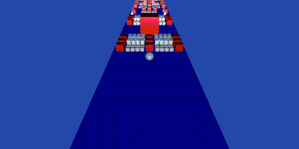
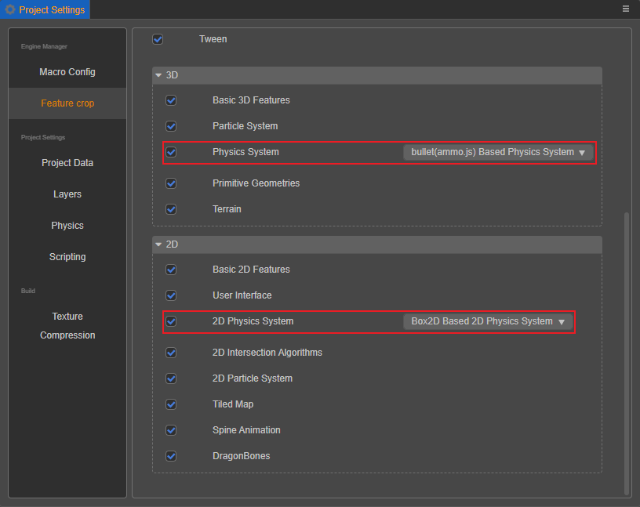

# Physical System

Cocos Creator's physics system provides an efficient componentized workflow and an easy way to use it. It currently supports rigid bodies, collision components, trigger and collision events, physics materials, ray casting, and more.

Cocos Creator has a built-in [2D Physics](../physics-2d/physics-2d.md) and [3D physics](physics.md), developers can configure the 2D or 3D physics system as needed via the Creator main menu bar in **Projects -> Project Settings -> Feature Cropping**.

