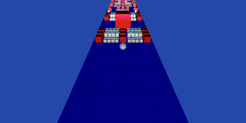

# Physics System

The physics system of Cocos Creator provides an efficient, componentized workflow with convenient usage. Currently, rigid body, collision components, trigger and collision events, physics materials, ray detection, and more are supported.

Developers can configure the 2D or 3D physics system as desired in **Project -> Project Settings -> Feature Cropping** on the main menu bar of Creator.

For more specific information, please refer to the
following:

- [2D Physics System](../physics-2d/physics-2d.md)
- [3D Physics System](physics.md)
