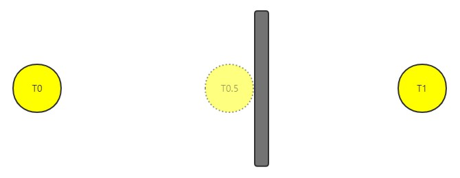

# Continuous Collision Detection

**Continuous Collision Detection** (abbreviated as **CCD**) is a technology used to avoid collision data inaccuracy due to penetration of objects moving at high speed in discrete motion, and can be used to achieve collisions with objects similar to a bullet moving at high speed without directly penetrating the object.

## Enable CCD

CDD is disabled by default. To enable it, set the `useCCD` property of the RigidBody component of the object to `true`:

```ts
const rigidBody = this.getComponent(RigidBody);
rigidBody.useCCD = true;
```

## Solving the linear penetration problem

Penetration is a phenomenon caused by the discrete motion of an object, which can be split into **movement** and **rotation**. Cocos Creator currently only supports solving **linear penetration** problems, which refer to penetration caused by discrete **movement** of objects.

Penetration usually occurs in objects that are moving at high speed, such as bullets. This is due to the fact that computer simulations are based on discrete forms, and when an object is moving too fast, the energy of a single integration is too large, which may cause the object to pass through another object that should have collided with it, as shown in the following figure:



Note that the ball moves from time T0 to time T1, missing the black square that should have collided at time T0.5. This is a typical linear penetration phenomenon caused by too much linear velocity.

## Support

Due to differences in support among physics engines, and for performance reasons, Creator supports CDD in the following cases:

- Only kinetic rigid bodies are supported.
- Only convex shapes are supported.
- No support for solving rotational penetration problems.
- For performance reasons, CCD events are only supported for types starting with `onCollision`.
- When the physics engine is set to **Bullet**, only single shape objects (containing only one collision component) are supported, and the `center` property of the collision component needs to be set to 0.
- When the physics engine is set to **Cannon**, only ball collision components are supported.
