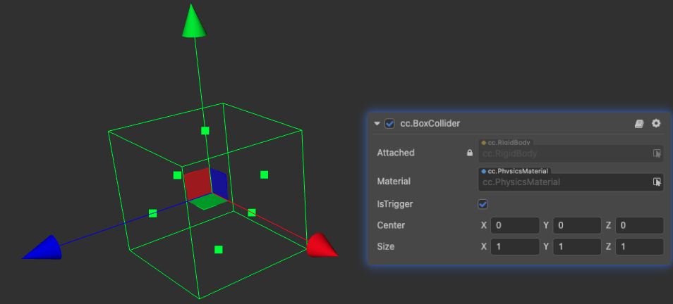
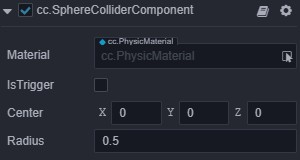
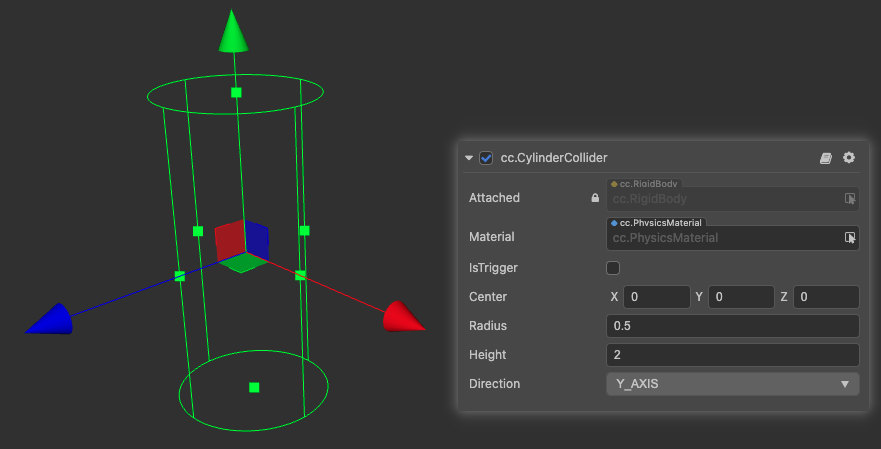
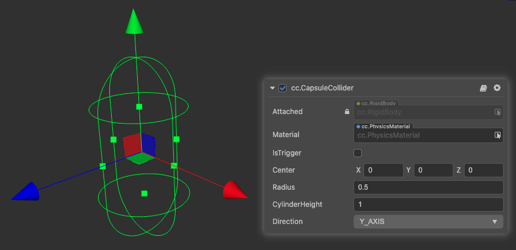
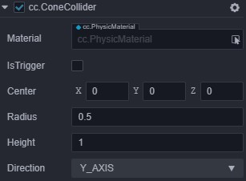
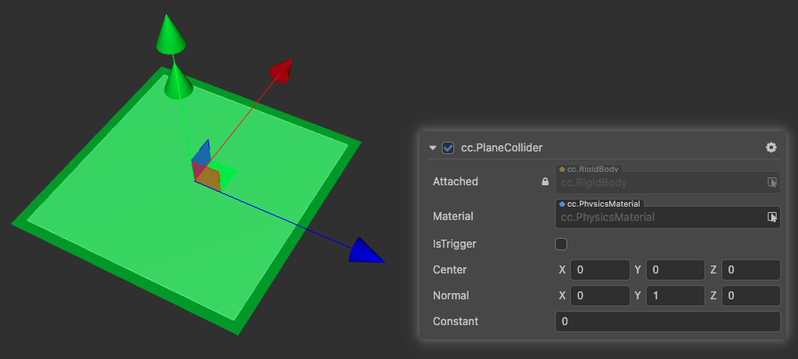
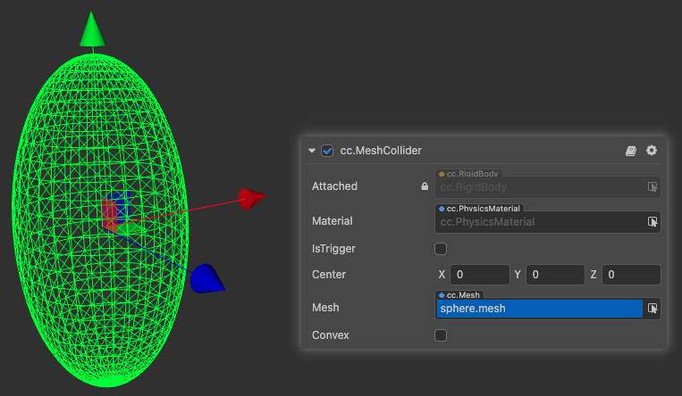
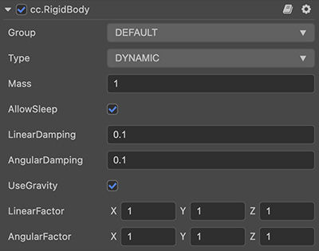
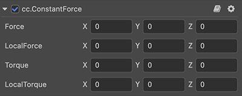

# Physics Component

__Cocos Creator__ currently provides users with a variety of __collider components__, common __rigid body components__, as well as __tool-type constant force components__.

## Collider Component

The __collider component__ is used to represent the shape of the __collision body__ of a __rigid body__. Different geometric shapes have different properties.

> **Note**: the following property names are all lowercase in the actual code.
> **Note**: currently only box, sphere and capsule are supported in `builtin`.

### BoxCollider

  Properties | Description
  ---|---
  **material** | The physics material referenced by the collider (the default physics material was referenced when it is empty)
  **isTrigger** | Whether it is a trigger, the trigger will not generate physical feedback
  **center** | The origin of the shape in the local coordinate system
  **size** | The size of the box, ie length, width, height

To use __BoxCollider__, please refer to the [BoxCollider API](__APIDOC__/en/#/docs/3.4/en/physics/Class/BoxCollider).

### SphereCollider

Properties | Description (Other reference box colliders)
---|---
**radius** | Radius of the sphere

To use __SphereCollider__, please refer to the [SphereCollider API](__APIDOC__/en/#/docs/3.4/en/physics/Class/SphereCollider).

### CylinderCollider

Properties | Description (Other reference box colliders)
---|---
**direction** | The reference axis of the cylinder's extended direction
**height** | The total height of the cylinder
**radius** | The radius of the circular surfaces at both ends of the cylinder

To use __CylinderCollider__, please refer to the [CylinderCollider API](__APIDOC__/en/#/docs/3.4/en/physics/Class/CylinderCollider).

### CapsuleCollider

Properties | Description (Other reference cylinders and box colliders)
---|---
**cylinderHeight** | The height of the cylinder in the capsule
**radius** | The radius of the sphere in the capsule

To use __CapsuleCollider__, please refer to the [CapsuleCollider API](__APIDOC__/en/#/docs/3.4/en/physics/Class/CapsuleCollider).

> **Note**: __cannon.js__ does not support capsule components. It is recommended to use two spheres and cylinders and piece them together.

### ConeCollider

Properties | Description (Other reference cylinders and box colliders)
---|---
**radius** | The radius of the circle of the underside of the cone
**height** | The height of the cone

To use __ConeCollider__, please refer to the [ConeCollider API](__APIDOC__/en/#/docs/3.4/en/physics/Class/ConeCollider).

### PlaneCollider

Properties | Description (Other reference box colliders)
---|---
**normal** | The normal vector to the plane
**constant** | The distance that the plane moves along the normal vector

To use __PlaneCollider__, please refer to the [PlaneCollider API](__APIDOC__/en/#/docs/3.4/en/physics/Class/PlaneCollider).

### MeshCollider

Properties | Description (Other reference box colliders)
---|---
**mesh** | The mesh asset referenced by the mesh collider, used to initialize the mesh collision volume
**convex** | Whether used the convex hull of the mesh is approximated, the number of vertices of the mesh should be less than 255 (through which any convex collider and dynamic rigid body can be supported).

To use __MeshCollider__, please refer to the [MeshCollider API](__APIDOC__/en/#/docs/3.4/en/physics/Class/MeshCollider).

> **Note**: __cannon.js__ has poor support for the mesh collider component, and only allows detection with the sphere\plane collider.
> **Note**: currently only __ammo.js__ backend supports __convex__ functionality.

### SimplexCollider

Properties | Description (Other reference box colliders)
---|---
**shapeType** | There are four types of simplex: point, line, triangular face and tetrahedron
**vertex0** | Vertex 0 of the simplex, point (consisting of 0)
**vertex1** | Vertex 1 of the simplex, line (consisting of 0,1)
**vertex2** | Vertex 2 of the simplex, triangular face (consisting of 0,1,2)
**vertex3** | Vertex 3 of the simplex, tetrahedron (consisting of 0,1,2,3)

> **Note**: `cannon.js` has imperfect support for line and triangular face.

To use __SimplexCollider__, please refer to the [SimplexCollider API](__APIDOC__/en/#/docs/3.4/en/physics/Class/SimplexCollider).

## RigidBody

In order to more easily simulate physical behavior, __Cocos Creator__ provides users with __rigid body components__.

Properties | Description (The property values ​​in the above picture are all default values)
---|---
**group** | The group of the physics element
**mass** | The mass of the object
**type** | The type of the rigid body
**linearDamping** | Linear damping, used to reduce the linear velocity of an object
**angularDamping** | Angular damping, used to reduce the rotation rate of objects
**useGravity** | Whether the rigid body is affected by gravity
**linerFactor** | Linear factor, which can affect the change of linear velocity in each axis
**angularFactor** | Rotation factor, which can affect the change of the rotation speed of each axis

To use __RigidBody__, please refer to the [RigidBody API](__APIDOC__/en/#/docs/3.4/en/physics/Class/RigidBody).

## ConstantForce

This is a tool component that depends on a __RigidBody__ and will apply a given force and torque to a rigid body every frame.

Properties | Description
---|---
**force** | The force applied to the rigid body in the world coordinate system
**localForce** | The force applied to the rigid body in the local coordinate system
**torque** | Torque applied to the rigid body in the world coordinate system
**localTorque** | Torque applied to the rigid body in the local coordinate system

To use __ConstantForce__, please refer to the [ConstantForce API](__APIDOC__/en/#/docs/3.4/en/physics/Class/ConstantForce).
