# Constraints

In the physics engine, **Constraints** are used to simulate connections between objects, such as rods, strings, springs, or ragdolls.

Constraints depend on [Rigidbody](physics-rigidbody.md). If the node does not have a rigidbody component, the engine will automatically add a rigidbody component when adding constraints.

> **Note**: The current constraint only works if the physics engine is selected as Bullet, PhysX or Cannon.js.

## HingeConstraint

Hinge constraints constrain the motion of connected objects to a certain axis. This constraint is useful in situations such as simulating the hinge of a door or the rotation of a motor.

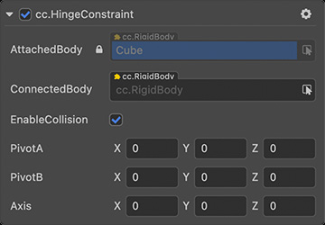

| Properties          | Description                                                                                                                                       |
| :------------------ | :------------------------------------------------------------------------------------------------------------------------------------------------ |
| **AttachedBody**    | The rigid body to which the constraint is attached, that is, the rigid body component under the same node where the current constraint is located |
| **ConnectedBody**   | Gets or sets the rigid body to which the constraint is connected, null means it is linked to a static body                                        |
| **EnableCollision** | Gets or sets whether collision is enabled between two bodies connected by a constraint                                                            |
| **PivotA**          | Constrain the relative position of a joint in the local space of its own rigid body                                                               |
| **PivotB**          | Constrain the relative position of the joint in the local space of the connected rigid body                                                       |
| **Axis**            | The axis that constrains constraint rotation in local space                                                                                       |

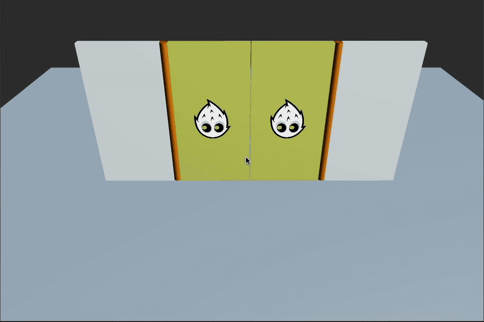

Please refer to [HingeConstraint API](__APIDOC__/en/class/physics.HingeConstraint) for the hinge constraint interface.

## PointToPointConstraint

A point-to-point constraint is a simple composite constraint that connects two objects, or one object, to a point in the coordinate system. The connected objects can be freely rotated with respect to each other while sharing a common connection point.

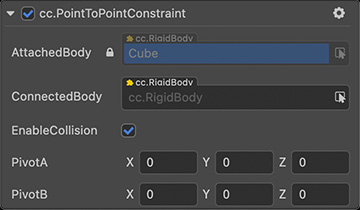

| Properties          | Description                                                                                                                                       |
| :------------------ | :------------------------------------------------------------------------------------------------------------------------------------------------ |
| **AttachedBody**    | The rigid body to which the constraint is attached, that is, the rigid body component under the same node where the current constraint is located |
| **ConnectedBody**   | Gets or sets the rigid body to which the constraint is connected, null means it is linked to a static body                                        |
| **EnableCollision** | Gets or sets whether collision is enabled between two bodies connected by a constraint                                                            |
| **PivotA**          | Constrain the relative position of a joint in the local space of its own rigid body                                                               |
| **PivotB**          | Constrain the relative position of the joint in the local space of the connected rigid body                                                       |

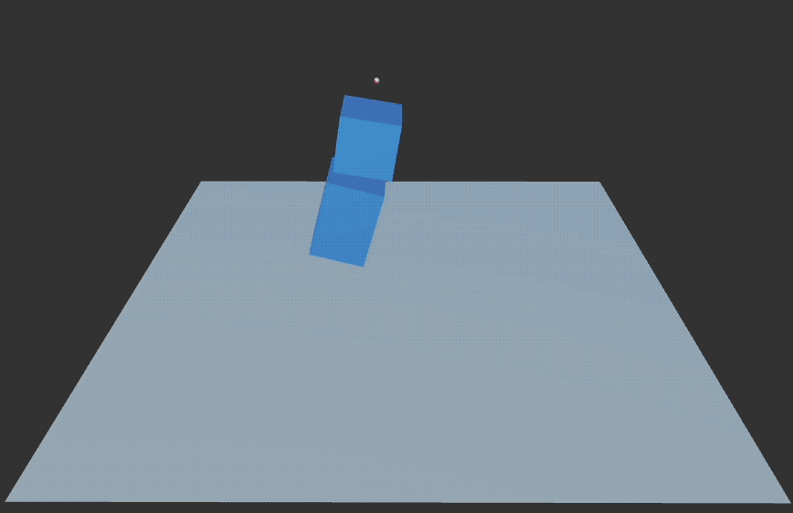

For point-to-point constraint interface, please refer to [PointToPointConstraint API](__APIDOC__/en/class/physics.PointToPointConstraint).

## FixedConstraint

A fixed constraint is the simplest constraint, it locks the relative position and rotation of two rigid bodies. The connected objects are not allowed to move relatively to each other.

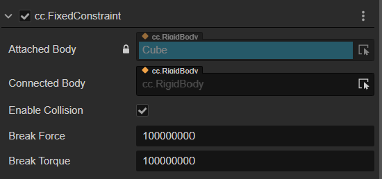

| Properties          | Description                                                                                                                                       |
| :------------------ | :------------------------------------------------------------------------------------------------------------------------------------------------ |
| **AttachedBody**    | The rigid body to which the constraint is attached, that is, the rigid body component under the same node where the current constraint is located |
| **ConnectedBody**   | Gets or sets the rigid body to which the constraint is connected, null means it is linked to a static body                                        |
| **EnableCollision** | Gets or sets whether collision is enabled between two bodies connected by a constraint                                                            |
| **BreakForce**      | Gets or sets the maximum force that can be applied to the constraint before it breaks                                                             |
| **BreakTorque**     | Gets or sets the maximum torque that can be applied to the constraint before it breaks                                                            |

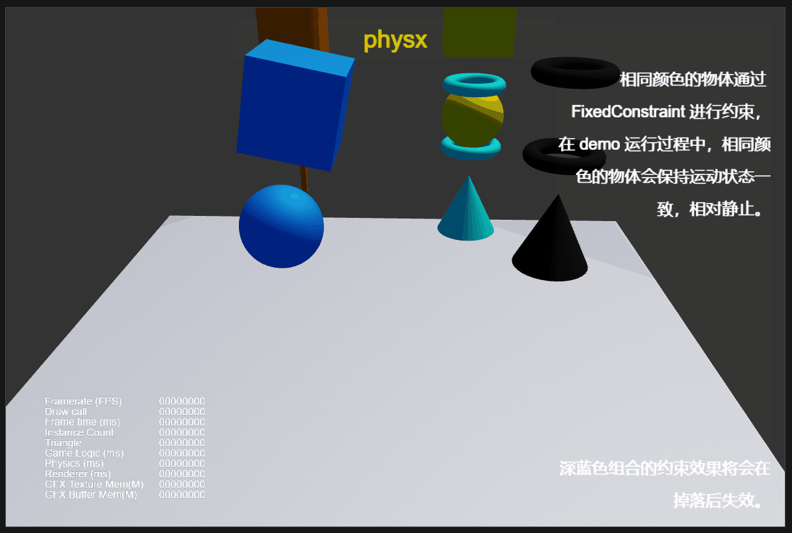

For fixed constraint interface, please refer to [FixedConstraint API](__APIDOC__/en/class/physics.FixedConstraint).

## Configurable constraint

Configurable constraints are one of the most comprehensive constraints in physics engines, including various commonly used constraint types in game engines. Through configuration, control can be applied to each of the six degrees of freedom, and nearly all commonly used special constraints in physics engines can be achieved by setting constraint parameters in different directions. Different degrees of freedom can have different constraint modes, such as free, limited, and locked. Free means no constraints are applied, limit means the range and process of the rigid body's motion are limited, and locked means the connected rigid bodies must be relatively stationary. For example, setting the constraint mode of all six degrees of freedom to locked is equivalent to using a fixed constraint to restrict the rigid body. In limit mode, the motion of the rigid body can be restricted to a certain extent, such as limiting the movement of that degree of freedom within a certain range. For the rigid body in limit mode, when it reaches the boundary of the restricted range, it will bounce back. At this time, the rebound strength can be adjusted by setting different rebound coefficients, and the elasticity of the constraint can be achieved by adjusting the parameters of the soft constraint, applying a certain amount of resistance to the motion, etc.

Rigid bodies connected by configurable constraints can produce the desired relative motion driven by the motor. After the motor is enabled, the rigid body will move to the specified relative position or gradually accelerate to the specified relative velocity and maintain motion. The motor has two different modes, servo mode and normal mode. In servo mode, the driver will make the rigid body move to the specified position or angle and stop after reaching the target position or angle. In normal mode, the driver will gradually accelerate the rigid body to achieve the specified linear velocity or angular velocity, and then maintain that velocity. Another adjustable parameter is the maximum driving force of the driver, which determines how fast the rigid body can accelerate towards the specified target position and velocity. When the maximum driving force is large, it will be difficult for external interference to change the relative motion state between rigid bodies.

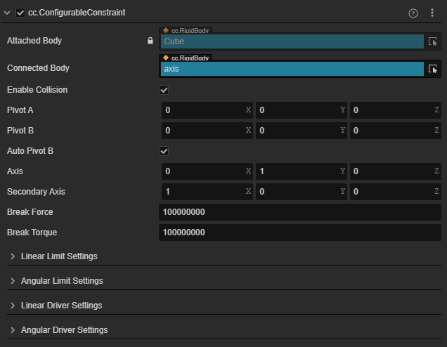
| Properties                | Description                                                                                                                                       |
| :------------------------ | :------------------------------------------------------------------------------------------------------------------------------------------------ |
| **AttachedBody**          | The rigid body to which the constraint is attached, that is, the rigid body component under the same node where the current constraint is located |
| **ConnectedBody**         | Gets or sets the rigid body to which the constraint is connected, null means it is linked to a static body                                        |
| **EnableCollision**       | Gets or sets whether collision is enabled between two bodies connected by a constraint                                                            |
| **Axis**                  | Gets or sets the principle axis of the constraint                                                                                                 |
| **SecondaryAxis**         | Gets or sets the secondary axis of the constraint (orthogonal to the principle axis)                                                              |
| **PivotA**                | The relative position of the joint in the local space of its own rigid body                                                                       |
| **PivotB**                | The relative position of the joint in the local space of the connected rigid body                                                                 |
| **AutoPivotB**            | Automatically derivate the pivotB from the pivotA and the relative transform between the two rigid bodies                                         |
| **BreakForce**            | Gets or sets the maximum force that can be applied to the constraint before it breaks                                                             |
| **BreakTorque**           | Gets or sets the maximum torque that can be applied to the constraint before it breaks                                                            |
| **LinearLimitSettings**   | Gets or sets the linear limit settings                                                                                                            |
| **AngularLimitSettings**  | Gets or sets the angular limit settings                                                                                                           |
| **LinearDriverSettings**  | Gets or sets the linear motor settings                                                                                                            |
| **AngularDriverSettings** | Gets or sets the angular motor settings                                                                                                           |

> Example: When the main axis of the constraint is set to the y-axis of the attached rigid body, and the secondary axis is set to the x-axis of the attached rigid body, the coordinate of the constraint is shown in the figure below.
> | local coordinate of the attached body                                               | linear coordinate of the joint                          | angular coordinate of the joint                                         |
> | :---------------------------------------------------------------------------------- | :------------------------------------------------------ | :---------------------------------------------------------------------- |
> | 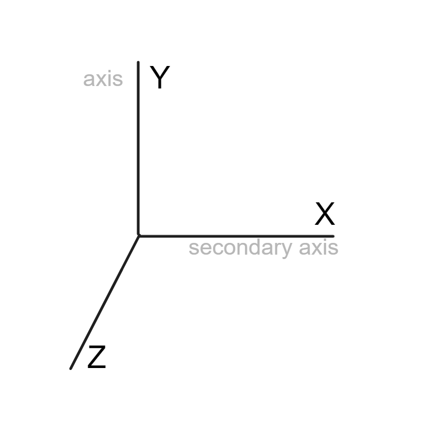 |  | 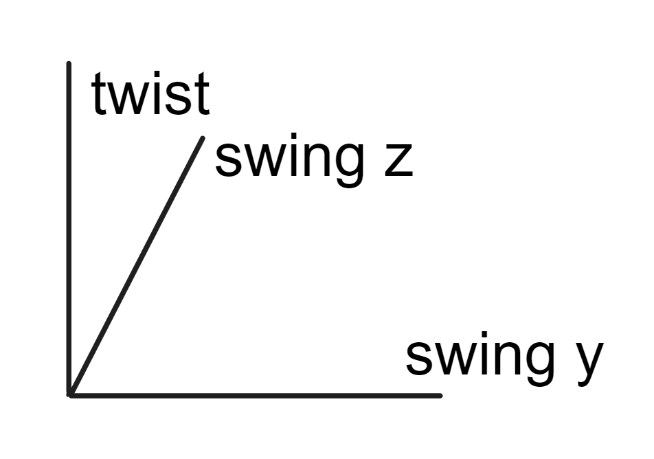 |

### Linear limit settings

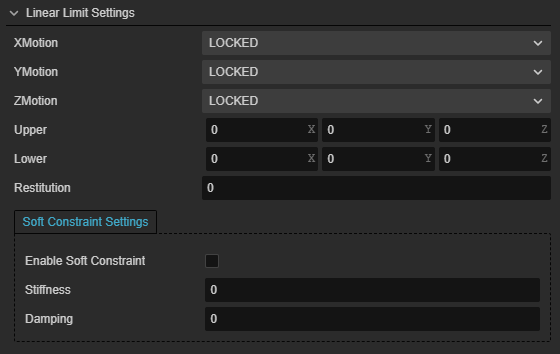
| Properties               | Description                                      |
| :----------------------- | :----------------------------------------------- |
| **xMotion**              | Gets or sets the constraint mode of the x-axis   |
| **yMotion**              | Gets or sets the constraint mode of the y-axis   |
| **zMotion**              | Gets or sets the constraint mode of the z-axis   |
| **upper**                | Gets or sets the upper limit of the linear limit |
| **lower**                | Gets or sets the lower limit of the linear limit |
| **restitution**          | Gets or sets the restitution of the constraint   |
| **enableSoftConstraint** | Gets or sets whether to enable soft constraint   |
| **damping**              | Gets or sets the damping of the constraint       |
| **stiffness**            | Gets or sets the stiffness of the constraint     |

### Angular limit settings

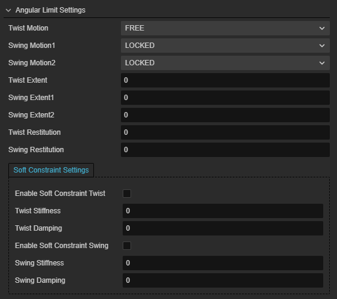
| Properties                    | Description                                              |
| :---------------------------- | :------------------------------------------------------- |
| **twistMotion**               | Gets or sets the constraint mode of the twist axis       |
| **swingMotion1**              | Gets or sets the constraint mode of the swing y axis     |
| **swingMotion2**              | Gets or sets the constraint mode of the swing z axis     |
| **twistExtent**               | Gets or sets the limit angle along the twist axis        |
| **swingExtent1**              | Gets or sets the limit angle along the swing y axis      |
| **swingExtent2**              | Gets or sets the limit angle along the swing z axis      |
| **twistRestitution**          | Gets or sets the restitution of the twist constraint     |
| **swingRestitution**          | Gets or sets the restitution of the swing constraint     |
| **enableSoftConstraintTwist** | Gets or sets whether to enable soft constraint for twist |
| **twistDamping**              | Gets or sets the damping of the twist constraint         |
| **twistStiffness**            | Gets or sets the stiffness of the twist constraint       |
| **enableSoftConstraintSwing** | Gets or sets whether to enable soft constraint for swing |
| **swingDamping**              | Gets or sets the damping of the swing constraint         |
| **swingStiffness**            | Gets or sets the stiffness of the swing constraint       |

### Linear driver settings

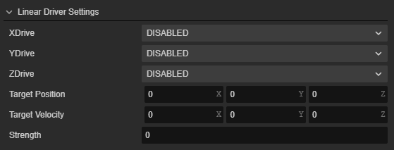
| Properties   | Description                                   |
| :----------- | :-------------------------------------------- |
| **xDrive**   | Gets or sets the driver mode along the x axis |
| **yDrive**   | Gets or sets the driver mode along the y axis |
| **zDrive**   | Gets or sets the driver mode along the z axis |
| **target**   | Gets or sets the target position              |
| **velocity** | Gets or sets the target velocity              |
| **force**    | Gets or sets the maximum driving force        |

### Angular driver settings

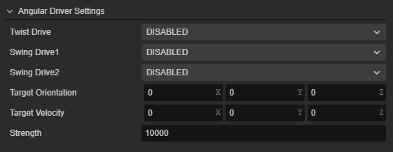
| Properties      | Description                                         |
| :-------------- | :-------------------------------------------------- |
| **twistDrive**  | Gets or sets the driver mode along the twist axis   |
| **swingDrive1** | Gets or sets the driver mode along the swing y axis |
| **swingDrive2** | Gets or sets the driver mode along the swing z axis |
| **target**      | Gets or sets the target angle                       |
| **velocity**    | Gets or sets the target angular velocity            |
| **force**       | Gets or sets the maximum driving force              |

For configurable constraint interface, please refer to [ConfigurableConstraint API](__APIDOC__/en/class/physics.ConfigurableConstraint).
