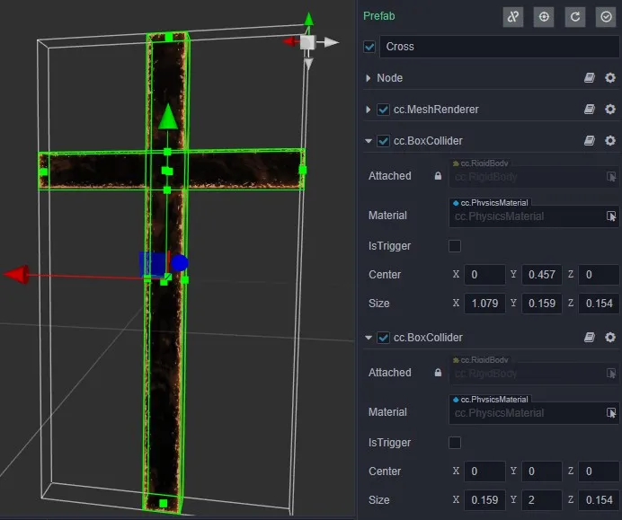
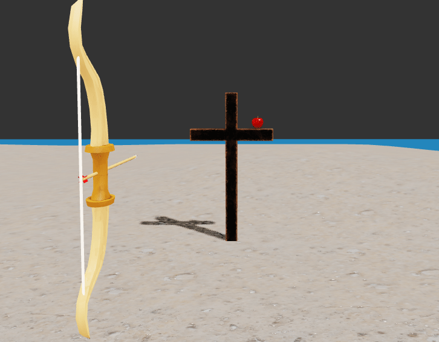
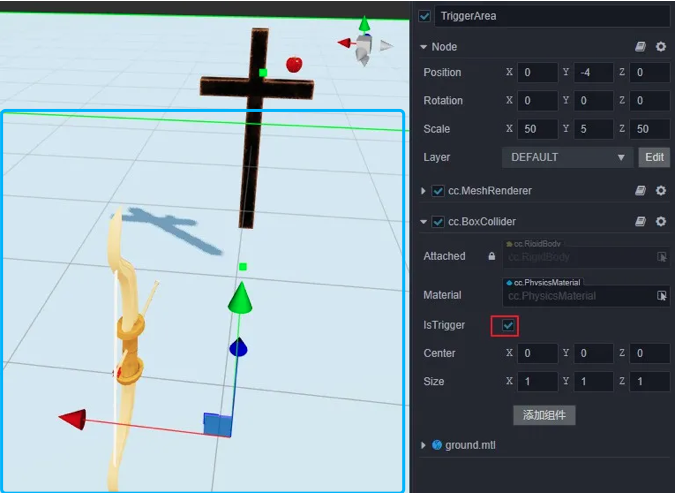
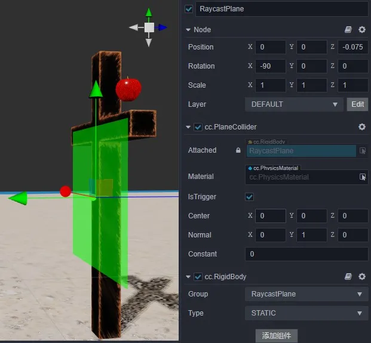
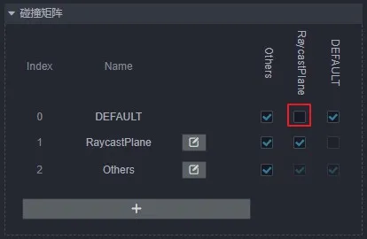
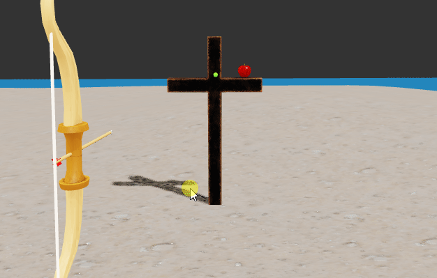
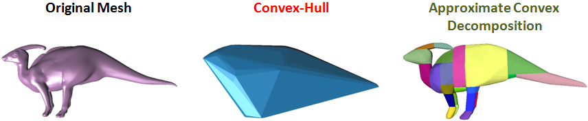

# Physics Examples

## Archery Case

1. Combining crosses with base shapes - composite shapes

    In the following figure, a cross is combined with two box shapes, and all the colliding bodies on the node are combined into a cross shape, which is the most basic way to achieve a shape with a concave surface.

    

    The easy misuse is to add collision bodies to multiple nodes to put together the cross, hoping that it can keep the overall structure in motion after the collision, which is not possible in the current structure and can only be achieved by adding collision bodies to individual nodes.

2. Shooting and recovering arrows - kinematics, dynamics, events

    The first step of archery is to draw the bow, and the arrow needs to follow the elastic rope skeleton completely, so we don't want the arrow to be affected by the physical rules.

    

    The general process of recovering an arrow is to restore it to the bow once it has touched the trigger area after it has been shot. This can be achieved by creating a listening area, first by piecing together the area using the collider component and checking `IsTrigger` on the collider (the ground in the image below, the part circled in blue, is the listening area).

    

    The above error-prone areas are:

    1. You want to modify the transformation information to manipulate the dynamics (Dynamic) type of rigid body motion, which should be controlled by the values of the physical layer such as velocity, force or impulse.

    2. Using a static rigid body to listen for events, a static rigid body will only generate events with a rigid body of type Kinematic or Dynamic. If both are static, no events will be generated.

    3. Listen for events with only OnTriggerEnter, but mistakenly think that OnTriggerStay and OnTriggerExit are included.

3. Aiming - collision matrix (filter detection), raycast detection, static plane

    Aiming is the step before shooting an arrow. The collimator is on the ray where the arrow is pointing, a static plane collider is added in front of the cross, and then the position of the collimator can be obtained using raycast detection.

    

    The static plane is only used for raycast detection, creating a grouping specifically for it and not with objects such as arrows, apples, etc. This is the most general method of performance optimization.

    

    When calling the raycast detection method, set the incoming mask to only and static plane detection, i.e. `0b10` (binary representation).

    The above-mentioned error-prone areas are:

    1. Not being able to distinguish between groupings on rigid components and layers on nodes. The two concepts are similar, but the users are different, the user of the grouping is the physical module and the user of the layer is the rendering module.

    2. Not understanding the mask properly and not knowing what value to pass. Here is a little trick, to a mask that can filter out `Others` for example, first Others index value is 2, then just let the binary mask from right to left order of the `2` bit for `1`, you can let `Others` through the filter, that is `ob100` (here it is strongly recommended not to change the index of the grouping arbitrarily).

    3. Mistakenly assume that the return value of the raycast detection interface is the hit data. There is a dedicated interface for getting the result, which is designed here to emphasize that this is a reused object. To reduce garbage memory, each call to the interface will only update their data, rather than regenerate a new one (if a persistent record is needed, then a copy can be cloned).

4. Shooting apples - static grid, convex package, multi-step simulation (step size adjustment)

    The average apple comes with a concave surface, and dealing with a good concave class or a model with continuous smooth irregular surfaces are very tricky, this is because the current mature theory and techniques are built on top of the world of discrete, convex packages (differential approximation in calculus to represent the differential is the most typical example).

    In real-time physics engines, such objects can only be supported up to the rigid body level of static or kinematic types, and there is nothing that can be done about dynamics. Unfortunately, however, real apple motion is strongly dependent on dynamics, and in this case the only way to participate in the simulation is to fill the apple with a mesh collider in the form of a convex package (with convex checked) and a kinetic rigid body, using an approximation.

    

    The motion performance is very much related to the simulation parameters, and penetration is the most representative phenomenon, which can be achieved by reducing the step length and increasing the number of steps, with a little trick to adjust the step length: enter the fractional equation, `1/Frame`, where `Frame` represents the frame rate.

    

    The above mistakes can be easily made by:

    1. kinetic rigid bodies added to a mesh collider with `convex` unchecked are penetrating with other objects or not reacting at all, this is a typical misuse, only those with `convex` checked will support kinetic rigid bodies.

    2. Turning on `convex` for a model with a very large number of vertices will increase the number of faces of the convex packet, which has a great impact on the performance, and it is not necessary to have a convex packet with a large number of faces.

    3. It is normal that the contact at the concave side of the model does not fit well after opening the convex packet, which is now solved by the real-time technique of combining the model with multiple convex packets, as shown in the following figure.

        

    4. Only the step length is adjusted, but not the number of steps, both of which need to work with each other to be effective. The tip is that the number of steps can be set to a larger value at will, and the step length is adjusted according to the maximum speed value; the larger the value, the smaller the step length should be.
