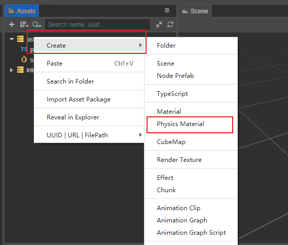
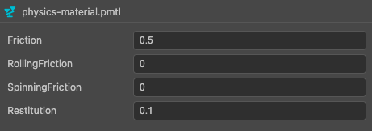

# Physics Material

A physics material is an asset that records information about the surface of an object that is used to calculate the frictional and force of restitution on colliding objects, etc.

## Create Physics Material

### Create in Editor

Physics materials can be created by right-clicking anywhere in the **Inspector** panel or by clicking between the **+** button:



### Creating by Code

Physics materials can also be instantiated by code:

```ts
import { PhysicsMaterial } from 'cc';

let newPMtl = new PhysicsMaterial();
newPMtl.friction = 0.1;
newPMtl.rollingFriction = 0.1;
newPMtl.spinningFriction = 0.1;
newPMtl.restitution = 0.5;
```

## Properties

Physics material properties are shown in the following figure:



| Properties | Description |
| :-- | :-- |
| **Friction** | The friction factor |
| **RollingFriction** | The rolling friction factor |
| **SpinningFriction** | The spinning friction factor |
| **Restitution** | Resilience factor |

When in contact with other surfaces, these coefficients are used to calculate the corresponding friction and force of restitution.

## Use Physics Material

Currently, physics materials are set on a collider basis, and each **Collider** has a **Material** property (when not set, the **Collider** will refer to the default physics material in the physics system).

Applying to **Collider** is also divided into two ways: editor operations and code operations.

For in-editor operations, simply drag and drop the asset into the **cc.PhysicalicMaterial** property box, as shown below.


Operate in the code:

```ts
import { Collider } from 'cc';

let collider = this.node.getComponent(Collider);
if (collider) {
    collider.material = newPMtl;
    collider.material.rollingFriction = 0.1;
}
```

## Shared Materials

In the physics system, physics materials have two states, shared materials and instanced materials.

- Shared material: Different colliders that share the same material, and modifications to that material affect all colliders holding that material. By default, colliders are initialized with the engine's default physics material. This can be accessed through `sharedMaterial`, with the following code example.

    ```ts
    import { Collider } from 'cc';
    let collider = this.node.getComponent(Collider);
    if (collider) {        
        let sharedMaterial = collider.sharedMaterial; 
        
        collider.sharedMaterial.friction = 0.5

        collider.sharedMaterial = newPMtl;
    }
    ```

- Instanced material: Only used by this collider, modifying this material will not affect other colliders.

  If a collider's physics material is in a shared state, a new physics material will be generated when `getter` of `material` is called.

  The following code demonstrates how calling `getter` on a collider changes the material to an instanced state when the physics material is in a shared state.

    ```ts
    import { Collider } from 'cc';
    let collider = this.node.getComponent(Collider);
    if (collider) {
        const material = collider.material; 
    }
    ```
