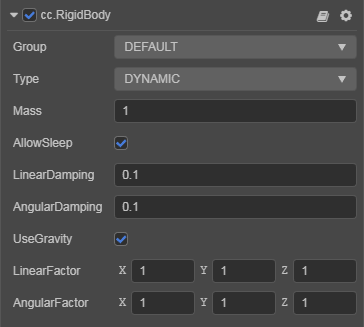

# RigidBody Component

**RigidBody** is the basic object that make up a physics world, and it can make a node physically affected and react.

The **RigidBody** component is used to control the properties associated with the simulation.



Click the **Add Component -> Physics Component -> RigidBody** button at the bottom of the **Inspector** panel to add the RigidBody component to the node.

## RigidBody Properties

| Property      | Function explanation |
| :-------------- | :------------------- |
| **Type**            | The type of the rigid body, including **DYNAMIC**, **STATIC** and **KINEMATIC**, See below for details.
| **Mass**            | The mass of the rigid body.                     |
| **AllowSleep**      | Whether to allow the rigid body to enter sleep state.   |
| **Linear Damping**  | Used to reduce the linear rate of rigid body. The larger the value, the slower the rigid body moves. |
| **Angular Damping** | Used to reduce the rotation rate of rigid body. The larger the value, the slower the rigid body rotates. |
| **Use Gravity**     | If enabled, the rigid body is affected by gravity.     |
| **Linear Factor**   | It can affect the linear velocity change of the rigid body in each axis. The larger the value, the faster the rigid body moves. |
| **Angular Factor**  | It can affect the rotation speed change of the rigid body in each axis. The larger the value, the faster the rigid body rotates. |

For more information, please refer to the [RigidBody API](__APIDOC__/en/#/docs/3.5/en/physics/Class/RigidBody).

### Obtaining a RigidBody

```ts
// TypeScript
const rigidBody = this.getComponent(RigidBody);
```

## Rigid Body Types

Rigid bodies are generally divided into three types, **STATIC**, **DYNAMIC**, and **KINEMATIC**.

- **STATIC**, which means a static rigid body, Used to describe a building at rest. If the object needs to keep moving, it should be set to __KINEMATIC__ type.
- **DYNAMIC**, which means that a dynamic rigid body can **be subjected to forces**. Move the object through **the laws of physics**, and make sure the mass is greater than 0.
- **KINEMATIC**, which means kinematic rigid body, Usually used to express the motion of the object such as the elevator platform, please control the motion of the object through the __Transform__.

## Center Of Mass

Currently the center of mass is fixed to the node to which the RigidBody component is bound, and the center of mass is relative to the collider shape. By adjusting the collider shape offset (`center`), the center of mass can be shifted in shape.


> **Note**: in order to make it easier to fit collider shape to the model, methods for changing mass centers may be added in the future, as well as methods for dynamically calculating mass centers mechanism.

## Sleeping or Waking the Rigid Body

### Sleeping the Rigid Body

If a rigid body is sleeping, all the force and velocity of the rigid body are cleared, and the rigid body freezed.

```ts
// asleep
if (rigidBody.isAwake) {
    rigidBody.sleep();
}
```

### Waking the Rigid Body

```ts
// awake
if (rigidBody.isSleeping) {
    rigidBody.wakeUp();
}
```

## Allowing The Rigid Body To Move

To move a rigid body, you need to change the speed of the rigid body. Currently, there are several ways to change the speed of the rigid body.

### By Gravity

The RigidBody component provides the `useGravity` property, set it to `true` and the rigid body will be affected by gravity.

### By Applying Force

The RigidBody component provides an `applyForce` interface with the signature:

`applyForce (force: Vec3, relativePoint?: Vec3)`

According to Newton's second law **F = m * a**, a force is applied to a certain point of the rigid body, so that there is acceleration, and the speed will change with the acceleration with time, which will cause the rigid body to move. Example:

```ts
rigidBody.applyForce(new Vec3(200, 0, 0));`
```

### By Applying Torsional Force

The RigidBody component provides the `applyTorque` interface with the signature:

`applyTorque (torque: Vec3)`

Through this interface, you can apply torque to the rigid body, because it only affects the rotation axis, so no longer need to specify the point of action.

### By Applying Impulse

The RigidBody component provides the `applyImpulse` interface, with the signature:

`applyImpulse (impulse: Vec3, relativePoint?: Vec3)`

According to the equation of conservation of momentum **F * Δt = m * Δv**, impulse is applied to a certain point of the rigid body. Since the mass of the object is constant, the speed will change immediately and the rigid body will move. Example:

```ts
rigidBody.applyImpulse(new Vec3(5, 0, 0));`
```

### By Directly Changing The Speed

#### Linear speed

The RigidBody component provides the `setLinearVelocity` interface, which can be used to change the linear velocity. The signature is:

`setLinearVelocity (value: Vec3)`

Example:

```ts
rigidBody.setLinearVelocity(new Vec3(5, 0, 0));
```

#### Spinning speed

The RigidBody component provides the `setAngularVelocity` interface, which can be used to change the rotation speed. The signature is:

`setAngularVelocity (value: Vec3)`

Example:

```ts
rigidBody.setAngularVelocity(new Vec3(5, 0, 0));
```

## Limit Movement Of Rigid Body

### By Sleeping

When sleeping the rigid body, all the force and speed of the rigid body will be emptied, which will stop the rigid body.

> **Note**: currently application of force or impulse, and changing the speed will wake up the rigid body again, and subsequent adjustments may be made, please pay attention to the version update announcement.

### By Damping

The RigidBody component provides `linearDamping` and `angularDamping` properties:

- The `linearDamping` property is used to set the linear damping.
- The `angularDamping` property is used to set the angular damping.

The range of the damping parameter is from 0 to infinity, where 0 means no damping and infinity means full damping. Generally, the value of damping is between 0 ~ 0.1.

### By Factor

The RigidBody component provides the `linearFactor` and `angularFactor` properties:

- The `linearFactor` property is used to set the linear factor.
- The `angularFactor` property is used to set the angular factor.

The factor is the type of `Vec3`. The value of the corresponding component is used to scale the speed change of the corresponding axis. The default value is `1`, which means that the scaling is `1` times, that is, no effect.

> **Notes**:
> 1. Set a certain component value of the factor to `0`, you can fix a certain axis of movement or rotation.
> 2. In the physics engines `cannon.js` and `ammo.js`, the factors act on different physical quantities, in `cannon.js` on speed and in `ammo.js` on force.
