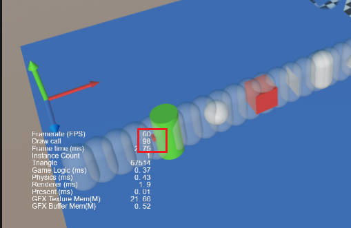

# Geometry Cast Detection

Cocos Creator supports the sweep method since v3.7.

Geometry cast detection, which will emit different geometry along a specified ray, is like using geometry to sweep an area, hence the name `sweep`. The sweep method will check the colliders in the region of the physics world that the geometry sweeps through and return a specific result.

Quit different from the `rayCast` method, the `sweep` method allow the physics engine to cast different geometries, and return specific collision information.

The engine now supports **box**, **sphere**, and **capsule** to sweep through.

## Methods

- Box sweep
    - `sweepBox`: cast a box along the specified ray, and returns all colliders it hits as a result.
    - `sweepBoxClosest`: cast a box along the specified ray, and return the closest collider it hits as a result.

    - parameters:

        - `worldRay`: geometry.Ray: ray in world space
        - `halfExtent`: IVec3Like, half size of the box.
        - `orientation`: IQuatLike, the orientation of the box
        - `mask`: number: mask，the default is 0xffffffff，for more, refer to [Group and Mask](./physics-group-mask.md) and [Raycast Detection](./physics-raycast.md)
        - `maxDistance`: number Maximum detection distance, the default value is 10000000, please do not use Infinity or Number.MAX_VALUE
        - `queryTrigger`: boolean, check the trigger colliders or not, the default value is true，

- Sphere sweep
    - `sweepSphere`: cast a sphere along the specified ray, and returns all colliders it hits as a result.
    - `sweepSphereClosest`: cast a sphere along the specified ray, and return the closest collider it hits as a result.

    - parameters:
        - `worldRay`: geometry.Ray: Ray in world space
        - `radius`: number, the sphere radius
        - `mask`: number:mask，the default is 0xffffffff，for more, refer to [Group and Mask](./physics-group-mask.md) and [Raycast Detection](./physics-raycast.md)
        - `maxDistance`: number Maximum detection distance, the default value is 10000000, please do not use Infinity or Number.MAX_VALUE
        - `queryTrigger`: boolean, check the trigger colliders or not, the default value is true，

- Capsule sweep
    - `sweepCapsule`: cast a sphere along the specified ray, and returns all colliders it hits as a result.
    - `sweepCapsuleClosest`: cast a sphere along the specified ray, and return the closest collider it hits as a result.
    - parameters:
        - `worldRay`:geometry.Ray: Ray in world space
        - `radius`: number: the radius of the capsule
        - `height`: number: distance between the two hal-sphere centers of the capsule
        - `orientation`: IQuatLike: orientation of the capsule
        mask，the default is 0xffffffff，for more, refer to [Group and Mask](./physics-group-mask.md) and [Raycast Detection](./physics-raycast.md)
        - `maxDistance`: number Maximum detection distance, the default value is 10000000, please do not use Infinity or Number.MAX_VALUE
        - queryTrigger: boolean, check the trigger colliders or not, the default value is true，

Please refer to  [API](__APIDOC__/zh/class/PhysicsSystem) for more information.

## Sweep result

All the sweep methods return true when they hit one or more colliders. For optimal reasons, the results are stored in the PhysicsSystem class. To fetch the result, please use `sweepCastClosestResult/sweepCastResults` or clone it out in case the former result may be invalid after the next sweep.

- The result of `sweepBoxClosest`, `sweepSphereClosest`, and `sweepCapsuleClosest` is stored in `PhysicsSystem.instance.sweepCastResults`, which type is `PhysicsRayResult`, the code example is as follows

  ```ts
  const result = PhysicsSystem.instance.sweepCastClosestResult;
  ```

- The result of `sweepBox`、`sweepSphere` and `sweepCapsule` is stored in `PhysicsSystem.instance.sweepCastResults`, which type is an array of `PhysicsRayResult`, the code example is as follows

    ```ts
    const results = PhysicsSystem.instance.sweepCastResults;

    for (let i = 0; i < results.length; i++) {
        const result = results[i];
        ...
    }
    ```

The detail of `PhysicsRayResult` is as follows:
- `hitPoint`: vec3, the hit point in world space.
- `distance`: number, the distance between the hit-point and the ray origin
- `collider`: Collider, the collider hit by the ray.
- `hitNormal`: vec3, the normal of the hit plane， in world space.

For more, please refer to [PhysicsRayResult](__APIDOC__/zh/class/PhysicsRayResult)。

## Examples

Let us take the `sweepSphereCloset` as an example:

```ts
if (PhysicsSystem.instance.sweepSphereClosest(this._ray, this._sphereRadius * this._scale, this._mask, this._maxDistance, this._queryTrigger)) {
    const result = PhysicsSystem.instance.sweepCastClosestResult;
}
```

When the result of the method is true, you can access the hit result.

For more examples, please refer to [GIT](https://github.com/cocos/cocos-example-projects/tree/master/physics-3d)。

The sweep result can be seen when running the **case-physics-sweep** scene after downloading the example project.



The red point in the previous diaphragm shows the sweep result.
