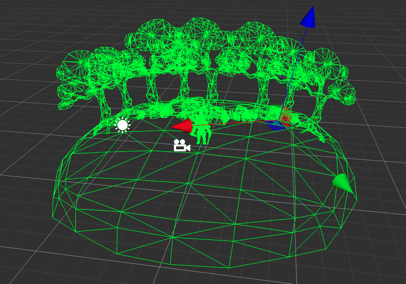
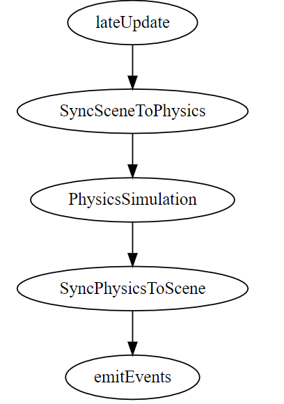

# 3D Physics System

## Introduction

The physics system is a crucial component of game engine, as it imbues the game world with the physical properties of the real world such as mass, gravity, and friction. This allows the game world to behave in a more realistic manner. The physics engine is responsible for simulating the motion and collision feedback of objects in the game world based on their physical properties. It is worth noting that the physics system is a complex system that interacts with not only game logic, but also the rendering system, animation system, and audio system. Typically, the game physics system only covers the basics of Newtonian mechanics, such as collision detection and rigid body motion. Other physical phenomena, such as fluid dynamics or soft body physics, require alternative approaches. Users can use the API provided by the physics engine to manipulate the physics system and achieve various physical effects in the game.

Cocos Creator supports the following physics engines.

- **Bullet**: default physics engine, asm.js/wasm version of [Bullet](https://pybullet.org/wordpress/). A physics engine with collision detection and physics simulation.
- **builtin**: built-in physics engine, lightweight engine for collision detection only.
- **cannon.js**: physics engine with collision detection and physics simulation.
- **PhysX**: Game physics engine developed by [NVIDIA](https://developer.nvidia.com/physx-sdk). A physics engine with collision detection and physics simulation.

Developers choose different physics engines according to their development needs for physics features or application scenarios, please refer to: [Physics Engines](physics-engine.md) for details.

> **Note**: PhysX is not supported in earlyer versions. To use PhysX please make sure the engine is upgraded to the latest version.

## Physics Worlds

Each element in the physics world can be understood as a separate **rigid body**, which can be made physical in Cocos Creator 3.x by adding a [Collider](physics-collider.md) or [RigidBody](physics-rigidbody.md) to the game object. Gives physics elements their physical properties. The physics system will perform physics calculations for these elements, such as calculating whether the objects collide and what forces are applied to the objects. When the calculations are complete, the physics system will update the physics world to the scene world, simulating the physical behavior that is restored in the real world.

Scene world and physics world:

> **Note**: The "rigid body"  here refers to an object in the physics world that remains unchanged in shape and size and whose relative positions of internal points remain unchanged while in motion or after being acted upon by a force.

### Physics Work Flow

After all components are `lateUpdate`, the engine will synchronize the nodes holding physical properties (rigid body component, collider component) to the physics world and drive the physics engine to simulate them, and then synchronize the results calculated by the physics engine to each node of the scene after the simulation is completed. The overall process is shown in the following figure:

## Add Physics Elements

Adding a physics element to the game world can be done in the following steps:

1. Create a new node. Here create a new cube model **Cube**.
2. Add a collider component, here add a [BoxCollider](physics-collider.md#BoxCollider). Click the **Add Component** button at the bottom of the **Inspector** panel, select **BoxCollider** in the **Physics** directory and adjust the parameters.
3. To give it a physical behavior, then add a [RigidBody](physics-rigidbody.md) component.

This gives us a physics element with **both collider and physics behavior**.
