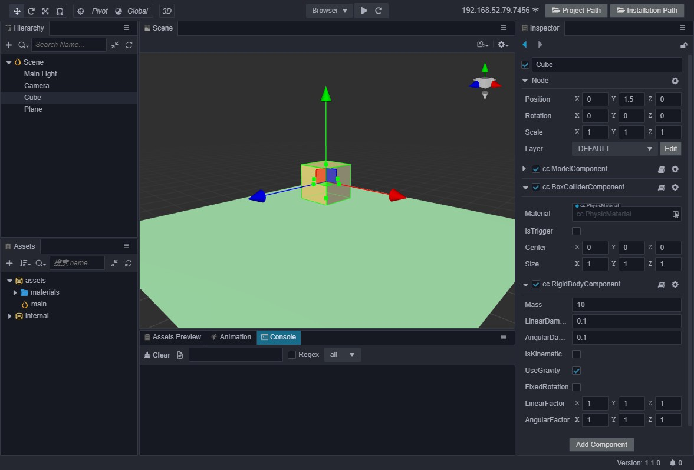

# Physics 3D Introduction

__Cocos Creator__ currently supports the lightweight collision detection system __builtin__ and the physics engine __cannon.js__ with physical simulation, and the __asm.js__/__wasm__ version __ammo.js__ of the powerful physics engine __bullet__, also we provides users with efficient and unified component-based workflow and convenient methods of use.

## Physics World And Elements

Elements in the physics world can be divided into **rigid body**. We can adding physics elements by adding a collider (__Collider__) or rigid body (__RigidBody__) component to the game object. The physics system will perform calculations on these elements to make their behaviors the same with the real world.

> **Note**: the __rigid body__ here doesn't refer to the __RigidBody__ component. The __RigidBody__ component is used to control the properties related to the physical behavior of the rigid body.

### Adding a Physical Element

Adding a physical element to the world can be divided int the following steps:

1. Create a new shape __Cube__;
2. Click __Add Component__ on the __Inspector__ panel witch is on the right of editor;
3. Select __BoxCollider__ under the __Physics__ menu, and adjust the parameters;
4. add a __RigidBody__ component in order to make it have physical behavior.

In this way we get a physical element that has **both a collider and a physical behavior**.

### Perfecting The Physics World

We can add a ground to the world. Following the steps 1,2,and 3, you can add another __Plane__ with **collider only**.

Then, adjust the view of the camera (select the camera and press the shortcut __Ctrl + Shift + F__ to align the camera view to screen).

Finally, click the run button, you can see the changes of physical elements in the scene. The final scene is shown in the following figure:

### Composition Of Physical Elements

A physical element can be composed of the following ways:

- A __RigidBody__ component
- One or more __Collider__ components
- One __RigidBody__ component plus one or more collider components

## More Detailed Modules

Additional physics system will be introduced in more detail through the following modules:

Module | Description
---|---
[**Physics Options**](physics-item.md) | Introduces the optional options of low-level physics engine in **Cocos Creator**
[**Physics System**](physics-system.md) | Introduces the physics system and a series of properties and interfaces of the physics system.
[**Physics Component**](physics-component.md) | Introduces some physics components and a series of properties on the panel.
[**Physics Usage**](physics-use.md) | Further introduces the use of physics, events, group masks, etc.
