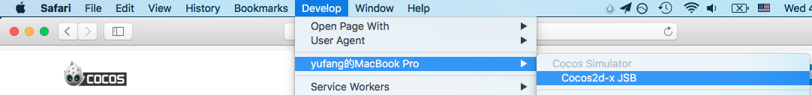
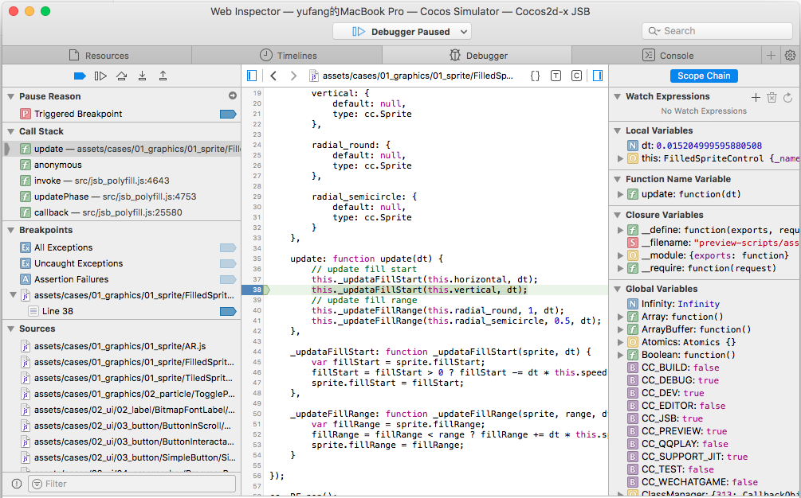
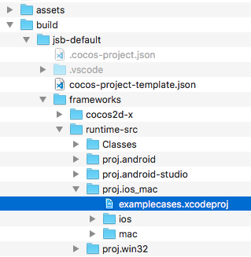
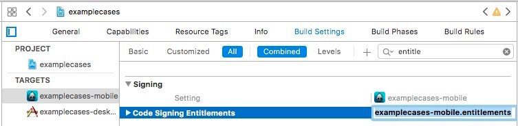
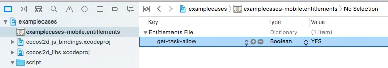
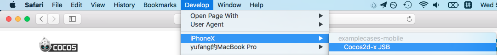
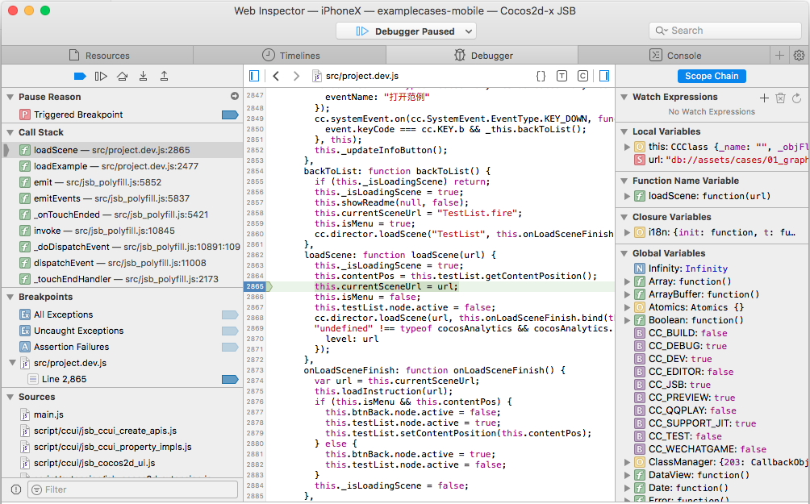

# Debug JavaScript on Native Platform

After the game is released to the native platform, because the operating environment is different, may appear in the browser preview can not reproduce the Bug, then we must directly in the original platform for debugging. However, traditional debugging methods can only be debugged to the C + + section and cannot debug JavaScript code. Cocos Creator introduced JSB 2.0 from v1.7, which makes it easy to remotely debug JavaScript in the native platform. If the Creator version is v1.6 below, please refer to [Native Platform Debugging](../publish/debug-native.md).

## Debug Simulator

In general, most of the problems of the original platform can be reproduced in the simulator, we can first test in the simulator, there are problems directly in the simulator debugging. There are two ways to debug the simulator.

### Method One

First choose to use the **simulator (debug)** as the preview platform on the top of the editor toolbar, and then click the **Run Preview** button in the editor to run the game in the simulator.

#### Windows

After running the simulator, open the address directly with the Chrome browser: `chrome-devtools://devtools/bundled/inspector.html?v8only=true&ws=127.0.0.1:5086/ 00010002-0003-4004-8005-000600070008` can be debugged:

#### Mac

- After running the simulator, in the Safari browser's **Preferences -> Advanced** tab, Check `Show Develop menu in menu bar`.
- Safari menu select `Develop -> your Mac device -> Cocos2d-x JSB`.

- To debug in a pop-up **Web inspector**:

### Method Two

Starting with **v2.0.7**, the [Open Simulator Debugger Panel](../getting-started/basics/editor-panels/preferences.md#preview-run) feature has been added to the **Preview Run** of **Settings** panel. The debugging steps are as follows:

  - Check the **Open Simulator Debugger Panel** in the **Setting -> Preview Run** panel, then click **Save**.
  - Running the simulator, then you can automatically open simulator debugger panel for debugging when start simulator.

## Debug on target device

If the game only run on the real machine, or the simulator can not reproduce the problem, it must be the real machine to the packaged game to debug.

### Android Debugging

- Make sure that the Android device is on the same LAN as Windows or Mac.
- Select the Android platform and Debug mode in the build publishing panel of Creator to build a compile-and-run project.
- Open address with Chrome browser: `chrome-devtools://devtools/bundled/inspector.html?v8only=true&ws={ip}:5086/ 00010002-0003-4004-8005-000600070008`, where `{IP}` is the local IP of the Android device, you can debug it. (**Note**: Starting with **v2.0.7**, 5086 needs to be changed to 6086)

### iOS Debugging

- Connect a device to a computer via a USB cable.
- Open IPhone Settings -> Safari -> Advanced -> Open Web Inspector.
- Select the IOS platform, Debug mode, and build the project in Creator's Build publishing panel. Open the project in Xcode.

- Add signature to Project: Select your iOS project -> General -> Signing -> Select your developer certificate.
- Add a entitlements file for the Xcode project and skip this step if the entitlements file exists. If not, open iCloud in the capabilities setting of the project, and then close. The .entitlements file is automatically added to the project.

- Make sure the Code Signing Entitlements option contains entitlements files in the Build Setting (**examplecases-mobile.entitlements** this part requires manual input).

- Open the entitlements file, manually add the **get-task-allow**, the value type is **Boolean**, and the value is **YES**.

- Compile the project in Xcode and publish the project to the device.
- Safari menu select `develop -> your device -> Cocos2d-x JSB` (This step if you can't find your device, it's probably because Safari is too low and needs to be upgraded Safari).

- To debug in a pop-up **Web Inspector**:

## Other Platform Debugging

If you need to debug in release mode, or the need to publish to the Windows or Mac platform debugging, or you need to debug a custom native engine, refer to the more detailed [JSB 2.0 Use Guide: Remote Debugging and Profile](../advanced-topics/jsb/JSB2.0-learning.md#remote-debugging-and-profile).
