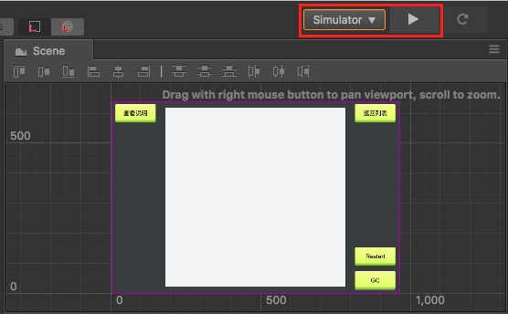

# Debugging JavaScript on Native Platforms

After a game is released on the native platform, because the runtime environment is different, there may be some bugs that cannot be reproduced in the browser preview. This means we must debug it directly on the native platform. Cocos Creator makes it easy to debug JavaScript remotely in the native platforms.

## Debug Simulator

In general, most of the problems of the original platform can be reproduced in the simulator, we can first test in the simulator, there are problems directly in the simulator debugging. There are two ways to debug the simulator.

### Method One

First choose to use the **Simulator (debug)** as the preview platform on the top of the editor toolbar, and then click the **Run Preview** button in the editor to run the game in the simulator.

After running the simulator, open the address <devtools://devtools/bundled/js_app.html?v8only=true&ws=127.0.0.1:5086/00010002-0003-4004-8005-000600070008> directly with the Chrome browser to debug. (If you are using an older version of Chrome, you need to change the `devtools` at the beginning of the address to `chrome-devtools`)

### Method Two

Starting with **v2.0.7**, the [Open Simulator Debugger Panel](../getting-started/basics/editor-panels/preferences.md#preview-run) feature has been added to the **Preview Run** of **Settings** panel. The debugging steps are as follows:

- Check the **Open simulator debugger panel** in the **Settings -> Preview Run** panel, then click **Save**.

  

- Running the simulator, then you can automatically open simulator debugger panel for debugging when start simulator.

## Debug on target device

If a game can only run on a physical device, or the simulator can not reproduce the problem, then the packaged game must be debugged on a physical device. Debugging steps are as follows:

- Make sure that the Android/iOS device is on the same LAN as Windows or Mac.

- Select the **Android / iOS** platform and **Debug** mode in the **Build** panel of Cocos Creator to build, compile and run a project (The iOS platform recommends connecting to the physical device via Xcode to compile and run).

- Open address with Chrome browser: <devtools://devtools/bundled/js_app.html?v8only=true&ws=xxx.xxx.xxx.xxx:6086/00010002-0003-4004-8005-000600070008>, where `xxx.xxx.xxx.xxx` is the local IP of the Android/iOS device, then you can debug it. (If you are using an older version of Chrome, you need to change the `devtools` at the beginning of the address to `chrome-devtools`)

  

## Other Platform Debugging

If you need to debug in release mode, or the need to publish to the Windows or Mac platform debugging, or you need to debug a custom native engine, refer to the more detailed [JSB 2.0 Use Guide: Remote Debugging and Profile](../advanced-topics/JSB2.0-learning.md#remote-debugging-and-profile) documentation.
