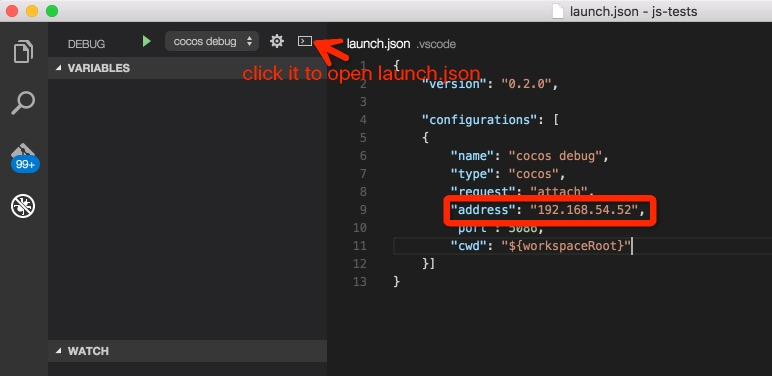

# Debug for Native Platform

Mobile and desktop native games developed with Cocos Creator are written in JavaScript and running in C++ through JSB. Due to the JSB implementation for different platform there may be some platform specific error that we need to find with VS Code's JSB debugging workflow.

## Install Cocos-Debug VS Code Extension

First download [Cocos Debug](http://7xougr.dl1.z0.glb.clouddn.com/vscode/cocos-debug.zip) VS Code extension and extract `cocos-debug` folder to the `.vscode/extensions` folder under user profile folder. Then let's launch VS Code.

Once the Cocos Debug extension is loaded. Click the **Debug** tab on the left sidebar and then click the gear icon to select `Cocos-JSB` debug setting.

If you have trouble loading VS Code extension, please check out the [Install Extension](https://code.visualstudio.com/docs/extensions/install-extension) doc on VS Code website。

## Debug Simulator

First run your game in Simulator, then find the project root under the simulator install location. This path differs according to your system:

- Windows：`CocosCreator/resources/cocos2d-x/simulator/win32`
- Mac：`CocosCreator.app/Contents/Resources/cocos2d-x/simulator/mac/Simulator.app/Contents/Resources`

On Mac you can't choose folder inside an app package in VS Code's open folder dialog, you'll have to open VS Code with no active project, then drag the folder above from Finder to VS Code window.

Open `src/project.dev.js` in the project, and you can add breakpoint as you wish. Switch to Debug tab in VS Code, choose `Cocos-Debug` from the gear menu, then click the green play button to start debug process.

Now you should be able to debug your JSB program on native platform. If anything goes wrong feel free to give us feedback on cocos forum.

For more detail information about VS Code debugging features, please read [VS Code Debugging Guide](https://code.visualstudio.com/docs/editor/debugging).

### Windows socket connect error

Launch debugger on Windows may get the following error in VS Code Debug console:

`ar: attachRequest: retry socket.connect`

Here's a possible solution: click the gear button in Debug view, and update `launch.json` to change the value of `address` to:

`"address": "::1"`

Due to some unknown reason on Windows some debug connection will try to use IPv6 first. So we need to fillin the local machine IP address in IPv6 format.

## Debug Built Native Project

Once you build the project for iOS, Android, Windows or Mac, you can debug these native projects with VS Code. Open the project in VS Code, usually the path is:

`myProject/build/myProject/jsb-default` or `myProject/build/myProject/jsb-binary`, depending on your build template.

Once you run the project on the target device or desktop simulator, the workflow is pretty much the same as above, please add your breakpoints in `jsb-default/src/project.dev.js`. Below are tips for debugging on mobile platform.

### iOS Debugging

If you want to debug on iOS devices, you should:

- Connect iOS device to Mac via USB cable
- Run cocos2d-x JSB program on iOS devices
- Use ip address the iOS device to fill the address section in launch.json

### Android Debugging

If you want to debug on Android devices, you should:

- Connect Android devices with PC via USB cable
- Run cocos2d-x JSB program on Android devices
- Use adb to forward tcp `adb forward tcp:5086 tcp:5086`

## Limitations

Currently VSCode82 can only attach to cocos2d-x JSB program to debug. Which means it can not pause on entry. We will improve it in future.

