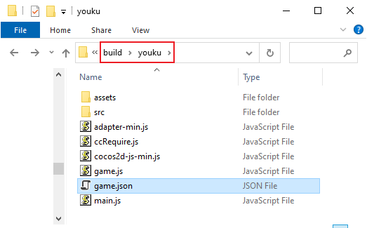
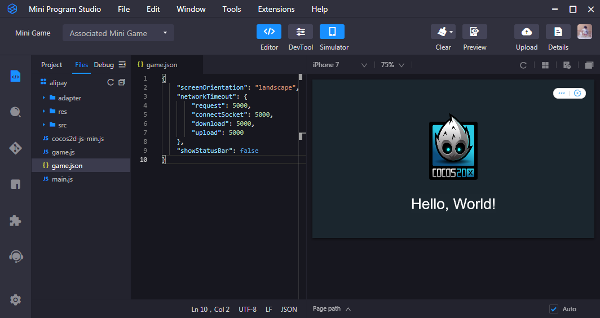

# Publish to Alipay Mini Games

Starting with Cocos Creator **v2.1.4**, creating games for the Alipay Mini Games is officially supported.

## Environment Configuration

- Download [Alipay Mini Program Studio](https://render.alipay.com/p/f/fd-jwq8nu2a/pages/home/index.html) on the PC and install it.

- Download [Alipay](https://mobile.alipay.com/index.htm) and install it on your phone.

- The minimum supported version of Alipay on Android is 10.1.75, on iOS is 10.1.78.

## Release Process

1. Use Cocos Creator to open the project that needs to be released. Select **Alipay Mini Game** in the Platform dropdown of the **Build...** panel and click **Build**.

    

2. After the build is complete, click the **Open** button behind the **Build Path**. You can see that the alipay mini game's project folder **alipay** directory is generated under the default release path build directory, which has included alipay mini game environment configuration file `game.json`.

    

3. Use **Alipay Mini Program Studio** to open **alipay** directory. Next, you can open alipay mini game project to preview and debug game content.

    

## Resource Management for Alipay Mini Game Environment

**Alipay Mini Game** is similar to **WeChat Mini Game**. There are restrictions on the package size. Resources more than **4MB** must be downloaded via a network request.

It is recommended to only save script files in the mini-game packages, while other resources are uploaded to the remote server, and downloaded from the remote server as needed. The download, cache, and version management of remote resources, Cocos Creator has already done it for you. The specific implementation logic is similar to the WeChat Mini Game. Please refer to [Resource Management for WeChat Mini Game](./publish-wechatgame.md#resource-management-for-wechat-mini-game-environment) documentation for details.

Specifically, developers need to:

1. When building, check the **md5Cache** function in the **Build** panel.
2. Set the **Remote URL** in the **Build** panel. And then click build.
3. When the build is complete, upload the **res** folder in the mini-game publish package to the server.
4. Delete the **res** folder under the local publish package directory.

## Resource Management for Alipay Mini Game Environment

**Alipay Mini Game** is similar to **WeChat Mini Game**. There are restrictions on the package size. Resources more than **4MB** must be downloaded via a network request.

Please refer to [Resource Management for WeChat Mini Game](./publish-wechatgame.md#resource-management-for-wechat-mini-game-environment) documentation for details.

**Note**: When Alipay loads the resources on the remote server on the physical device, it only supports access via https, so the resource file must be placed on https, otherwise the loading of the resource will fail.

## Alipay Mini Games Known issues

Currently, our adaptation of Alipay Mini Games has not been completely completed, and the following modules are still not supported:

- WebView
- VideoPlayer
- Subpackage Loading
- Custom Font

The above functions are expected to be gradually supported in future updates, and we will continue to communicate closely with Alipay Mini Games engineers to continuously optimize the adaptation effect.

## About Documentation

Since the documents related to Alipay mini games are currently only open to the inside, you can contact them directly if needed:

| Contacts | Email |
| ----- | ----- |
| LiZhi | lz98684@alibaba-inc.com      |
| HuangJiao | huangjiao.hj@alibaba-inc.com |
