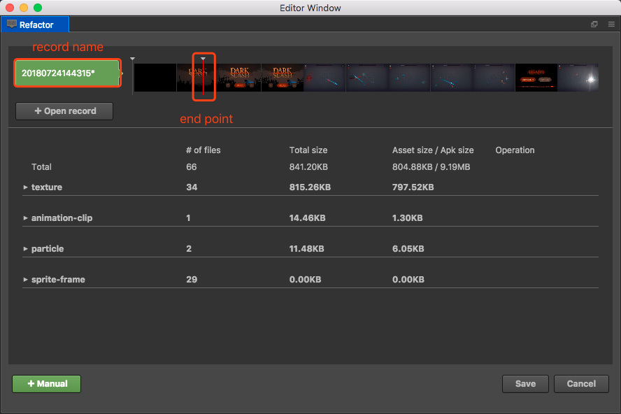
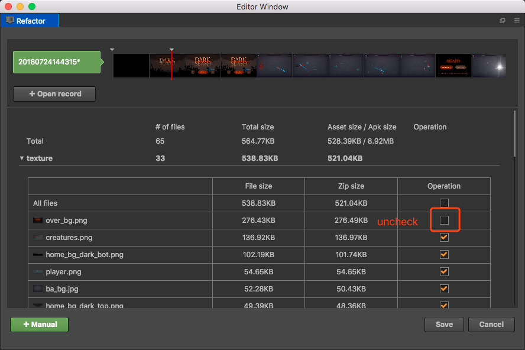
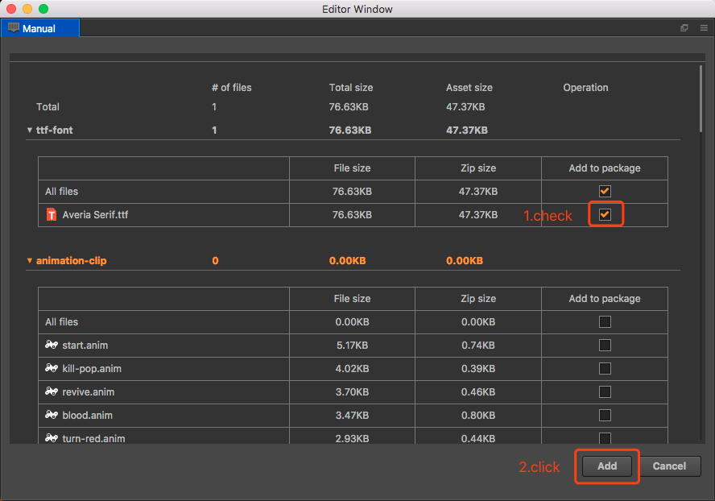

# Publish Android Instant Games

## Requirement 
 - Android Studio 3.0+

 - Android Phone 6.0+

 - NDK r10c +

   

## Instant Games Publish Process

 1. Start CocosCreator. 

 2. Open **Projec** t-> **Build panel** , select **Android Instant** platform , and **android-instant** template.

 3. If you don't need to refactor or want to experience the publish process , You can hook the **Skip Record & Refactor **box , then click **Build** , **Compile **, connect android phone to computer and then click **Play** , when process complete you can run instant app on the phone.

    

    4. If you need  **refactor** , you can click **Record** button and simulator will be opened. The simulation will automatically record the resources used . What we need to do is to play the game according to our game flow and let the simulator record resources information.

       

    5. After the recording is completed, click on the **Refactor**, the Refactor panel will be opened. In this panel, we can complete the refactor operation.(please see the following introduction  **Refactor** for more detail)

    6. After we do the **Refactor**, we need to select the path of our record in the **record config path**, click the **...** button and select the record we just create.(the records path is in `path_to_your_project/temp/android-instant-games/profiles`, and we delete the record that we don't need by delete the record folder)

       

    7. Like step 3, Click **Build**, **Compile**, **Play** button, and make sure the phone is on the same LAN as the PC, you can test the game running on the Instant App (More about Build config description please see the following introduction **Android Instant Build Panel**)

       

## Refactor

The **Refactor** is used to edit the first package of the game and select the resources to be placed in the first package.

### How to use

1. When you finish the Record, Click **Refactor** to open Refactor panel.

2. The **Refactor** opens the latest record by default. If you need to open another record, you can click **+ Open record**. The **Refactor** can also open multiple records at the same time for comparison.

3. Drag the **end point**, you can choose to divide the resources into the first package. When you drag the end point, you can find the data of the file list and the total size and other data changes. Select the size of the first package suitable for the game and we can finish the first step of the record.

4. **Refactor** also can cancel resource manual, on the page of the file list, expand the nodes of each category, and we can see the size of each file, we can remove the resource by uncheck the resource item.

   

5. If some resources are not in the first package, but we want to put it in the first package, we can click the **+Manual** button to open **Manual** panel, the rest of the resources will be presented here. Check the resources you need to put into the first package and click the **Save** button you will find it add to the first panel.

   

6. We can also drag resources from **Assets** panel  into **Refactor** panel to add another resources into first package.

7. Finally, click **Save** button to save the first package info into record.

8. In the **Record config path** option of the **Build...** panel,select the record we just edited, and then click the **Build** button, creator will use this record to generate the first package and other resources.

## Android Instant Build Panel

### Several major configurations description

- **Server Address**: CocosCreator will go to this address to download resources tha are not in the first package. we can put remote_res (resource path:`build/android-instant/remote_res`) on our servers or CDN.

- **Default URL**: Android will load your instant app by this URL.(see more detail: <a href="https://developer.android.com/topic/google-play-instant/getting-started/first-instant-app">Android Instant App Docs</a>)

- **Record Config Path**: CocosCreator will use this crecord config to generate first package and remote_res folder.

  

## Instant Cookie API

We have provided some APIs to make it easier for developers to call some of Google's features directly, we support Google Cookie API now.(CocosCreator Cookie API Demo: <a href="https://github.com/wuzhiming/AndroidInstantCookieDemo">**AndroidInstantCookieDemo**</a>)

- cc.androidInstant.showInstallPrompt()   For more information, please visit：<a href="https://developers.google.com/android/reference/com/google/android/gms/instantapps/InstantApps.html#showInstallPrompt(android.app.Activity,%20android.content.Intent,%20int,%20java.lang.String)t">showInstallPrompt</a>

- cc.androidInstant.isInstantApp()   For more information, please visit：<a href="https://developers.google.com/android/reference/com/google/android/gms/instantapps/PackageManagerCompat#isInstantApp()">isInstantApp</a>

- cc.androidInstant.getInstantAppCookie()   For more information, please visit：<a href="https://developers.google.com/android/reference/com/google/android/gms/instantapps/PackageManagerCompat#getInstantAppCookie()">getInstantAppCookie</a>

- cc.androidInstant.setInstantAppCookie()   For more information, please visit：<a href="https://developers.google.com/android/reference/com/google/android/gms/instantapps/PackageManagerCompat#setInstantAppCookie(byte%5B%5D)">setInstantAppCookie</a>

- cc.androidInstant.getInstantAppCookieMaxSize()    For more information, please visit：<a href="https://developers.google.com/android/reference/com/google/android/gms/instantapps/PackageManagerCompat#getInstantAppCookieMaxSize()">getInstantAppCookieMaxSize</a>

  

## Knowledge links

1. <a href="https://developer.android.com/topic/google-play-instant/getting-started/first-instant-app">Instant App</a>
2. <a href="https://developers.google.com/android/reference/com/google/android/gms/instantapps/InstantApps">Google InstantApps API</a>
3. <a href="https://github.com/googlesamples/android-instant-apps">Google Instant App Samples</a>
4. <a href="https://github.com/wuzhiming/AndroidInstantCookieDemo">CocosCreator AndroidInstantCookieDemo</a>

