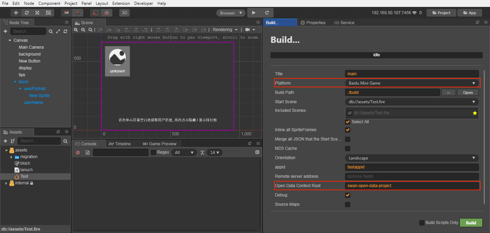
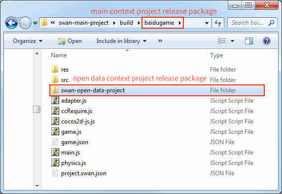
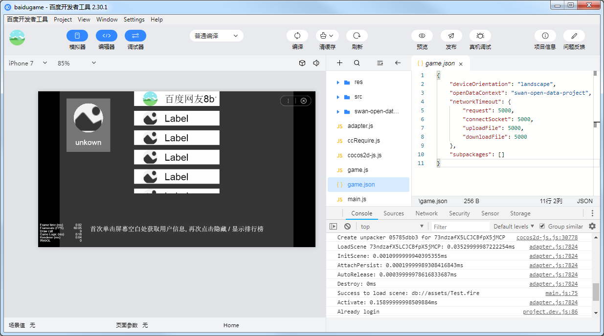

# Access to the Open Data Context of Baidu Mini Games

Similar to WeChat Mini Game, in order to protect its social relationship chain data, **Baidu Mini Game** also implements an **Open Data Context**, which can get friends information that is both playable and two-way attention. This is a separate game execution environment. The resources, engines, and programs in the **Open Data Context** are completely isolated from the main game. Developers can only access the `swan.getUserInfo()`, `swan.getUserCloudStorage()`, and `swan.getFriendCloudStorage()` APIs provided by Baidu Mini Games in the Open Data Context, which are used to obtain the corresponding user data. Since the open data context can only be rendered on the `sharedCanvas` of offscreen canvas, we need to draw the `sharedCanvas` onto the main context.

Since the open data context is a closed, independent JavaScript scope, developers need to create two projects:

- Main context project (normal game project)
- Open data context project (project that use the Baidu API to obtain user data)

In the open data context project, it is packaged independently through the open data context packaging process and placed in the Baidu release package of the main context project, which can be previewed and debugged on the simulator and physical device as a complete Baidu Mini Game project.

The specific use method of baidu Baidu Mini Game Open Data Context, please refer to [The sample project for Open Data Context](https://github.com/cocos-creator/example-baidu-subdomain).

## Main context project

Create a node in the main context as an open data context container, add the `SwanSubContextView` component to set the open data context view and update the open data context texture. The aspect ratio of this node should be equal to the aspect ratio of the open data context design resolution (otherwise stretching happens).

## Open data context project

Create an open data context project to obtain user data through the relevant API, and create a display of UI according to your own needs. The entire open data context project should only contain its content UI, and the design resolution of the Canvas component in the scene should be set to the full resolution of the UI, not the resolution corresponding to the main context.

## SwanSubContextView Tips

This is the core component of the open data context solution. In addition to the regular requirements, there are a few tricks that allow users to better control the performance of open data contexts.

- **View update**

  In general, the open data context view is fixed, but there are also cases where the open data context is updated in the view node of the main context, such as using the `Widget` to adapt the parent node, such as the case where the design resolution changes after the scene switch. Or the developer manually adjusted the size of the view. In this case, the developer must call the `updateSubContextViewport` interface to update the view parameters in the open data context so that the event can be correctly mapped to the open data context view.

- **Manually update the texture**

  In Creator v2.1.1, when the open data context is evoked, as soon as the **SwanSubContextView** component load succeeds, the open data context texture begins to update to the main context and is displayed, after which the texture is updated for each frame. However, the update of the open data context texture may sometimes be costly, and the open data contexts designed by developer is a static interfaces (such as page-turning interfaces), in this case, you do not need to update the texture per frame, you can try to prevent each frame updating logic by disabling components and update it by manually calling the `update` function when needed:

  ```js
  subContextView.enabled = false;
  subContextView.update();
  ```

  This manual control is the best performance solution. If you need to enable automatic update texture, the main loop of the Open Data Context resumes execution when the **SwanSubContextView** component is enabled.

- **Set the texture update frequency**

  In Creator v2.1.1, the **FPS** property has been added to the **SwanSubContextView** component, and the user can directly control the frame rate of Open Data Context by setting FPS.

  

  The FPS property has the following two advantages:

  - The Main Context will calculate an `update interval` ​​based on the **FPS** you set. This `update interval` prevents the engine from frequently calling `update` to update the Canvas texture of Open Data Context. 
  - By reducing the **FPS** of Open Data Context, you can also reduce the performance overhead of Open Data Context to some extent.

  **Note: The FPS property overrides the `cc.game.setFrameRate()` implementation of the Open Data Context, so it is recommended to set the FPS property of the `SwanSubContextView` component directly in the Main Context project.**

## Release Process

### Module selection

Since the code and resources of the Baidu open data context cannot be shared with the main context, it is very sensitive to the package. The developer needs to set the [Project module culling option](../getting-started/basics/editor-panels/project-settings.md) for the open data context project.

It should be noted that the developer cannot remove the **Canvas Renderer** module from the **Project Setting -> Module Config** panel in the open data context project, because the open data context only supports Canvas rendering. At the same time, the rendering components supported under Canvas rendering are also limited (the UI components are not limited) and currently only support:

- Sprite
- Label
- Graphics
- Mask

### Release Steps

1. Open the main context project, open the **Build** panel in **Menu Bar -> Project**, select the **Baidu Mini Game** in the **Platform** item, and fill in the **Open Data Context Root**. This directory is the path to the publishing package that is generated after the open data context is built. Then click the **Build**.

    

    This step will help the user automatically configure the **Open Data Context Root** into the main context project `build -> baidugame -> game.json` to identify the directory where the open data context file is located under the main context release package.

    

2. Open the open data context project, open the **Build** panel, select **Baidu Mini Game Open Data Context** in the **Platform** item.

3. The **Build Path** set the same path in the **Open Data Context Root** filled in the main context, that is, assigned to the release package directory of the main context project. Then click the **Build**.

    **Note**: The **Title** in the **Build** panel must match the name of the **Open Data Context Root** set in the main context project.

    

    Or you can not modify the **Build Path** to manually copy the release package to the release package directory of the main context project after the open data context project is built. As shown below:

    

4. Use Baidu developer tools to open the main context project release package, and then you can release and debugging follow the normal process of Baidu Mini Game.

    

## Reference link

- [Cocos Creator Open Data Context Sample Project of Baidu Mini Games](https://github.com/cocos-creator/example-baidu-subdomain)

- [Baidu official document: Relationship Chain Data Usage Guide](https://smartprogram.baidu.com/docs/game/tutorials/open_api/guide/#%E5%BC%80%E6%94%BE%E6%95%B0%E6%8D%AE%E5%9F%9F)
