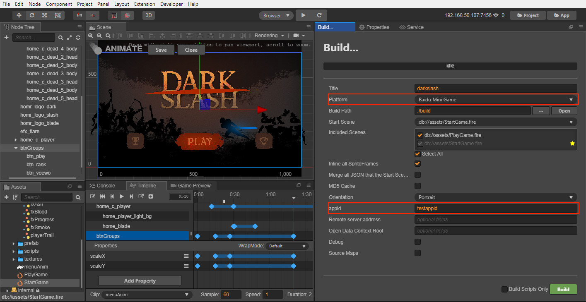
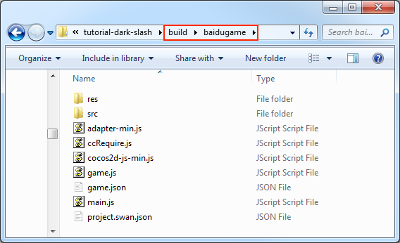

# Publish to Baidu Mini Games

**Baidu Mini Game** is an extension of the **Baidu Mini Program** platform, which is provided in the **Baidu App**. This platform not only provides powerful game capabilities, but also provides a large number of native interfaces, such as payment, file system, location, sharing, etc. like Smart Mini Progame. It is equivalent to combining the advantages of **Web** for easy propagation and rich **Native** features.

The operating environment of **Baidu Mini Game** is similar to that of **WeChat**. The basic idea is to provide the encapsulated necessary WEB interface to the user, and pursue the same development experience as WEB. **Baidu Mini Game** provides a WebGL interface encapsulation based on the Smart Mini Progame environment, which greatly improves rendering capabilities and performance. However, since these interfaces are encapsulated by the **Baidu** team through the native implementation of self-research, they are not equivalent to the browser environment.

As an engine, in order to simplify the developer's workload as much as possible, the main tasks we have done for users include:

- The engine framework is adapted to the **Baidu Mini Game** API, pure game logic level, users don't need any additional modifications.
- **Cocos Creator** editor provides a fast packaging process, directly released as a **Baidu Mini Game**.
- Automatic loading of remote resources, cache resources and cache resource versioning.

For specific **Baidu Mini Game** application, station development, game submission, review and release process can refer to [Baidu Mini Game registration guidance document](https://smartprogram.baidu.com/docs/game/).

## Using Cocos Creator to release Baidu Mini Games

### Prerequisites

- Download and install **Baidu Developer Tools** in [Baidu Developer Tools Documentation](https://smartprogram.baidu.com/docs/game/tutorials/howto/dev/).
- Download and install the **Baidu app** in the app store of your phone.
- Log in to [Smart Mini Progame Platform](https://smartprogram.baidu.com/developer/index.html) and find **App ID**.

    

### Release process

1. Select the **Baidu Mini Game** in the Platform of the **Build** panel, fill in the mini game **appid**, and then click **Build**.

    

2. After the build is completed, a Baidu mini game project folder of **baidugame** will be generated under the project's build directory, which already contains the configuration files of Baidu Mini Game's environment: `game.json` and `project.swan.json`.

    

3. Use the **Baidu Developer Tools** to open the **baidugame** folder, and you can preview and debug the game content of Baidu mini game project. About how ​​to use Baidu Developer Tools, please refer to [Baidu Developer Tools Documentation](https://smartprogram.baidu.com/docs/game/tutorials/howto/dev/) for details.

    

    **Note**: When preview and debugging, if there is a prompt that **The current version of the developer tool can't publish mini program, please update to the latest developer tools**. This means the **appid** filled in the **Build** panel is the **appid** of the **Baidu Mini Program**, not the **appid** of the **Baidu Mini Game**, please re-apply for the **appid** of the **Baidu Mini Game**.

## Resource Management for Baidu Mini Game Environment

Baidu Mini Game is similar to WeChat Mini Game, there are restrictions on the package. Anything more than 4MB of extra resources must be downloaded through the network request.

We recommend that you only save script files in mini game packages, and other resources are downloaded from remote servers. And the download, cache and version management of remote resources, Cocos Creator has already done it for you. The specific implementation logic is similar to the WeChat Mini Game. For details, please refer to [Resource Management for WeChat Mini Game Environment](./publish-wechatgame.md#resource-management-for-wechat-mini-game-environment).

At the same time, when the **md5Cache** feature of the engine is enabled, the url of the file will change as the content of the file changes. When the game releases a new version, the resources of the old version will naturally become invalid in the cache, and only the new resources can be requested from the server, which achieves the effect of version control.

Specifically, developers need to do the following:

1. When building, check the md5Cache feature in the **Build** panel.
2. Set **Remote server address** in the **Build** panel and then click **Build**.
3. After the build is complete, upload the `res` folder under the **Baidu Mini Game** release package directory to the server.
4. Delete the `res` folder under the local release package directory.

**Note**:

- When Baidu loads the resources on the remote server on the physical device, it only supports access via https, so the resource file must be placed on https, otherwise the loading of the resource will fail.

- If the cache resource exceeds the environment limit of Baidu, you need to manually clear the resource. You can use the `remoteDownloader.cleanAllCaches()` and `remoteDownloader.cleanOldCaches()` interfaces to clear the cache in Baidu mini game. The former will clear all cache resources in the cache directory, please use it with caution. The latter will clear the cache resources that are not used in the current application in the cache directory.

## Baidu Mini Game Subpackage Loading

The subpackage loading method of Baidu mini game is similar to WeChat, and the package restrictions are as follows:

- The size of all subpackage of the entire Mini Game can not exceed **8MB**.
- The size of single subpackage / main package can not exceed **4MB**.

Please refer to the [SubPackage Loading](../scripting/subpackage.md) for details.

## Platform SDK Access

In addition to pure game content, the Baidu Mini Game environment also provides a very powerful native SDK interface, these interfaces are only exist in the Baidu Mini Game environment, equivalent to the third-party SDK interface of other platforms. The porting of such SDK interfaces still needs to be handled by developers at this stage. Here are some of the powerful SDK capabilities offered by Baidu Mini Game:

1. User interface: login, authorization, user information, etc.
2. Baidu cashier payment
3. Forwarding information
4. File upload and download
5. Other: images, locations, ads, device information, etc.

### Access to the Open Data Context of Baidu Mini Games

Similar to WeChat Mini Game, in order to protect its social relationship chain data, Baidu Mini Game also implements an **Open Data Context**, which can get friends information that is both playable and two-way attention. This is a separate game execution environment. The resources, engines, and programs in the **Open Data Context** are completely isolated from the main game. Developers can only access the `swan.getUserInfo()`, `swan.getUserCloudStorage()`, and `swan.getFriendCloudStorage()` APIs provided by Baidu Mini Games in the Open Data Context, which are used to obtain the corresponding user data.

For details about the Baidu Mini Game Open Data Context process, please refer to [Access Baidu Mini Game Open Data Context](./publish-baidugame-sub-domain.md).

## Baidu Mini Games known issues

At present, our adaptation work of Baidu Mini Game is not completely finished, and the following components are not supported for the time being:

- VideoPlayer
- WebView

If needed, you can directly call Baidu's [API](https://smartprogram.baidu.com/docs/game/api/openApi/authorize/) to use.

## Reference link

- [Baidu Mini Game Registration Guide](https://smartprogram.baidu.com/docs/game/)
- [Baidu Developer Tools Documentation](https://smartprogram.baidu.com/docs/game/tutorials/howto/dev/)
- [Baidu Mini Game API documentation](https://smartprogram.baidu.com/docs/game/api/openApi/authorize/)
