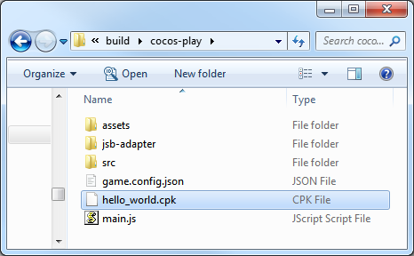

# Publish to Cocos Play

## Environment Configuration

- Download and install [Cocos Play Self-test Tools](https://gamebox.gitbook.io/project/you-xi-jie-ru-wen-dang/ji-shu-dui-jie/zi-ce-gong-ju) on your Android device (recommended Android Phone 6.0 or above).

## Release Process

Use Cocos Creator to open a project. Open the **Build** panel from the **Menu bar -> Project**, select **Cocos Play** in the **Platform** dropdown, and then click **Build**.

### Configuration Options

The specific filling rules for the relevant parameter configuration are as follows:

- **Main Bundle Compression Type**

  Set the compression type of the main package, please refer to the [built-in Asset Bundle — `main`](../asset-manager/bundle.md#the-built-in-asset-bundle) documentation for details.

- **Main Bundle Is Remote**

  This option is optional and needs to be used with the **Resource Server Address** option. 
  If set, the main package is configured as a remote package, and along with its related dependent resources are built into a built-in Asset Bundle — [main](../asset-manager/bundle.md#the-built-in-asset-bundle) under the **remote** folder of the release package directory. You need to upload the entire **remote** folder to the remote server.

- **Start Scene Asset Bundle**

  This option is optional. 
  If set, the start scene and its related dependent resources are built into the built-in Asset Bundle — [start-scene](../asset-manager/bundle.md#the-built-in-asset-bundle) to speed up the resource loading of the start scene. Please refer to the [Start Scene Loading](publish-wechatgame.md#speed-up-the-loading-of-the-start-scene) for details.

- **Custom game package path**

  This item is optional. You can customize the directory in which the `.cpk` (generated after the build) is stored. If not set, the `.cpk` is generated to the release package `build/cocos-play` directory by default.

- **Resource Server Address**

  This option is optional and used to fill in the address of the remote server where the resources are stored.

  - If this option is left blank, the `build/cocos-play/remote` folder in the release package directory will be packaged into the **cpk** package.

  - If this option is filled in, the `remote` folder will not be packaged into the built **cpk** package. You need to manually upload the `remote` folder to the filled in Resource Server Address after build.

  Refer to the Resource Management section at the bottom of the document for more details.

- **Separate Engine**

  Starting with v2.3.3, Cocos Play supports separate engine. Check **Separate Engine** when using, and then build and release normally in the **Build** panel, without additional manual operation. You can refer to the [WeChat Engine Plugin Instructions](./wechat-engine-plugin.md) for details.

### Build

After the build is completed, click the **Open** button behind the **Build Path** to open the build release package. You can see that the **cocos-play** directory is generated under the default release path `build` directory, which is the exported Cocos Play game project directory and **.cpk** file, the **cpk** package is in the `build/cocos-play` directory. If you have set a **Custom game package path**, the **cpk** package will be generated into the specified directory.

### Access testing

Developers must use the Cocos Play **Self-test Tools** to test access without problems before submitting to the platform for review. The size of the package is not required for the self-test, but if it is to be submitted for review, the package size cannot exceed **10M**. 
The **Self-test Tools** can launch the game and provide features such as game login, payment, etc. By reading the game configuration parameters, you can determine the type of game to start and how the game will start. For details, please refer to [Self-test Tools Documentation](https://gamebox.gitbook.io/project/you-xi-jie-ru-wen-dang/ji-shu-dui-jie/zi-ce-gong-ju).

Open the previously installed **Self-test Tools**, then click the **Configure Game** button at the top left of the **Self-test Tools** to enter the game configuration page. Configure parameters as required and then click **Save**.

#### Parameters

| Parameters      | Function Explanation  |
| --------------  |  -----------          |
| **gameId**      | Game ID, which can be obtained from the background. |
| **gameKey**     | Game key, which can be obtained from the background. |
| **gameSecret**  | Game secret key, which can be obtained from the background. |
| **gameType**    | Game type, including **Versus** and **non-Versus**. You can see how to use it in the **Start Game** section below. |
| **gameMode**    | Game mode, please select **Runtime**.    |
| **loadType**    | Game load type, which is how the game starts. Includes both **File** and **Url**. Please refer to the **Start Game** section below. |
| **path**        | Game load address, needs to be used with **loadType**. Please refer to the **Start Game** section below.   |

### Start Game

There are two ways to start the game through the **Self-test Tools**.

1. Load the game package as a file from the specified location (The game loadType is **File**).

    - Copy the `.cpk` file generated after the build to the device directory, if it is copied to the internal storage directory of device, you need to create a new folder (For example named `cocosplay`) in the internal storage directory and copy the `.cpk` file to the `cocosplay` folder.
    - Select **File** in the **loadType** of the game configuration page.
    - Fill in the path to the `cocosplay` folder where the `.cpk` file is placed in the **path** option. Such as `cocosplay/game.cpk`.
    - Click on **Save** after the configuration is complete, then click on **Start Game** to open the game.

2. Open the game as a web page from the specified URL (The game loadType is **Url**).

    - Upload the `.cpk` file to the server.
    - Select **Url** in the **loadType** of the game configuration page.
    - Fill in **path**, such as: <http://192.168.0.1:8080/game.cpk>.
    - Click on **Save** after the configuration is complete, then click on **Start Game** to open the game.

## Resource Management for Cocos Play Environment

**Cocos Play** is similar to **WeChat Mini Game**. There are restrictions on the package size. The main package size limit for Cocos Play is **10MB**, more than that must be downloaded via a network request.

Cocos Creator already helps developers with downloading, caching and version management of remote resources. The specific implementation logic and operation steps are similar to the WeChat Mini Game. Please refer to the [Resource Management for WeChat Mini Game](./publish-wechatgame.md#resource-management-for-the-wechat-mini-games) documentation for details.

## Reference documentation

- [Cocos Play Center](https://gamebox.cocos.com/)
- [Cocos Play Documentation Center](https://gamebox.gitbook.io/project/)
- [Cocos Play API Documentation](https://gamebox.gitbook.io/project/you-xi-jie-ru-wen-dang/ji-shu-dui-jie/ji-chu-neng-li)
- [Cocos Play Self-test Tools](https://gamebox.gitbook.io/project/you-xi-jie-ru-wen-dang/ji-shu-dui-jie/zi-ce-gong-ju)
- [Cocos Play Self-test Tools Download](https://gamebox.gitbook.io/project/you-xi-jie-ru-wen-dang/zi-ce-gong-ju)
