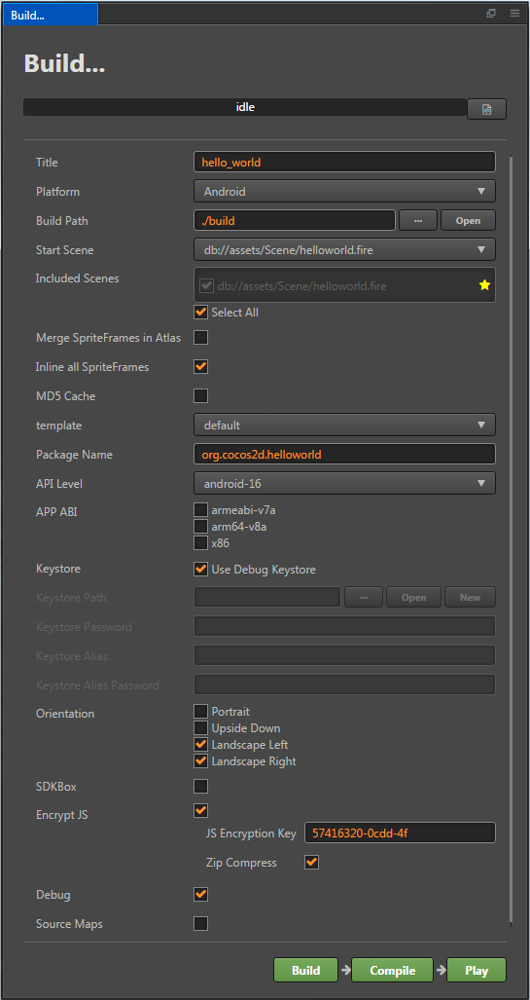
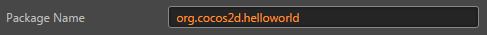
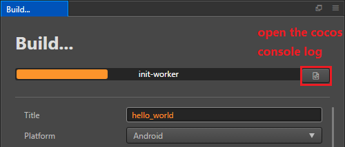
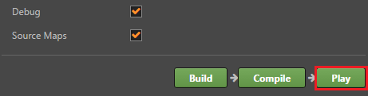
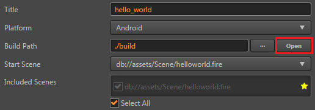

# Build and release games on Native platforms

Open `Project/Build...` in the main menu and open `Build` panel.

Currently, there are four native platforms, which include: Android, iOS, Mac and Windows. The options of release games on Mac and Windows will only appear in concerning operating systems.



## Configure a Package Name

An input field named **package name** will appear in the constructing release window after selecting an native platform, into which you can input the package name of your game (also called Package Name or Bundle ID). The package name is usually arranged in the reverse order of the product's website url, such as: `com.mycompany.myproduct`.

**Notice**:

- Only numbers, letters and underscores can be included in the package name. Besides, the last section of package name should start with a letter, but not an underline or a number.
- If your Xcode version is less than 7.2, the package name also can not include underscores.



## Build settings

### Merge SpriteFrames in Atlas

Merge all the SpriteFrames in the same atlas into the same package. This option is disabled by default. When enabled, it can reduce the number of SpriteFrame files that need to be downloaded when hot update. However, if the number of SpriteFrame in the atlas is large, the startup time on the native platform may be extended.

### Inline all SpriteFrames

When merging assets automatically, combine all SpriteFrames and the assets that are being relied on into the same package. It is recommended to enable this option in web. When enabled, it will increase the overall game size slightly, consume a little bit of network traffic, but can significantly reduce the number of network requests. It is recommended to disable this option in native, because it will increase the package size used in hot update.

### MD5 Cache

Append MD5 value to the exported assets for resolving native cache issue.
```js
// If you want to load the resource by itself, you need to call the JS layer's transformURL for URL conversion by the following way
auto cx = ScriptingCore::getInstance()->getGlobalContext();
JS::RootedString url(cx);
ScriptingCore::getInstance()->evalString('cc.loader.md5Pipe.transformURL(url);', &url);
````

## Build a Native Project

After selecting the release platform and setting up the package name and initial scene, the project can now be built. Click the **Build** button on the bottom right corner, and start building workflow.



When compiling scripts and zipping resources, a progress bar will display on the top of the window. After the progress bar has reached 100%, please continue to wait unitl the building of the project in **console** is finished. If it's successful, the diary as showed below will display:

```bash
Built to "/myProject/tutorial-blackjack/build/tutorial-blackjack" successfully
```

Next, you can choose to directly open the original preview provided by Cocos Creator, or manually open the constructed native project in IDE of corresponding platform for further preview, adjustment and release.

## Direct Preview

Click the **Play** button on the bottom right corner, you can preview games of native platforms via the default method provided by Cocos Framework.



On Mac/iOS/Windows platforms, Cocos Simulator will be used to preview the game on the desktop. While on Android platform, you can preview only after connecting your computer with smartphone via USB port and opening USB test on your computer.

After clicking **Play** button, a part of the building work will be continued, the real time progress of which will be seen on the console.

## Use an Native Project



Click the **open** button near the release path, the building release path will be opened in the document manager of operating system.

`jsb` of this path includes all the native build projects.


The red frames in the picture indicate projects of different native platforms. Next, only by using IDE(such as: Xcode,Eclipse,Visual Studio) that corresponds to the native platform to open these projects, can you make further operations like compilation, preview and release. For the usage instructions for native platform's IDE, please search related information on your own, which will not be discussed in detail here.


