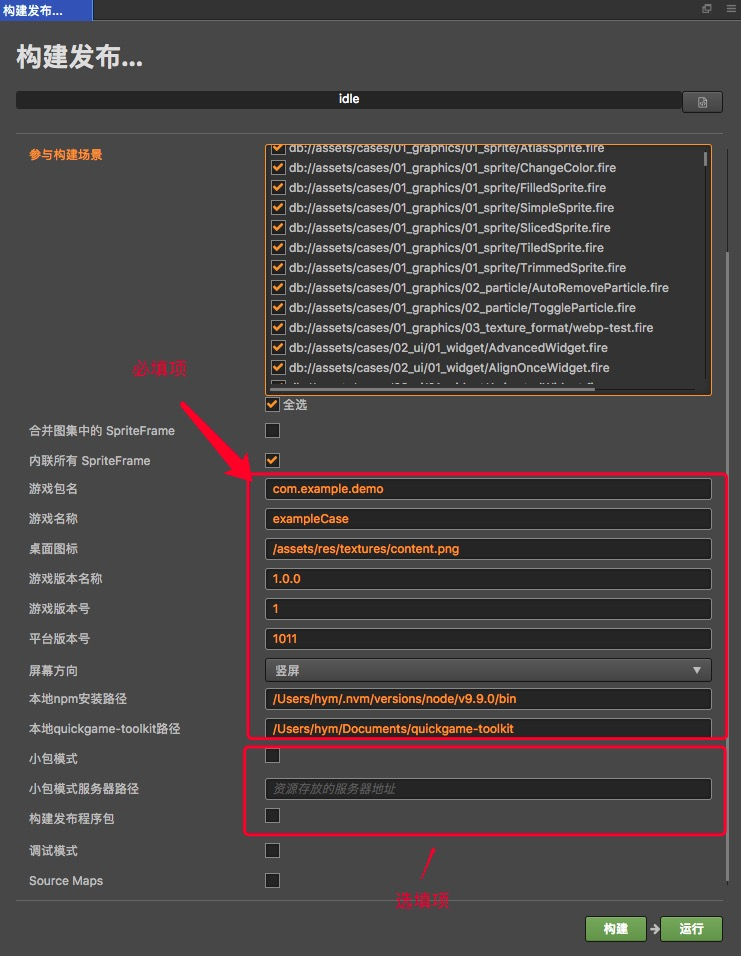
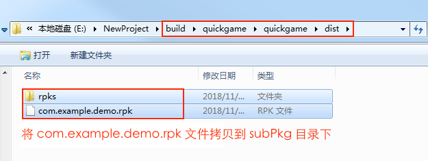

# Publishing to OPPO Mini Games

Starting with __v2.0.5__, __Cocos Creator__ officially supports the release of games to the __OPPO Mini Game__ platform. It takes just a single click with __Cocos Creator__ to publish to the __OPPO Mini Game__ platform.

## Environment Configuration

- Download [Quick Game Debugger](http://cdofs.oppomobile.com/cdo-activity/static/quickgame/tools//bbce19cecbf7c26c396762d61192a11e.zip) and install it on your Android device (Android Phone 6.0 or above is recommended)

- Install [nodejs-8.1.4](https://nodejs.org/zh-cn/download/) or above, globally

- Download [quickgame-toolkit](http://cdofs.oppomobile.com/cdo-activity/static/quickgame/tools//0974ab43dc361f148189515ee254ff6d.zip) and unzip it.

  If you want to reduce the wait time for building `rpk` with __Cocos Creator__ for the first time, you can do the following to install the project dependencies:

  ```bash
   # Command line is specified in the unpacked quickgame-toolkit directory
   cd quickgame-toolkit

   #Installation project dependencies
   npm install
  ```

- Determine whether you need to install [Debugging Tools](http://cdofs.oppomobile.com/cdo-activity/static/quickgame/tools//6de9d1c3f06030ae7c52f5105f60383f.zip) according to your own development needs.

## Release Process

1. Use __Cocos Creator__ to open the project project that needs to be released. Select **OPPO Mini Game** in the **Publishing Platform** dropdown of the **Build Release** panel.



Where **Game Package Name**, **Game Name**, **Desktop Icon**, **Game Version Name**, **Game Version Number**, **Platform Version Number**, **Local npm Installation Path**, **Local Quickgame-toolkit Path** These parameters are required and filled in according to the user's requirements and the prompt information in the parameter input box. The **Packet Mode**, **Packet Mode Server Path**, **Build Release Package** is optional. The specific filling rules for the relevant parameter configuration are as follows:

- **App icon**

  **App icon** is required. When building, the app icon will be built into the __OPPO Mini Game__ project. Please make sure that the image under the app icon path exists. For example, if the application icon path is /assets/image/logo.png, the image directory and logo.png need to exist in the **Assets** directory of __Cocos Creator__ **Explorer**.

- **Local npm Installation Path**

  **Local npm installation path** is required. The purpose of filling out the npm installation path is to provide an environment for building rpk. If you do not fill in the item, __Cocos Creator__ will only export the game project directory and will not generate the rpk package.

    - Mac system

    ```bash
    # Get local npm installation path
    which npm

    # If the output is
    /Users/yourname/.nvm/versions/node/v8.1.4/bin/npm

    # Then the local npm installation path is filled in as:
    /Users/yourname/.nvm/versions/node/v8.1.4/bin
    ```

    - Windows system

    ```bash
    # Get local npm installation path
    where npm

    # If the output is
    C:\Program Files\nodejs\npm

    # Then the local npm installation path is filled in as
    C:\Program Files\nodejs
    ```

- **local quickgame-toolkit path**

  **Local quickgame-toolkit path** is required. The purpose of this entry is to call the command provided by __quickgame-toolkit__ to build `rpk` and generate `rpk` in the __build/quickgame/dist/ directory__.

    **Please note:** Fill in the **local quickgame-toolkit path** for the __quickgame-toolkit__ file path after **extracting**.

- **Small package mode and packet mode server path**

  This item is optional. The in-package volume of the mini-game contains code and resources that cannot exceed 4M, and resources can be loaded via network requests. **Small package mode** is to help users keep the script files in the small game package, other resources are uploaded to the remote server, and downloaded from the remote server as needed. And the download, cache and version management of remote resources, __Cocos Creator__ has already helped the user. What the user needs to do is the following two steps:

  1. When building, check the **packet mode** and fill in the **packet mode server path**. Then click on **Build**.

  2. After the build is complete, click the **Open** button after the **Publish Path** to upload the **jsb-link/res** directory under the release path to the packet mode server. For example, if the default publishing path is build, you need to upload the **build/jsb-link/res** directory.

  At this point, the `res` directory will no longer be included in the built-up quickgame directory, and the resources in the res directory will be downloaded from the filled **packet mode server address** via the network request.

- **Build a release package**

  **Build a release package** is optional. The purpose of this check is to build an rpk package that can be published directly. However, there are three prerequisites: **local npm installation path**, **local quickgame-toolkit path**, and **add release signature**. <br>
  If you do npsql -U postgres -Wot check the **Build Release Package**, the `rpk` package for testing is built.

    - Add release signature:

      In the game project root directory, add the **build-templates/jsb-link/sign/release** directory, then place your private key file **private.pem** and **certificate.pem** in the release directory. As shown below:

      

    - How to generate a release signature

      The user needs to generate the signature file **private.pem**, **certificate.pem** through tools such as `openssl`.

    ```bash
    # Command line assignment to the release directory just added to the root directory of the game
    cd E:\workspace\YourProject\build-templates\jsb-link\sign\release
    # Generate a signature file with the openssl command tool
    openssl req -newkey rsa:2048 -nodes -keyout private.pem -x509 -days 3650 -out certificate.pem
    ```

  **Note**: `openssl` can be opened directly in the terminal in Linux or Mac environment, and in the Windows environment you need to install `openssl` and configure system environment variables.

2.  **Build release** After the relevant parameters of the panel are set, click **Build**. After the build is complete, click the **Open ** button behind the **Publish Path** to open the build release package. You can see that the **quickgame** directory is generated under the default release path build directory, which is the exported __OPPO Mini Game__. The game project directory and `rpk`, `rpk` package are in the __/build/quickgame/dist__ directory.


3. run the built `rpk` to the phone.

Copy the generated mini-game `rpk` file (located in the dist directory of the minigame project's quickgame directory) to the `/sdcard/games/` directory on your phone's SD card. Then open the **Quick Game Debugger** that has been installed before on the Android device, click the **Quick Game** section, and then find the icon corresponding to the game name. If not found, click on the upper right corner. More button - refresh button to refresh.

4. Subpackage rpk

Subpackage loading, that is, splitting the game content into several packages according to certain rules, only downloading the necessary packages when starting up for the first time. This necessary package is called **main package**, and the developer can trigger in the main package. Download other sub-packages, which can effectively reduce the time spent on the first boot. To use this function, you need to set [Subcontracting Configuration](../scripting/subpackage.md) in __Cocos Creator__, and the package will be automatically subcontracted when the setting is completed.

After the build is complete, the subpackage directory is in the `/build/quickgame/quickgame/dist` directory. <br> 
In this case, you need to create a new **subpackage** directory in the **sdcard** directory of the Android device, and then copy the **.rpk** file in the `/build/quickgame/quickgame/dist` directory to the subpackage directory.



Then switch to the **Package Load** section of **Quick App**, click Refresh at the top right to see the game name of the subpackage, click **Second Open** to use the same as the normal packaged `rpk` .


## Related Reference Links

- [OPPO Quick Game Tutorial](https://cdofs.oppomobile.com/cdo-activity/static/201810/26/quickgame/documentation/games/quickgame.html)
- [OPPO Quick Game API Documentation](https://cdofs.oppomobile.com/cdo-activity/static/201810/26/quickgame/documentation/feature/account.html)
- [OPPO Quick Game Tool Download](https://cdofs.oppomobile.com/cdo-activity/static/201810/26/quickgame/documentation/games/use.html)
