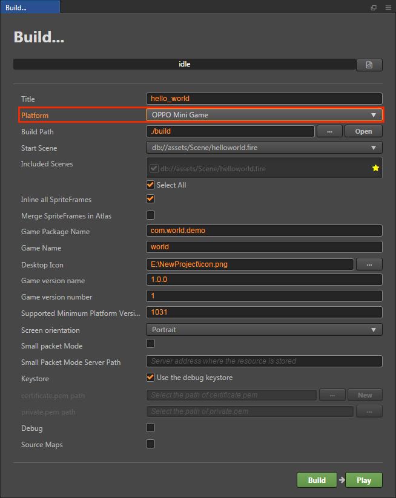
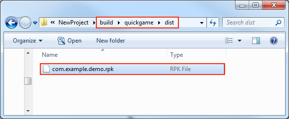

# Publishing to OPPO Mini Games

## Environment Configuration

- Download [OPPO Mini Game Debugger [cn]](https://activity-cdo.heytapimage.com/cdo-activity/static/201810/26/quickgame/documentation/#/games/use) and install it on your Android device (Android Phone 6.0 or above is recommended)

- Install [nodejs-8.1.4](https://nodejs.org/en/download/) or above, globally

## Release Process

1. Use __Cocos Creator__ to open the project that needs to be released. Select **OPPO Mini Game** in the **Platform** dropdown of the **Build...** panel.

    

The specific filling rules for the relevant parameter configuration are as follows:

- **Game Package Name**

  **Game Package Name** is filled in according to the user's needs. It's required.

- **Game Name**

  **Game Name**, the name of the OPPO Mini Game, is required. And the **Title** at the top of the **Build** panel does not participate in the OPPO mini game packaging process.

- **Desktop Icon**

  **Desktop Icon** is required. Click the **...** button at the back of the input box to select the icon you want. When building, the Desktop Icon will be built into the __OPPO Mini Game__ project. Desktop Icon suggest using PNG pictures.

- **Game Version Name**

  This item is required. **Game Version Name** is the real version, such as: 1.0.0.

- **Game Version Number**

  This item is required. **Game Version Number** is different from the **Game Version Name**, and the **Game Version Number** is mainly used to distinguish the version update. Each time when you submit audit, the game version number is at least 1 higher than the value of the last submitted audit. It must not be equal to or less than the value of the last submitted audit, and it is recommended that the **Game Version Number** be recursively incremented by 1 each time when the audit is submitted. **Note**: The **Game Version Number** must be a positive integer.

- **Supported Minimum Platform Version Number**

  This item is required. According to the requirements of OPPO Mini Games, this value must be greater than or equal to **1031** at present.

- **Small Packet Mode**

  This item is optional. The in-package volume of the mini-game contains code and resources that cannot exceed 10M, and resources can be loaded via network requests. **Small Packet Mode** is to help users keep the script files in the mini game package, other resources are uploaded to the remote server, and downloaded from the remote server as needed. And the download, cache and version management of remote resources, Cocos Creator has already helped the user. What the user needs to do is the following steps:

  1. When building, check the **Small Packet Mode** and fill in the **Small Packet Mode Server Path**.

  2. **First game resource package into the game package**, this item is optional (New in v2.1.3).

      In the Small Packet Mode, due to too many resources on the launch scene, downloading and loading resources for a long time may result in a short black screen when entering the game for the first time. If **First game resource package into the game package** is checked, you can reduce the black screen time when you first enter the game. However, it should be noted that the `res/import` resource does not support split resource downloading at this time, and the entire `import` directory is also packaged into the first package.
  
      Developers can choose whether to check this item according to their needs. Then click on **Build**.

  3. After the build is complete, click the **Open** button after the **Build Path** to upload the **quickgame/res** directory under the release path to the packet mode server. For example, if the default publishing path is build, you need to upload the **build/quickgame/res** directory.

  At this point, the **res** directory will no longer be included in the built-up rpk, and the resources in the res directory will be downloaded from the filled **Small Packet Mode Server Path** through the network request.

- **Keystore**

  When you check the **Keystore**, the default is to build the rpk package with a certificate that comes with Creator, which is used only for **debugging**. **Note**: When the rpk package is to be used to submit an audit, do not check the **Keystore** to build it.
  
  If you don't check the **Keystore**, you need to configure the signature files **certificate.pem path** and **private.pem path**, where you build a rpk package that you can **publish directly**. The user can configure two signature files by using the **...** button to the right of the input box. **Note**: These two signature files are not recommended to be placed in the **build/quickgame** directory of the publish package, otherwise the build directory will be emptied each time when it is built, resulting in file loss.

  There are two ways to generate a signature files:

    - Generated by the **New** button after the **certificate.pem path** in the **Build** panel.

    - Generated by the command line.

      The user needs to generate the signature file **private.pem**, **certificate.pem** through tools such as **openssl**.

      ```bash
      # Generate a signature file with the openssl command tool
      openssl req -newkey rsa:2048 -nodes -keyout private.pem   -x509 -days 3650 -out certificate.pem
      ```

      **Note**: **openssl** can be opened directly in the terminal in Linux or Mac environment, and in the Windows environment you need to install `openssl` and configure system environment variables. Restart Creator after the configuration is complete.

- **Custom npm folder path**

  This item is optional. Starting with **v2.0.10**, the global npm of the operating system can be automatically obtained and without manual setting. The way to obtain npm is:

  - **Windows**: Gets the path in the environment variable from the system.
  - **Mac**: Gets the path in the environment variable from the configuration file of Shell.
  
  If not, make sure the npm is properly installed and can be started directly in the command line environment. The obtained npm is used to provide an environment for building rpk. If the npm folder path cannot be found at building, __Cocos Creator__ will only export the game project directory and will not generate the rpk package.

  The npm filling rules below **v2.0.10** are as follows:

  - If you do not fill out this item, the Creator will read the npm path in the environment variable by default on the Windows system, and the npm in the **/usr/bin/local** directory is read by default on the Mac system to build the exported mini game rpk package that can be run.
  - If your PC environment does not have npm installed or cannot read the npm path in the system, you will need to fill out the **Custom npm folder path** to build and exported rpk package. Fill in the rules as follows:

    - Windows system

      ```bash
      # Get local npm folder path
      where npm
      # If the output is
      C:\Program Files\nodejs\npm
      # Then the local npm folder path is filled in as:
      C:\Program Files\nodejs
      ```

    - Mac system

      ```bash
      # Get local npm folder path
      which npm
      # If the output is
      /Users/yourname/.nvm/versions/node/v8.1.4/bin/npm
      # Then the local npm folder path is filled in as:
      /Users/yourname/.nvm/versions/node/v8.1.4/bin
      ```

**2. Build**

After the relevant parameters of the **Build** panel are set, click **Build**. After the build is complete, click the **Open** button behind the **Build Path** to open the build release package. You can see that the **quickgame** directory is generated under the default release path build directory, which is the exported __OPPO Mini Game__. The game project directory and **rpk**, **rpk** package are in the __/build/quickgame/dist__ directory.



**3. Run the built rpk to the phone**

Copy the generated mini-game **rpk** file (located in the dist directory of the OPPO minigame project's quickgame directory) to the `/sdcard/games/` directory on your phone's SD card. Then open the **Mini Game Debugger** that has been installed before on the Android device, click the **OPPO Mini Game** section, and then find the icon corresponding to the game name. If not found, click on the upper right corner. More button - refresh button to refresh.


**4. Subpackage rpk**

Subpackage loading, that is, splitting the game content into several packages according to certain rules, only downloading the necessary packages when starting up for the first time. This necessary package is called **main package**, and the developer can trigger in the main package to download other sub-packages, which can effectively reduce the time spent on the first boot. To use this function, you need to set [Subpackage Configuration](../scripting/subpackage.md) in __Cocos Creator__, and the package will be automatically subpackaged when the setting is completed.

After the build is complete, the subpackage directory is in the `/build/quickgame/dist` directory. <br>
In this case, you need to create a new **subPkg** directory in the **sdcard** directory of the Android device, and then copy the **.rpk** file in the `/build/quickgame/dist` directory to the **subPkg** directory.

Then switch to the **Package Load** section of **Mini Game Debugger**, click Refresh at the top right to see the game name of the subpackage, click **Second Open** to use the same as the normal packaged **rpk**.


**Note**: Subpackage rpk needs to be copied to the `/sdcard/subPkg/` directory of Android devices, and non-subpackage rpk needs to be copied to the `/sdcard/games/` directory of Android devices, both of which cannot be mixed.

For more information, please refer to the [OPPO Mini Game - Subpackage [cn]](https://activity-cdo.heytapimage.com/cdo-activity/static/201810/26/quickgame/documentation/#/subpackage/subpackage) documentation.

## Related Reference Links

- [OPPO Mini Game Tutorial [cn]](https://activity-cdo.heytapimage.com/cdo-activity/static/201810/26/quickgame/documentation/#/games/quickgame)
- [OPPO Mini Game API Documentation [cn]](https://activity-cdo.heytapimage.com/cdo-activity/static/201810/26/quickgame/documentation/#/feature/account)
- [OPPO Mini Game Tool Download [cn]](https://activity-cdo.heytapimage.com/cdo-activity/static/201810/26/quickgame/documentation/#/games/use)
