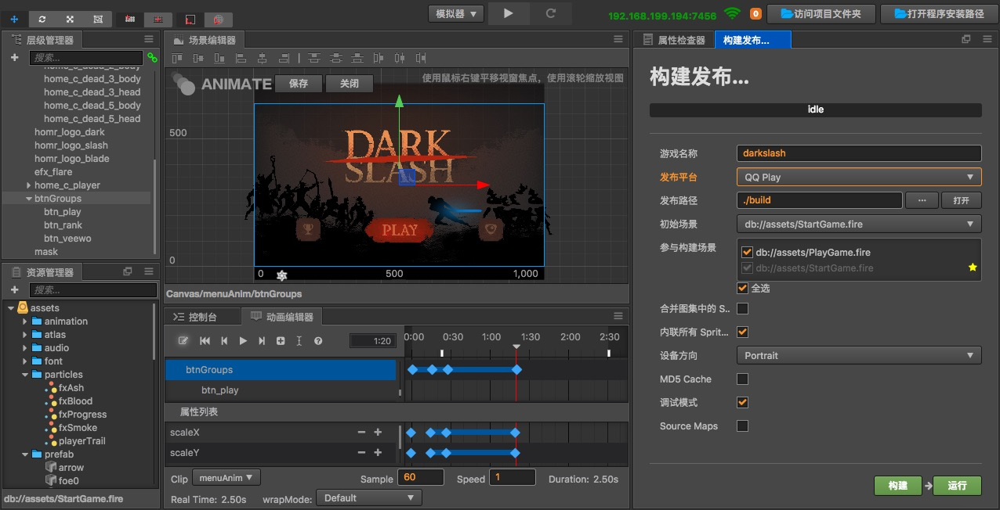
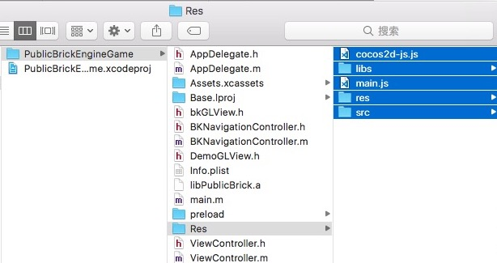

# 发布到 QQ「玩一玩」平台

QQ「玩一玩」与微信小游戏类似，内置于 QQ 中，无需下载游戏就能玩转多款热门手游。玩一玩的底层 runtime 并不是真正的 HTML 浏览器内核，而是玩一玩自研的 Bricks 游戏引擎。Cocos Creator 从 v1.9 版本开始就支持游戏内容跨平台发布到 QQ「玩一玩」。
 
 作为跨平台游戏引擎方，Creator 为用户完成的主要工作包括：

- 引擎负责适配 QQ「玩一玩」平台，用户的游戏逻辑代码不需要任何额外的修改
- Cocos Creator 编辑器提供打包流程，可直接发布为符合 QQ「玩一玩」技术规范的游戏
- 支持 QQ「玩一玩」平台标准的远程资源加载、缓存，以及缓存资源的版本控制

Cocos Creator 可以直接打包出符合 QQ「玩一玩」技术标准的游戏包，但是提交游戏的入口，腾讯暂时还没有开放。现在只能走商务关系[申请成为开发者](http://hudong.qq.com/)，开通服务号，才能拿到 AppID。

## 使用 Cocos Creator 一键发布手机 QQ「玩一玩」

**准备工作：**

- 获取 Bricks 引擎工程（这个工程暂时不能对外公开，开发者可以向 Creator 引擎团队申请内测，或者直接向腾讯申请 bitbucket 库读取权限）

**发布流程：**

1、使用 Creator 打开需要发布的项目工程，在构建发布面板中选择 [QQ Play] 平台进行构建；

构建完成后访问项目文件夹，在 build 目录下就会生成一个 qqplay 的发布包：

2、将 qqplay 文件夹中的内容拷贝到 Bricks 引擎工程的 Res 文件夹中：

3、打开 Bricks 引擎中的 Xcode 工程，就可以直接进行玩一玩的编译调试了。具体可查看 [Bricks 引擎官方调试文档](http://hudong.qq.com/docs/engine/introduce/safari_debug.html)。

与这篇文档搭配的还有一段教学视频，可以结合视频中的操作来理解，更加直观。



<iframe frameborder="0" width="100%" height="440" src="https://v.qq.com/iframe/player.html?vid=m055288q7cl&tiny=0&auto=0" allowfullscreen></iframe>



 

**注意事项：**

- 目前 Bricks 仅支持 Mac 使用 Xcode 工程开发，Windows 系统暂时还不支持。
- 首包必须在 10M 以内，后续的资源可以部署在腾讯 CDN 上用 https 进行加载

**暂时不支持的模块列表：**

- WebView
- VideoPlayer
- DeviceMotion

以上功能预计在以后的更新中逐个支持。我们也将持续与 QQ 玩一玩的工程师们紧密沟通，不断优化适配效果。在 QQ「玩一玩」开发过程中如遇到问题欢迎到论坛提问。
