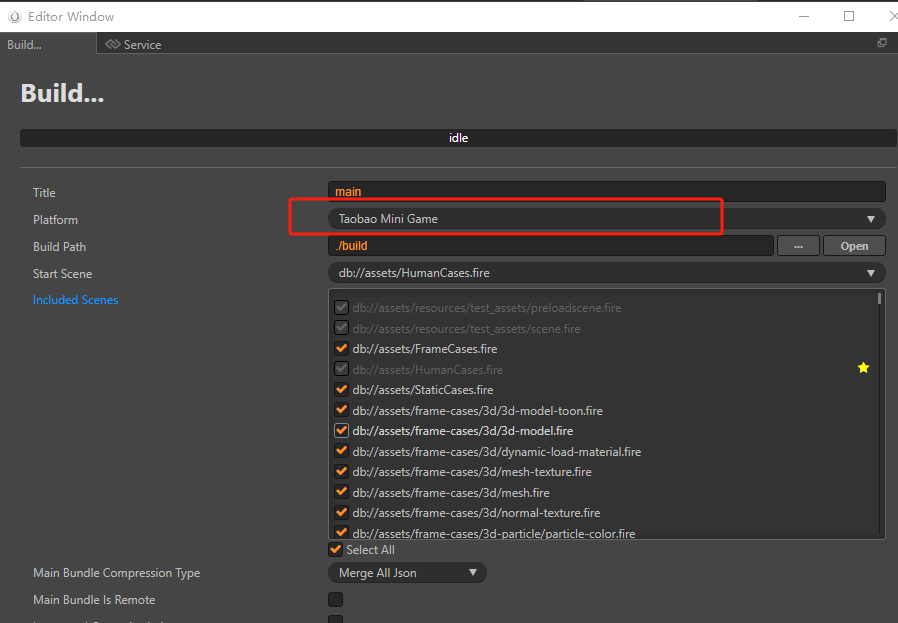
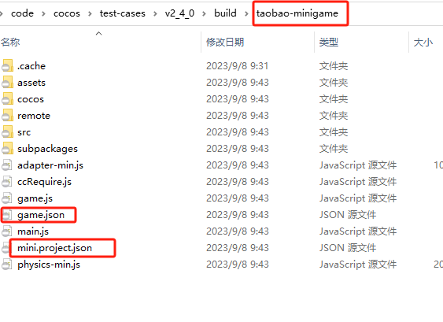
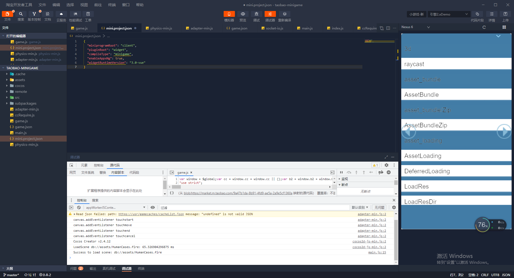

# Publishing to Taobao Mini Game

Cocos Creator has supported publishing games to **Taobao Mini Game** since version 2.4.12.

## Preparations

- Refer to the [Taobao Mini Game Integration Guide](https://open.taobao.com/v2/doc#/abilityToOpen?docType=1&docId=121007&treeId=804) and complete the developer onboarding process and application creation on the Taobao Open Platform.

- Download and install the [Taobao Developer Tools](https://developer.taobao.com/?spm=a219a.15212435.0.0.11ef669aIQNlnI) for desktop.

- Download [Taobao](https://market.m.taobao.com/app/fdilab/download-page/main/index.html) and install it on your mobile device.

- The minimum supported version of the Taobao client on Android is 10.22.30, and on iOS, it's also 10.22.30.

## Publishing Process

Open the project you want to publish in Cocos Creator, go to **Menu -> Project**, open the **Build and Publish** panel, choose **Taobao Mini Game** as the **Publish Platform**, and then click **Build**.

### Parameter Configuration

Here are the rules for configuring the relevant parameters:

- **Main Package Compression Type**

  Set the compression type for the main package. For specific details, refer to the [Asset Bundle - Compression Types](../asset-manager/bundle.md#compression-types) documentation.

- **Configure Main Package as Remote Package**

  This is an optional item and should be used in conjunction with the **Resource Server Address** option. When selected, the main package will be configured as a remote package, along with its related dependent resources, all of which will be built into the built-in Asset Bundle - [main](../asset-manager/bundle.md#built-in-asset-bundle). Developers need to upload the entire "remote" folder to the remote server.

- **Initial Scene Sub-Package**

  This is an optional item. When selected, the initial scene and its related dependent resources will be built into the built-in Asset Bundle - [start-scene](../asset-manager/bundle.md#built-in-asset-bundle) in the "assets" directory of the release package. This improves the loading speed of resources for the initial scene. For more information, refer to the documentation on [Loading Resources for the Initial Scene](publish-wechatgame.md#loading-speed-for-initial-scene).

- **Resource Server Address**

  This is an optional item for filling in the address where resources are stored on the remote server. After building, developers need to manually upload the "remote" folder from the release package to the specified resource server address.

### Running a Preview

- After the build is complete, click the **Open** button next to **Publish Path** to see the generated Taobao Mini Game project folder, **taobao-minigame**, under the "build" directory. It already contains the configuration files for the Taobao Mini Game environment: `game.json` and `mini.project.json`.

  

- Use the **Taobao Developer Tools** to open the generated **taobao-minigame** folder, where you can preview and debug the game content. Refer to the [Taobao Developer Tools Introduction](https://miniapp.open.taobao.com/doc.htm?docId=119188&docType=1&tag=dev) for specific usage instructions.

  

## Resource Management in Taobao Mini Game

Taobao Mini Game, like WeChat Mini Game, has package size limitations, and any additional resources exceeding 2MB must be downloaded via network requests. For package optimization, it's recommended to remove unused engine modules.

Cocos Creator has already handled remote resource downloading, caching, and version management for developers. The implementation logic and steps are similar to WeChat Mini Game, so please refer to the [WeChat Mini Game Resource Management](./publish-wechatgame.md#resource-management-in-wechat-mini-game) for details.

## Limitations of Taobao Mini Game

Taobao Mini Game currently does not support the following features:

- VideoPlayer
- WebView
- Custom fonts

## Differences Between Taobao and Other Mini Game Platforms

- Access to Global Variables: Accessing global variables in Taobao requires them to be mounted onto the global variable. For example: `$global.my = my;`

- Explanation of 'global-variables.js': The window variable is a reference to the global object, so it is essential to ensure that variables already exist on the global object for temporary variables to have values. If you are using custom scripts or third-party plugins and encounter situations where global variables are missing, it is typically due to loading timing issues, where the script is being used before it is fully loaded.

- Taobao's Custom JavaScript Virtual Machine: Taobao utilizes its own custom JavaScript virtual machine, which is not developed based on V8. The number of draw calls has a more significant impact on frame rates compared to other platforms, so efforts should be made to minimize the number of draw calls.

- Inconsistencies Among Taobao IDE, Simulator, and Real Device JS Environments: The JavaScript environments in Taobao's IDE, simulator, and real devices are not consistent. If there are no issues on real devices, it is recommended to report the problem directly to the Taobao platform.

- Frame Rate Discrepancies in Real Device Debugging and Preview: There can be significant differences in frame rates between real device debugging and preview modes. Frame rates during real device debugging tend to be lower, so it is advisable to verify frame rates using the preview mode during testing.

## References

- [Taobao Open Platform Development Guide](https://miniapp.open.taobao.com/docV3.htm?docId=119114&docType=1&tag=dev)
- [Taobao Developer Onboarding Documentation](https://miniapp.open.taobao.com/doc.htm?spm=a219a.15212435.0.0.4f44669ay8X5vm&docId=119111&docType=1&)
- [Introduction to Taobao Mini Game](https://open.taobao.com/v2/doc#/abilityToOpen?docType=1&docId=121009&treeId=804)
- [Taobao Mini Game API Documentation](https://open.taobao.com/v2/doc#/abilityToOpen?docType=1&docId=121112&treeId=805)
- [Download Taobao Developer Tools](https://developer.taobao.com/?spm=a219a.15212435.0.0.7892669alqxNjY)
- [Taobao Developer Tools Introduction](https://miniapp.open.taobao.com/doc.htm?docId=119189&docType=1&tag=dev)
- [Taobao Developer Tools Real Device Debugging](https://miniapp.open.taobao.com/doc.htm?docId=119194&docType=1&tag=dev)