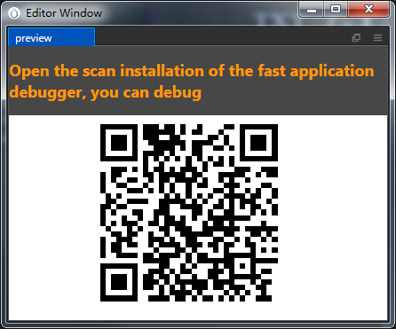

# Publishing to vivo Mini Games

Starting with __v2.0.5__, Cocos Creator officially supports the release of games to the __vivo Mini Games__. It takes just a single click with Cocos Creator to publish to the vivo Mini Game. This document is currently written on the basis of **v2.0.6**, which is the lowest recommended version to use. If you are using v2.0.5, it is recommended to upgrade to v2.0.6.

## Environment Configuration

- Download [Quick App & vivo Mini Game Debugger](https://dev.vivo.com.cn/documentCenter/doc/163) and [vivo Mini Game Engine](https://dev.vivo.com.cn/documentCenter/doc/163) and install it on your Android device (recommended Android Phone 6.0 or above)

- Install [nodejs-8.1.4](https://nodejs.org/zh-cn/download/) or above, globally:

    **Note**: After installing nodejs, you need to pay attention to whether the npm source address is https://registry.npmjs.org/

    ```bash
    # View current npm source address
    npm config get registry

    # If not, reset the npm source address
    npm config set registry https://registry.npmjs.org/
    ```

- Install `qgame-toolkit` globally:

    ```bash
    npm install -g qgame-toolkit
    ```

## Release Process

**First**, use __Cocos Creator__ to open the project that needs to be released. Select **vivo Mini Game** in the **Platform** dropdown of the **Build...** panel.


**Required parameter items**: Filled in according to the user's requirements and the prompt information in the parameter input box. Including **App Package Name**, **App Name**, **App Icon**, **App Version Name**, **App Version Number**, **Supported Minimum Platform Version Number**.

**Optional parameter items**: Includes **Small Packet Mode**, **Small Packet Mode Server Path** and **Custom npm folder path (New in v2.0.9)**.

For the **Keystore** and two signature files (**certificate.pem path** and **private.pem path**), need to select the **Keystore** or fill in two paths according to user requirements.

The specific filling rules for the relevant parameter configuration are as follows:

- **App Package Name**

  **App Package Name** is required and is filled in according to the user's needs.

- **App Name**

  **App Name** is required. Is the name of the vivo Mini Game. And the **Title** at the top of the **Build** panel does not participate in the vivo mini game packaging process.

- **Desktop Icon**

  **Desktop Icon** is required. Click the **...** button at the back of the input box to select the icon you want. When building, the Desktop Icon will be built into the __OPPO Mini Game__ project. Desktop Icon suggest using PNG pictures.

- **App Version Name**

  This item is required. **App Version Name** is the real version, such as: 1.0.0.

- **App Version Number**

  This item is required. **App Version Number** is different from the **App Version Name**, and the **App Version Number** is mainly used to distinguish the version update. Each time when you submit audit, the app version number is at least 1 higher than the value of the last submitted audit. It must not be equal to or less than the value of the last submitted audit, and it is recommended that the **App Version Number** be recursively incremented by 1 each time when the audit is submitted. **Note**: The **App Version Number** must be a positive integer.

- **Supported Minimum Platform Version Number**

  This item is required. According to the requirements of vivo Mini Games, this value must be **1020** at present.

- **Small Packet Mode and Small Packet Mode Server Path**

  This item is optional. The in-package volume of the mini-game contains code and resources that cannot exceed 4M, and resources can be loaded via network requests. **Small Packet Mode** is to help users keep the script files in the small game package, other resources are uploaded to the remote server, and downloaded from the remote server as needed. And the download, cache and version management of remote resources, Cocos Creator has already helped the user. What the user needs to do is the following two steps:

  1. When building, check the **Small Packet Mode** and fill in the **Small Packet Mode Server Path**. Then click on **Build**.

  2. After the build is complete, click the **Open** button after the **Publish Path** to upload the **jsb-link/res** directory under the release path to the packet mode server. For example, if the default publishing path is build, you need to upload the **build/jsb-link/res** directory.

  At this point, the built-up **qgame** directory will no longer contain the **res** directory, and the resources in the **res** directory will be downloaded from the filled **Small Packet Mode Server Path** via the network request.

- **Keystore**

  When you check the **Keystore**, the default is to build the rpk package with a certificate that comes with Creator, which is used only for **debugging**.
  
  If you don't check the **Keystore**, you need to configure the signature files **certificate.pem path** and **private.pem path**, where you build a rpk package that you can **publish directly**. The user can configure two signature files by using the **...** button to the right of the input box.
  
  **Note**: These two signature files are not recommended to be placed in the **build/qgame** directory of the publish package, otherwise the build directory will be emptied each time when it is built, resulting in file loss.
  
  There are two ways to generate a signature files:

    - Generated by the **New** button after the **certificate.pem path** in the **Build** panel.

    - Generated by the command line.

      The user needs to generate the signature file **private.pem**, **certificate.pem** through tools such as openssl. The certificate in the **build/qgame/sign/debug** directory is for debugging purposes only.

      ```bash
      # Generate a signature file with the openssl command tool
      openssl req -newkey rsa:2048 -nodes -keyout private.pem -x509 -days 3650 -out certificate.pem
      ```

      **Note**: The `openssl` tool can be opened directly in the terminal in linux or Mac environment, and in the Windows environment you need to install `openssl` and configure system environment variables.

- **Custom npm folder path**

  This item is optional. Starting with **v2.0.10**, the global npm of the operating system can be automatically obtained without manual setting. The way to obtain npm is:

  - **Windows**: Gets the path in the environment variable from the system.
  - **Mac**: Gets the path in the environment variable from the configuration file of Shell.
  
  If not, make sure the npm is properly installed and can be started directly in the command line environment. The obtained npm is used to provide an environment for building rpk. If the npm folder path cannot be found at building, __Cocos Creator__ will only export the game project directory and will not generate the rpk package.

  The npm filling rules below **v2.0.10** are as follows:
  
  - If you do not fill out this item, the Creator will read the npm path in the environment variable by default on the Windows system, and the npm in the **/usr/bin/local** directory is read by default on the Mac system to build the exported mini game rpk package that can be run.
  - If your PC environment does not have npm installed or cannot read the npm path in the system, you will need to fill out the **Custom npm folder path** to build and exported rpk package. Fill in the rules as follows:

    - Windows system

      ```bash
      # Get local npm folder path
      where npm
      # If the output is
      C:\Program Files\nodejs\npm
      # Then the local npm folder path is filled in as:
      C:\Program Files\nodejs
      ```

    - Mac system

      ```bash
      # Get local npm folder path
      which npm
      # If the output is
      /Users/yourname/.nvm/versions/node/v8.1.4/bin/npm
      # Then the local npm folder path is filled in as:
      /Users/yourname/.nvm/versions/node/v8.1.4/bin
      ```

**Second**, after the relevant parameters of the **Build...** panel are set, click **Build**. After the build is complete, click the **Open** button behind the **Build Path** to open the build release package. You can see that the **qgame** directory is generated under the default release path build directory, which is the exported __vivo Mini Game__ project directory.


And the rpk package will be generated in the **/build/qgame/dist** directory.


**Third**, run the packaged rpk to your phone. There are three ways to run rpk on your phone:

- **Method One**：

    Click the **Run** button in the **Build** panel to wait for the QR Code interface to be generated:

    

    Then open the **Quick App & vivo Mini Game Debugger** that was installed before on your Android device. Click the **Scan code install** button to scan the QR Code to open the **rpk**.

    

- **Method Two**:

    Generate URLs and QR codes using the __vivo Mini Game Packer Commands__.

    ```bash
    # First assign the command line to the qgame directory
    cd E:\workspace\YourProject\build\qgame

    # Generate URL and QR code
    npm run server
    ```

    Then open the **Quick App & vivo Mini Game Debugger** that was installed before on your Android device.

    

    Finally, click the **Scan code install** button to copy the URL generated in the first step to the browser, and then directly scan the QR code on the web page to open the **rpk**.

- **Method Three**:

    Copy the generated small game **rpk** file (located in the dist directory of the game project qgame directory) to the mobile phone SD card

    Open the **Quick App & vivo Mini Game Debugger** that has been installed before on your Android device, click **Local Install**, then find the **rpk** file from your phone SD and select Open.

    

## Reference link

- [vivo Mini Games Development Documentation](http://minigame.vivo.com.cn/documents/lesson/debug.html#chrome%E6%B5%8F%E8%A7%88%E5%99%A8%E7%9C%9F%E6%9C%BA%E8%B0%83%E8%AF%95)
- [vivo Mini Games API Documentation](http://minigame.vivo.com.cn/documents/api/system/life-cycle.html)
- [Quick App & vivo Mini Game Debugger Download](http://minigame.vivo.com.cn/documents/download/engine.html)
