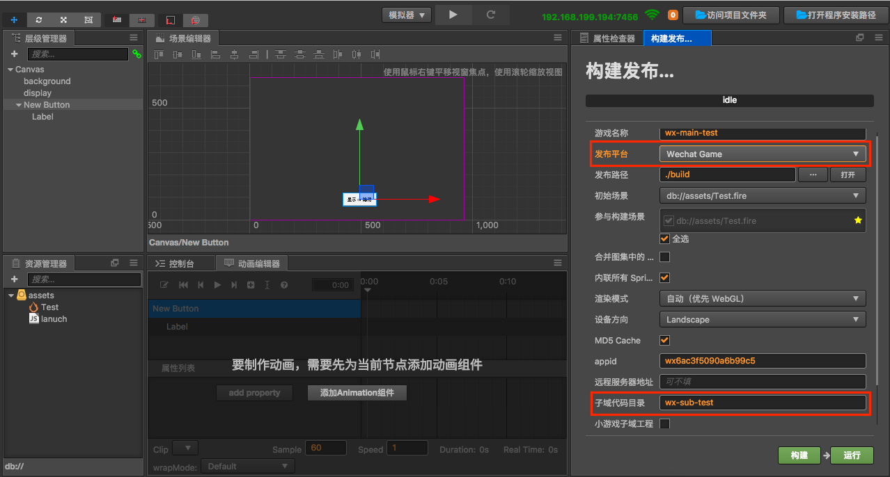
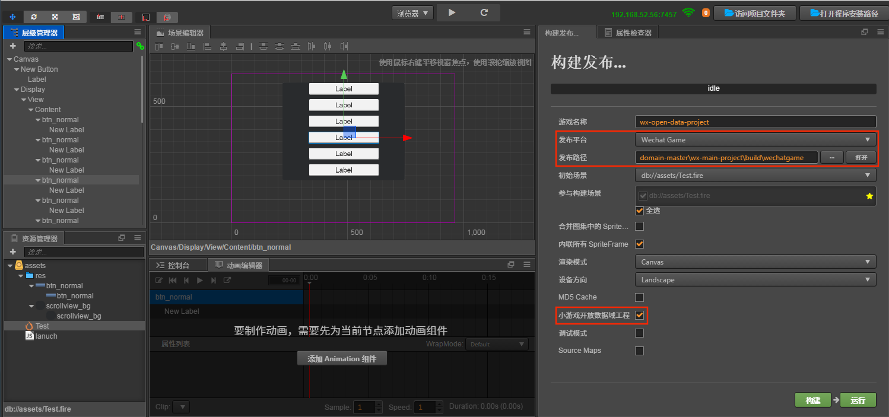
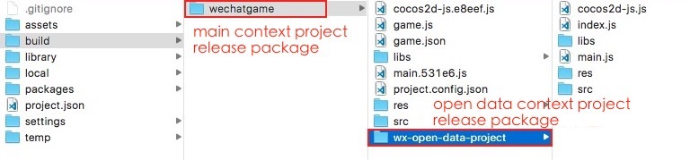

# Access to the Open Data Context of WeChat Mini Games

In order to protect its social relationship chain data, **WeChat Mini Games** has added the concept of **Open Data Context**, which is a separate game execution environment. The resources, engines, and programs in the open data context are completely isolated from the main game. Developers can access the `wx.getFriendCloudStorage()` and `wx.getGroupCloudStorage()`, the two APIs provided by __WeChat__, only in the open data context. These APIs will help to implement some features, such as leaderboards. Since the open data context can only be rendered on the offscreen canvas, `sharedCanvas`, we need to draw the `sharedCanvas` onto the main context.

Since the open data context is a closed, independent JavaScript scope, developers need to create two projects:

  - Main context project (normal game project)
  - Open data context project Engineering (projects that use the WeChat API to obtain user data for functions such as leaderboards)

In the open data context project, it is packaged independently through the open data context packaging process and placed in the WeChat build package of the main context project, which can be previewed and debugged on the simulator and real machine as a complete WeChat project.

__Cocos Creator__ supports packaging to open data contexts since v1.9.1, and an important update in v2.0.1. The two versions are used differently, as described below.

## Publish to the Open Data Context of WeChat Mini Games (updated version)

The updated version is supported in __v2.0.1__ and higher, for __v1.9.1__ to __v2.0.0__ version please refer to [old version open data context release](../publish-wechatgame-sub-domain.md#publish-to-the-open-data-context-version-before-update).

### Integration method

- Create an open data context project to obtain user data through the relevant API, and create a display of UI according to your own needs. The entire open data context project should only contain its content UI. The design resolution of the Canvas component in the scene should be set to the full resolution of the UI, without the corresponding main context resolution.
- Create a node in the main context as an open data context container, add the `WXSubContextView` component to set the open data context view and update the open data context texture. The aspect ratio of this node should be equal to the aspect ratio of the open data context design resolution (otherwise stretching happens).

The difference from the previous version is:

1. It is completely free to control the size of the open data context, reduce the resolution and improve the performance, and improve the resolution optimization effect, which can be easily done in the open data context.
2. The contents of the open data context will be directly scaled into the container node area of ​​the main context, and no stretch will occur as long as the aspect ratio is consistent.
3. The event response of the open data context is handled by the engine, and the user does not need to care.
4. The texture update of the open data context is handled by the engine, and the user does not need to care.

### WXSubContextView Tips

This is the core component of the new open data context solution. In addition to the regular requirements that can be met, there are a few tricks that allow users to better control the performance of open data contexts.

- **View update**

  In general, the open data context view is fixed, but there are also cases where the open data context is updated in the view node of the main context, such as using the Widget to adapt the parent node, such as the case where the design resolution changes after the scene switch. Or the developer manually adjusted the size of the view. In this case, the developer must call the `updateSubContextViewport` interface to update the view parameters in the open data context so that the event can be correctly mapped to the open data context view.

- **Manually update the texture**

  In Creator v2.1.1, when the open data context is evoked, as soon as the WXSubContextView component load succeeds, the open data context texture begins to update to the main context and is displayed, after which the texture is updated every frame. However, the update of the open data context texture may sometimes be costly, and the open data contexts designed by developer is a static interfaces (such as page-turning interfaces), in this case, you do not need to update the texture per frame, you can try to prevent each frame updating logic by disabling components and update it by manually calling the update function when needed:

  ```javascript
  subContextView.enabled = false;
  subContextView.update();
  ```

  This manual control is the best performance solution. If you need to turn on automatic update texture, the main loop of the Open Data Context resumes execution when the **WXSubContextView** component is enabled.

- **Set the texture update frequency**

  In Creator v2.1.1, the **FPS** property has been added to the **WXSubContextView** component, and the user can directly control the frame rate of Open Data Context by setting **FPS**.

  

  The **FPS** property has the following two advantages:

  - The Main Context will calculate an **update interval** ​​based on the set **FPS**. This **update interval** prevents the engine from frequently calling **update** to update the Canvas texture of Open Data Context.
  - By reducing the FPS of Open Data Context, you can also reduce the performance overhead of Open Data Context to some extent.

  **Note: The FPS property overrides the `cc.game.setFrameRate()` implementation of the Open Data Context, so it is recommended to set the FPS property of the WXSubContextView component directly in the Main Context project.**

### Module selection

Since the code and resources of the WeChat open data context cannot be shared with the main context, it is very sensitive to the package. The developer needs to set the [project module culling option](../getting-started/basics/editor-panels/project-settings.md) for the open data context project. It should be noted that starting with v2.0.0, developers can't check the WebGL Renderer in open data context projects. The Canvas Renderer must be checked because the open data context only supports Canvas rendering. At the same time, the rendering components supported under Canvas rendering are also limited (the UI components are not limited) and currently only support:

- Sprite
- Label
- Graphics
- Mask

### Release Steps

1. Open the main context project, open the **Build** panel in **Menu Bar -> Project**, select the **WeChat Mini Game** in the **Platform**, and fill in the **Open Data Context Root**. This directory is the path to the publishing package that is generated after the open data context is built. Then click on **Build**.

    

    This step will help the user automatically configure the __Open Data Context Root__ into the main context project `build -> wechatgame -> game.json` to identify the directory where the open data context file is located under the main context distribution package.

    

2. Open the open data context project, open the **Build** panel, select the **WeChat Mini Game Open Data Context**.

3. The **Build path** set the same path in the **Open Data Context Root** filled in the main context, that is, assigned to the release package directory of the main context project. Then click on **Build**.

    > **Note**: the **Title** in the **Build** panel must match the name of the **Open Data Context Root** set in the main context project.

    

    Or you can not modify the **Build Path** to manually copy the release package to the release package directory of the main context project after the open data context project is built. As shown below:

    

4. Click **Run** in the main context project to launch the WeChat Mini Game Developer tool, and then publish and debug according to the normal process of the previous WeChat Mini Game.

    

**Note:**

- If you publish the open data context and then publish the main context, the release code of the open data context will be overwritten, and We've fixed the issue in the v2.0.7
- Because WeChat Mini Games will support WebGL rendering mode for Open Data Context in later versions, so Creator adapted WebGL mode for Open Data Context in v2.0.9. However, it currently cause the project to appear **[GameOpenDataContext] Open Data Context only supports using 2D rendering mode** error message when running in the WeChat developer tool. This error message is due to the use of `document.createElement("canvas").getContext("webgl")` to detect if WeChat mini games support WebGL, it will not affect the normal use of the project, you can ignore it.

### Reference link

- [Cocos Creator Open Data Context Sample Project of WeChat Mini Games](https://github.com/cocos-creator/example-wechat-subdomain/archive/master.zip)

- [WeChat official document: Relationship Chain Data Usage Guide](https://developers.weixin.qq.com/minigame/en/dev/guide/open-ability/open-data.html)

---------------------

## Publish to the Open Data Context of WeChat Mini Games (version before update)

The following method is applicable to v2.0.0. For earlier versions, please refer to [Accessing Open Data Context of WeChat Mini Games](../../../1.10/manual/en/publish/publish-wechatgame.html)

### Integration method

- Create an open data context project to obtain user data through the relevant API, and create a display of UI according to your own needs. The open data context must use a full screen window, maintaining the same design resolution and adaptation mode as the main context.
- The main context creates the Texture2D by acquiring the global object sharedCanvas (Canvas of the open data context), and then creates the SpriteFrame through the Texture2D, thereby assigning the SpriteFrame to the Sprite to be displayed to the main context, if the open data context is operational function (for example, operations such as sliding, dragging, etc.), then the main context needs to get the sharedCanvas in real time in the update to refresh the sprite.

### Module selection

Since the code and resources of the WeChat open data context cannot be shared with the main context, it is very sensitive to the package. The developer needs to set the [project module culling option](../getting-started/basics/editor-panels/project-settings.md) for the open data context project. It should be noted that starting with v2.0.0, developers can't check the WebGL Renderer in open data context projects. The Canvas Renderer must be checked because the open data context only supports Canvas rendering. At the same time, the rendering components supported under Canvas rendering are also limited (the UI components are not limited) and currently only support:

  - Sprite
  - Label
  - Graphics
  - Mask

**Main context code example:**

```js
    cc.Class({
        extends: cc.Component,
        properties: {
            display: cc.Sprite
        },
        start () {
            this.tex = new cc.Texture2D();
        },
        // Refresh the texture of the open data context
        _updateSubDomainCanvas () {
            if (!this.tex) {
                return;
            }
            var openDataContext = wx.getOpenDataContext();
            var sharedCanvas = openDataContext.canvas;
            this.tex.initWithElement(sharedCanvas);
            this.tex.handleLoadedTexture();
            this.display.spriteFrame = new cc.SpriteFrame(this.tex);
        },
        update () {
            this._updateSubDomainCanvas();
        }
    });
```

### Release Steps

1. Open the main context project, open the **Build** panel in **Menu Bar -> Project**, select the **WeChat Mini Game**, and fill in the **Open Data Context Root**. This directory is the path to the publishing package that is generated after the open data context is built. Then click on **Build**.

    

    This step will help the user automatically configure the Open Data Context Root into the main context project **build -> wechatgame -> game.json** to identify the directory where the open data context file is located under the main context distribution package.

    

2. Open the open data context project, open the **Build** panel, select the **WeChat Mini Game Open Data Context**.

3. The **Build path** set the same path in the **Open Data Context Root** filled in the main context, that is, assigned to the release package directory of the main context project. Then click on **Build**.

    > **Note**: the **Title** in the **Build** panel must match the **Open Data Context Root** name set in the main context project.

    

    Or you can modify the **Build path** to manually copy the release package to the release package directory of the main context project after the open data context project is built. As shown below:

    

4. Click **Run** in the main context project to launch the **WeChat Developer Tools**, and then publish and debug according to the normal process of the previous **WeChat Mini Game**.

    

### Reference link

- [Cocos Creator Open Data Context Sample Project of WeChat Mini Games](https://github.com/cocos-creator/example-wechat-subdomain/archive/1.x.zip)

- [WeChat official document: Relationship Chain Data Usage Guide](https://developers.weixin.qq.com/minigame/en/dev/guide/open-ability/open-data.html)
