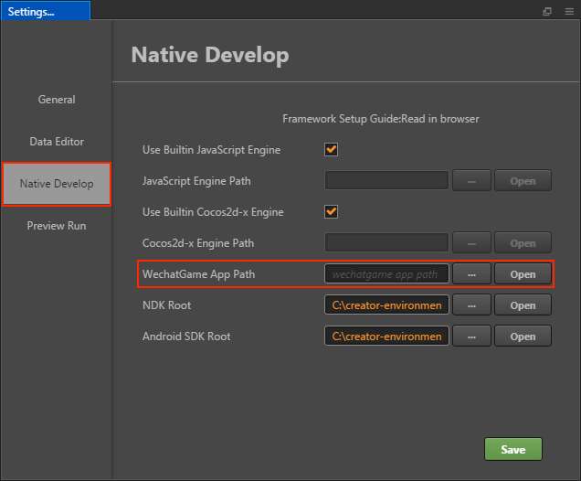
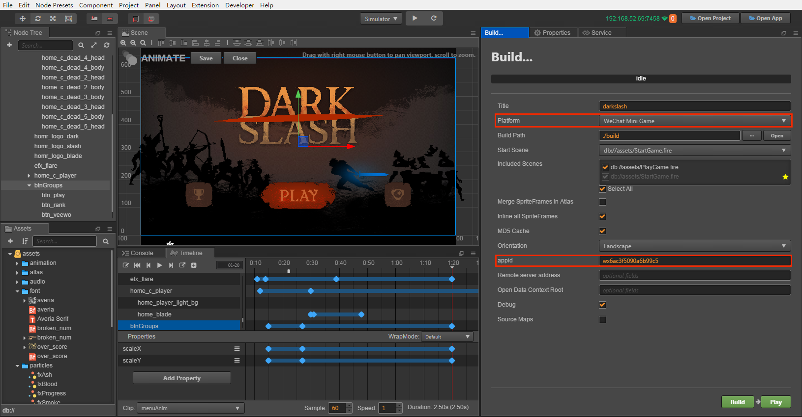
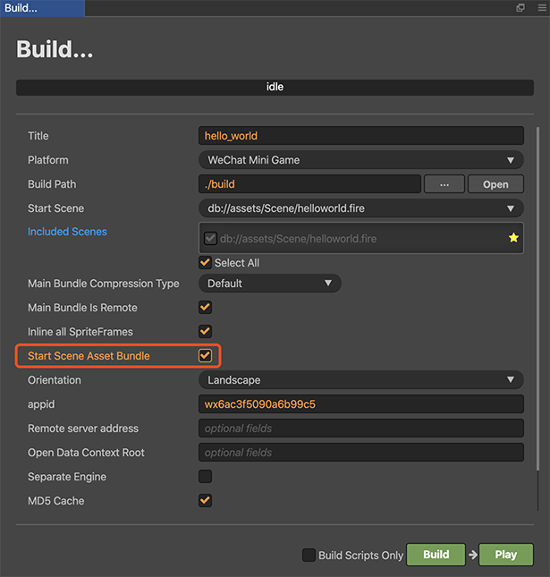

# Publish to WeChat Mini Games

The runtime environment of the WeChat Mini Game is an extension of the WeChat Mini Program, providing a WebGL interface encapsulation based on the mini program environment, greatly improving rendering capabilities and performance. However, since these interfaces are encapsulated by the WeChat team, they are not equivalent to the browser environment.

As the engine side, in order to make the developers' workload as easy as possible, our main tasks for developers include the following:

- The engine framework adapts to the WeChat Mini Game API, pure game logic level, users do not need any additional modifications.
- The **Cocos Creator** editor provides a fast packaging process, released directly as a **WeChat Mini Game**, and automatically evokes the developer tools of the mini game.
- Automatically load remote resources, cache resources, and cache resource version control.

In addition, the game submission, review and release process of the **WeChat Mini Game** is no different from the **WeChat Mini Program**. For details, please refer to the [WeChat Mini Game Developer Document](https://developers.weixin.qq.com/minigame/en/dev/guide/).

## Using Cocos Creator to publish WeChat Mini Games

1. Download WeChat DevTools on [WeChat Official Document](https://developers.weixin.qq.com/miniprogram/en/dev/devtools/download.html)

2. Set the WeChat DevTools path in [Native Develop](../getting-started/basics/editor-panels/preferences.md#native-develop) window. 
    > Mac: Cocos Creator -> Preferences -> Native Develop 
    > Windows: File -> Settings -> Native Develop

    

3. Log in to the WeChat public platform and find the appid

    

4. Select the **WeChat Mini Game** in the **Platform** of the **Build** panel, fill in the mini game appid, and then click **Build**

    

5. Click **Play** to open the WeChat DevTools

    

    **Note**: The WeChat DevTools, if it has not been run on a Mac before, will show an error called `Please ensure that the IDE has been properly installed`. You need to manually open the WeChat DevTools once before you can click the **Run** call directly in the Creator.

6. Preview deployment

    According to this process, a release package `wechatgame` folder will be generated under the project's build directory, which already contains the configuration files `game.json` and `project.config.json` of the WeChat Mini Games environment.

    

## Resource Management for WeChat Mini Game

In a **WeChat Mini Game** environment, resource management is the most special part. It differs from the browser in the following four points:

1. The size of the **WeChat Mini Game's** package cannot exceed **4MB**, including all the code and resources. Additional resources must be downloaded through the network.

2. For files downloaded from a remote server, the **WeChat Mini Game** environment does not have the browser's caching and outdated update mechanism.

3. For the resources in the **WeChat Mini Game** package, they are not loaded on demand in the mini game environment, but rather all the resources in the package are loaded at once, and then the game page is launched.

4. You cannot download script files from a remote server.

This brings up two key issues, home page loading speed and remote resource caching and version management. For the home page loading speed, we recommend that developers only save the script file in the **WeChat Mini Game** package, and all other resources are downloaded from the remote server. As for downloading, caching and version management of remote resources, Cocos Creator has done the job for developers. Let's look at the logic of this part below. Note that this section is updated in v2.4, so if you are using a version before v2.4, please take care to switch to the corresponding documentation branch.

In a mini game environment, the process of downloading resources from the engine is as follows:

1. Check if the resource is in the mini game pack
2. Check if the resource is in local cache storage if it's not in game pack
3. Check if the resource is in the temporary directory if it's not in cache
4. Download from a remote server if they do not exist in mini game pack
5. After downloading to temporary directory, use it directly
6. Save it to the game application cache slowly in backstage for re-access.
7. Local cache storage has space limitation, if total space of cache exceeds the limit, the LRU algorithm is used to delete older resources.

It should be noted that once the cache space is full, all the resources that need to be downloaded cannot be saved, only the temporary files for save download resources can be used, and WeChat will automatically clean up all temporary files after the mini game is exited. So the next time you run the mini game again, those resources are downloaded again and the process keeps looping.  
In addition, the problem of file saving failure due to cache space exceeding the limit does not occur on the WeChat DevTools, because the WeChat DevTools does not limit the cache size, so testing the cache needs to be done in a real WeChat environment.

At the same time, when the md5Cache function of the engine is enabled, the URL of the file will change with the content of the file, so that when a new version of the game is released, the resources of the old version will naturally fail in the cache, and you can only request new resources from the server, which also achieves the effect of version control.

Starting with v2.4.0, all resources are managed in `asset bundles`. The engine has some builtin bundles:
- main: the main bundle of the game, minus all other `asset bundle` resources, the rest of the resources belong to the main bundle
- resources: resources in `assets://resources`
- internal: resources in `internal://resources`

If you need to upload the resource to the server, configure the `asset bundle` where the resource is located as a remote bundle. The operation steps are as follows:

1. Rationalize the allocation of your resources, setting resource folders that require modular management as `asset bundles`.
2. Configure the `asset bundle` that needs to be uploaded as a `remote bundle`. Select the `asset bundle` that needs to be placed on the server in the **Assets** panel and configure it in the **Properties** panel, as shown in the following figure. When the configuration is complete, click the **Apply** button in the upper right corner.

    

3. If the main bundle needs to be configured as a remote one, please check **Main Bundle Is Remote** in the **Build** panel.
4. Check **MD5 Cache** in the **Build** panel.
5. Set **Remote Server Address**, and then click **Build** button.
6. When the build is complete, upload the **remote** folder in the mini game release package to the server.
7. Delete the `remote` folder inside the release package.
8. For the test phase, you may not be able to deploy to the official server, you need to use the local server to test, then open the **Details** page in the WeChat DevTools, check the **Does not verify valid domain names, web-view (business domain names), TLS versions and HTTPS certificates** option in the project settings.

    

**Note**: 

1. If the cache resource exceeds the WeChat environment limit, you need to manually clear the resource. The exposed methods `clearCache()`, `clearLRU()` and `removeCache(cacheId: string)` in `cc.assetManager.cacheManager` can be used to clear the cache under WeChat Mini Games. The specific differences are as follows:
    - The `clearCache()` method clears all cache resources from the cache directory, so use it carefully.
    - The `clearLRU()` method clears the least recently used cache in the cache directory.
    - The `removeCache(cacheId: string)` method precisely removes a cache records from the cache.

2. When you upgrade the engine of your mini game, the assets already cached in the storage will not be cleared automatically. And these cached assets don't match the version of engine. This may cause problems such as resource loading errors or rendering errors. Solutions include the following two types:
    - Check the option **MD5 Cache** when you build your game. It ensures that the newest asset will be loaded.
    - Clear the cache on the physical device with `cc.assetManager.cacheManager.clearCache()`. On the developer tool, clear the cache with the following options:

        

### Speed ​​up start scene loading

If you want to place the main bunle on the server and place the start scene related resources in the package to speed up the loading of the start scene, you can check **Start Scene Asset Bundle** in the **Build** panel.

Once the build is complete, a bundle of `start-scene` will be generated in the `assets` directory. This bundle will not be placed on the server, and the engine will automatically load the bundle in package during the game startup phase, thus speeding up the loading of the initial scene.

## WeChat Mini Game Engine Plugin

Please refer to the [WeChat mini games engine plugin instructions](./wechat-engine-plugin.md) for details.

## WeChat Mini Game Subpackage Loading

WeChat Mini Game how to achieve subpackage loading, please refer to [Subpackage Loading](../scripting/asset-bundle.md).

## Platform SDK Access

In addition to pure game content, the **WeChat Mini Game** environment actually provides a very powerful native SDK interface, the most important of which is user, social, payment, etc. These interfaces are only available in the **WeChat Mini Game** environment, equivalent to other Third-party SDK interface for the platform. The porting of such SDK interfaces still needs to be handled by developers at this stage. Here are some of the powerful SDK capabilities provided by the **WeChat Mini Games** environment:

1. User interface: login, authorization, user information, etc.
2. WeChat payment
3. Forward and get forwarding information
4. File upload and download
5. Media: pictures, recordings, cameras, etc.
6. Other: location, device information, scan code, NFC, etc.

## Access to the Open Data Context of WeChat Mini Games

In order to protect its social relationship chain data, **WeChat Mini Games** has added the concept of **Open Data Context**, which is a separate game execution environment. The resources, engines, and programs in the Open Data Context are completely isolated from the main game. Developers can only access the `wx.getFriendCloudStorage()` and `wx.getGroupCloudStorage()` APIs provided by **WeChat** in the Open Data Context to implement some rankings, for example.

**Cocos Creator** supports packaging to Open Data Context starting with **v1.9.1**. For details, please refer to [Access to the Open Data Context of WeChat Mini Games](../publish/publish-wechatgame-sub-domain.md).

## WeChat Mini Games Known issues

In addition, our adaptation of WeChat Mini Games has not been completely completed, and the following modules are still not supported:

- WebView

If you need it, you can currently use it by calling the WeChat's API directly.

## Reading

- [WeChat Mini Game Developer Document](https://developers.weixin.qq.com/minigame/en/dev/guide/)
- [WeChat Public Platform](https://mp.weixin.qq.com/?lang=en_US)
- [Mini Program API Documentation](https://developers.weixin.qq.com/minigame/en/dev/api/)
- [WeChat DevTools Download](https://mp.weixin.qq.com/debug/wxagame/en/dev/devtools/download.html)
- [WeChat Cache Space Overflow Case](https://github.com/cocos-creator/WeChatMiniGameTest)
