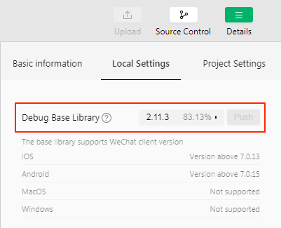
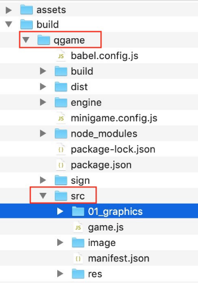

# Mini Game Subpackage

Some mini-game platforms support subpackaging for segmenting resources and scripts, and Creator also integrates subpackaging into Asset Bundle's workflow, where you can set the compression type to **mini game subpackage** in Asset Bundle's compression type option, and Asset Bundle will be built into the mini game subpackage. For details, see [Asset Bundle](../asset-manager/bundle.md#compression%20type)

When building for the **WeChat Mini Game**, the configuration of the **subpackage** will be automatically generated into the **game.json** configuration file of the **WeChat Mini Games** release package according to the rules.

**Note**: WeChat Mini Games require a specific version to support the **subpackage** feature. WeChat 6.6.7 Client, 2.1.0 and above base library support, please update to the latest client version, developer tools please use version **1.02.1806120** and above. After updating the developer tools, don't forget to modify the version of __Details -> Project Settings -> Debug Base library__ to __2.1.0__ and above in the developer tools:

### Subpackage Load Packet Size Limit

At present, the size of the WeChat Mini Game subpackage has following restrictions:

- The size of all subpackage of the entire Mini Game can not exceed **8M**
- The size of single subpackage / main package can not exceed **4M**

Please refer to the [WeChat SubPackage Loading](https://developers.weixin.qq.com/minigame/en/dev/guide/base-ability/sub-packages.html) documentation for details.

## vivo Mini Games

When building for the **vivo Mini Game**, the configuration of the **subpackage** will be automatically generated into the **manifest.json** configuration file in the `qgame/src` directory of the **vivo Mini Games** release package according to the rules.

**Note**:

- Starting with **v2.1.3**, vivo Mini Game supports subpackage loading.
- Starting with **1051** version, **Quick App & vivo Mini Game Debugger** 
supports the subpackage loading of vivo Mini Game. Versions lower than 1051 do not support subpackage loading, but they are also compatible. If a subpackage is configured in the editor's **Properties**, it will not affect the normal operation of the game. Please refer to [vivo SubPackage Loading - runtime compatibility](https://minigame.vivo.com.cn/documents/#/lesson/base/subpackage?id=%e8%bf%90%e8%a1%8c%e6%97%b6%e5%85%bc%e5%ae%b9) for details.
- Unlike the WeChat Mini Game, vivo Mini Game after the project is built, the corresponding subpackage file will be generated in the **src** directory of release package **qgame** directory.

  

### Subpackage Load Packet Size Limit

At present, the size of the vivo Mini Game subpackage has following restrictions:

- The size of all subpackage and main package of the entire Mini Game can not exceed **8M** (The compressed package after packaging contains whole package no more than **12M**, please refer to [vivo SubPackage Loading-compatibility](https://minigame.vivo.com.cn/documents/#/lesson/base/subpackage?id=%e7%bc%96%e8%af%91%e6%97%b6%e5%85%bc%e5%ae%b9) for details.
- The size of single subpackage / main package can not exceed **4M**

Please refer to the [vivo SubPackage Loading](https://minigame.vivo.com.cn/documents/#/lesson/base/subpackage) for details.