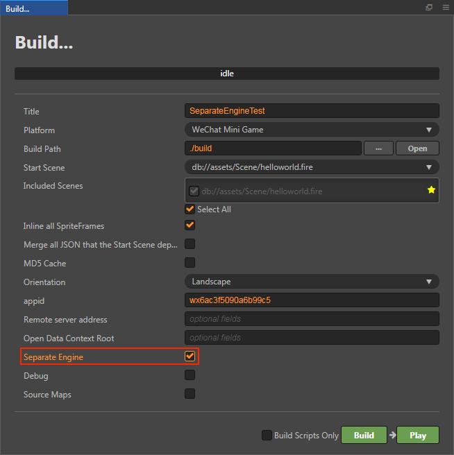

# WeChat mini games engine plugin instructions

The Game Engine Plugin is a new feature added to WeChat v7.0.7, which has the official version of the Cocos Creator engine built-in. If the plugin is enabled in the first game the player experiences, all games that also have the plugin enabled do not need to download the Cocos Creator engine again, just use the same version of the engine directly from the public plugin library, or incremental update the engine.

For example, when a player has played an A game developed using Cocos Creator v2.2.0, and the A game already enabled this plugin. Then he played the B Game, also developed by v2.2.0, and would not have needed to re-download the Cocos Creator engine if the B game had also enabled this plugin. Even if the B Game is developed using Cocos Creator v2.2.1, WeChat only needs to incremental update the difference between the two engine versions. This will drastically reduce the download counts of mini games, and improve the startup speed of mini games by 0.5-2s for a better user experience.

## How to use

Cocos Creator provides a powerful integrated game development environment that is easy to use with engine plugin.

### Cocos Creator v2.2.1 and above

The engine plugin is already integrated in Cocos Creator v2.2.1. Simply check **Separate Engine** in the **Build** panel, and then build and release normally, without additional manual operation. (This feature only takes effect in non-debug mode)

### Cocos Creator v2.0.5 to v2.2.0

1. Download the Cocos Creator build plugin

    Download: <https://github.com/cocos-creator/plugin-wechat-engine-separation/archive/master.zip>

2. Install plugin

    - If you need to apply it globally (all projects): Copy the unzipped plugin folder to `C:\Users\Administrator\.CocosCreator\packages` (Windows) or `Users/.CocosCreator/packages` (Mac).

    - If you need to apply to a single project: Copy the unzipped plugin folder to the `packages` folder in your project, which is the sibling directory of the `assets` folder. (If there is no `packages` folder you can create one manually.)
 
3. Build

    Restart Cocos Creator once the plugin is installed. Then build and release normally in the **Build** panel, without additional manual operation. (This feature only takes effect in non-debug mode)

    If you need to disable the engine plugin feature later, remove the plugin directly.

### Cocos Creator v2.0.4 and below

According to the survey, the percentage of developers who currently use Cocos Creator v2.0.4 and below is very small. We do not recommend that this part of the developer use the engine plugin, because the effect is not obvious, but increases maintenance costs.

If you really need to use the engine plugin, it is recommended to upgrade to Cocos Creator v2.0.10 or later, which can better support WeChat mini games.

### Considerations

1. The **Details -> Local Settings -> Debug Base Library** in the WeChat DevTools needs to be set to **2.9.0** or above.

2. The **Details -> Local Settings -> Use Local plugins** option in the WeChat DevTools is used to set whether or not to disable the engine plugin, which is usually not need to checked. (This option only takes effect in WeChat DevTools)
    - If unchecked, the engine plugin in WeChat public plugin library is used for debugging
    - If checked, the engine plugin generated after the local build is used for debugging

    

## FAQ

Q: Does WeChat Open Data Context support this feature? 
A: According to WeChat rules, it is not currently supported.

Q: Does the engine plugin feature support engine customization? 
A: Not supported. You can only build with the editor's original builtin engine, otherwise the editor will pop up a prompt.

Q: The project enable the engine module clipping, should I need to disable it when using the engine plugin? 
A: No, the project can continue to use the engine module clipping as before. The engine plugin provides a complete engine that is compatible with all clipping settings without affecting the original project package.

Q: After the engine plugin is enabled, will the engine code still be counted into the first package? 
A: According to WeChat's rules, it will still be counted.

Q: After the engine plugin is enabled, can I remove all modules in **Module Config** of editor to reduce the package size? 
A: No, because WeChat only supports engine plugin since v7.0.7, if the engine is clipped randomly, the game may not be able to run on a lower version of WeChat.

## Trouble Shooting

Q: Cocos Creator v2.2.0 cannot enter the game when the engine plugin is enabled on iOS 9? 
A: Sorry, this is a known compatibility issue and has been fixed in v2.2.1.

Q: When the engine plugin is enabled, prompt "Code package unpacking failed" or "Login user is not the developer of the Mini Program" in the WeChat DevTools, while the physical device previews correctly? 
A: The default appid in the **Build** panel is a common test id, and according to WeChat's rules, you need to fill in the appid applied for yourself to test the engine plugin.

Q: When the engine plugin is enabled, prompt "Unauthorized plugin, `Add plugin`" in the WeChat DevTools? 
A: Click the `Add plugin` in the prompt, then select add CocosCreator plugin and recompile. If prompt "There are no plugins to add" when you add the plugin, you can select the **Clear Cache -> Clear All** option in the WeChat DevTools and try again.

Q: When the engine plugin is enabled in Cocos Creator v2.1.3, prompt that some 3d-related functions are not defined? 
A: This is a compatibility issue with older Cocos Creator build plugin, so just download the latest Cocos Creator build plugin and replace it.

Q: Prompt "The plugin used has a new version" when submitting for audit, can I update it? 
A: Please do not update, and click the "OK" button.
    
  

## Related Reference Links

- [WeChat mini games engine plugin development documentation](https://developers.weixin.qq.com/minigame/dev/guide/base-ability/game-engine-plugin.html)
