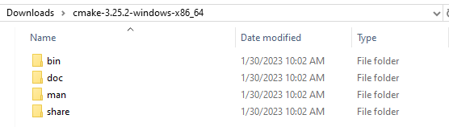
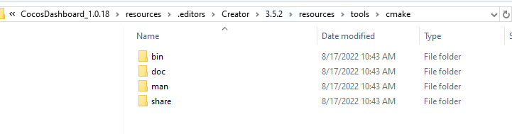
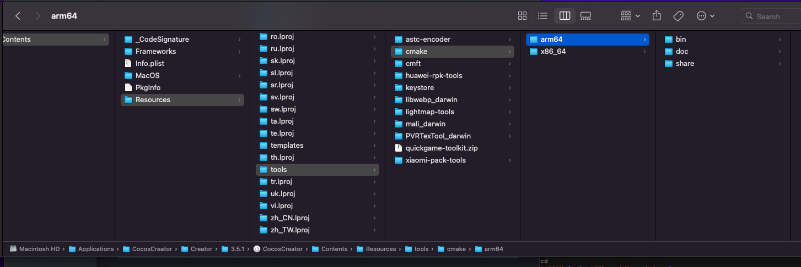

# Upgrade CMake

Versions prior to v3.6 do not support specifying a cmake path, and can be upgraded by overwriting the editor's built-in cmake directory.

### Windows platform
1. Go to https://cmake.org/download/ to download the required cmake version, and extract it

2. Open the editor internal directory `resources/tools/cmake/`

3. Overwrite the editor's built-in cmake with the downloaded cmake content, leaving the directory structure unchanged.

4. Restart the editor and it will take effect.

### Mac platform

1. Go to https://cmake.org/download/ to download the required cmake version, and unzip it
   

2. Open the editor internal directory `Contents/Resources/tools/cmake/arm64` (or `x86_64`)

 

3. Copy the contents of the downloaded `CMake/Contents` to the editor's corresponding directory. 

4. Restart the editor and it will take effect.
