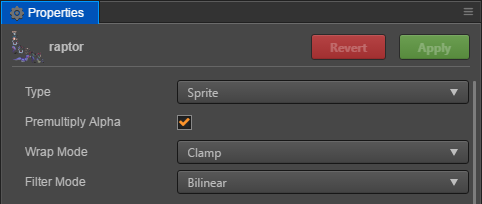
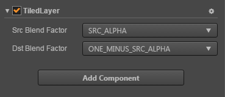
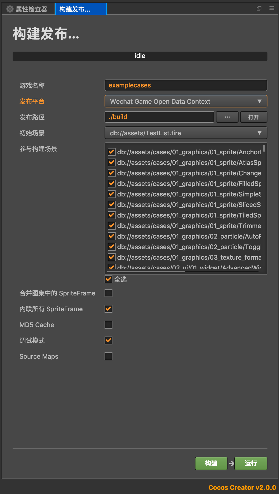
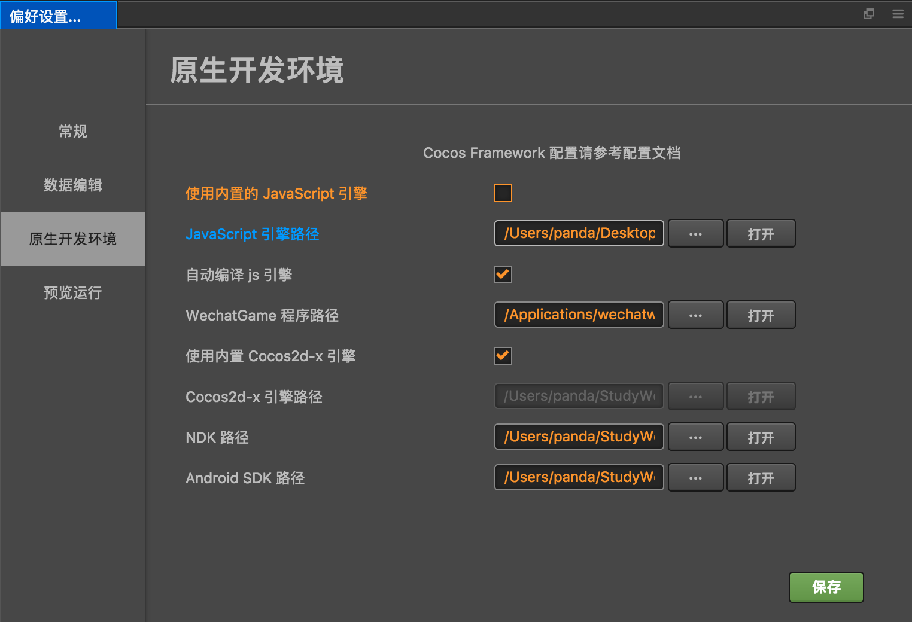

# Cocos Creator v2.0 Upgrade Guide

# 1 Overview

__Cocos Creator v2.0__ is the result of a large-scale *under the hood* refactoring plus two months of
stability testing. This article will assist __v1.x__ users in upgrading to __v2.0__.

In general, the core goals of the Cocos Creator v2.0 design were twofold:

1. Significantly improve the engine performance
2. Provide more advanced rendering capabilities and richer rendering customization options

In order to accomplish this goal, we completely rewrote the underlying renderer, which structurally guarantees performance improvements of web and mini games platforms. And rendering capabilities. At the same time, in order to ensure that users project can be upgraded more smoothly, we have almost no changes to the API of the component layer. Of course, these changes are not completely transparent to the user, such as the engine loading process, the event system, the streamlining and reorganization of the engine's overall API, which will have an impact on the user-level API.

Of course, the upgrade is just the beginning, Cocos Creator has prepared more in-depth updates and features coming in updates to the v2.x version.

## 2.0.0 List of known issues

Since many users have feedback on the problems encountered in upgrading from 1.x, we also need to highlight the risks of the current upgrade, the problems, and the plan to fix these issues.

List of known issues:

  1. The performance of Spine & DragonBones in 2.x native platform is not as good as 1.x. ETC texture compression are not supported (1.x can be implemented by hack).
  2. Particle resources with built-in base64 texture may fail during 1.x upgrade. We will roll back the upgrade of the Particle resource in 2.0.1 and return to the 1.x state to avoid errors. If you encounter a similar problem, you can bypass it by using an external map file.
  3. 1.x RichText upgrade may cause the scene to continue to report error: __can not read property `_worldMatrix` of null__. Will be fixed in 2.0.1. Temporarily you can remove RichText in the old version and then add it again in 2.0 to bypass it.
  4. The remote avatar loaded in the WeChat open data field cannot be displayed, and the camera background color cannot be set. Fixed in 2.0.1.
  5. Playing a release version may be blacked out because the script file name case under libs is overwritten during the release process. Fixed in 2.0.1. If you encounter problems, please use the 1.x version to play.
  6. Some Spine animations are rendered incorrectly after the upgrade. Fixed in 2.0.1.
  7. Using Tilemap with Camera zoom, there will be problems with the map being oversized. Fixed in 2.0.1.
  8. RichText does not support color modification by node color.
  9. Native platform does not support VideoPlayer and WebView components at this time
  10. IE 11 is not supported. Fixed in 2.0.1.
  11. The current v2.0 has the possibility that the rendering performance of the engine may decline on the native platform, which may have a significant impact on specific games. It is recommended that the native platform project under development be carefully upgraded. We will optimize afterwards.

# 2. Editor upgrade

Let's take a look at the changes at the editor level. Since the focus of v2.0 is focused on the engine level, there are actually not many changes in this area. They are mainly texture resources, platform release, and the use of some components. In future versions of v2.x, editor level upgrades will be released.

## 2.1 Texture Resource Configuration

Maybe developers have noticed the configuration of texture resources in Creator 1.x, such as Wrap Mode and Filter Mode, but in fact, no matter how you set it in 1.x, it will not affect the runtime texture resources. So in 2.0, we made these configurations take effect at runtime, and we also added an option to prefetch textures:



- __Wrap Mode:__ Loop mode, which determines how the texture is sampled when uv exceeds 1.
  - __Clamp:__ the value of __uv__ is automatically limited to __0, 1__ and exceeds __0 or 1__ directly.
  - __Repeat:__ When over, the value of __uv__ is modulo, so that the texture can be rendered in a loop.
- __Filter Mode:__ Filter mode, which determines whether to blend the surrounding pixels with the surrounding pixels when floating point samples are used to achieve the smoothing effect of texture scaling. In effect, Trilinear smoothness is higher than Bilinear, higher than Point, but Point is very suitable for pixel-style games. When scaling textures, the pixel boundaries will not be blurred, maintaining the original pixel painting style.
  - __Point (nearest point sampling):__ directly use the nearest pixel on the uv value
  - __Bilinear (secondary linear filtering):__ take the average of the pixel corresponding to uv and the surrounding four pixels
  - __Trilinear (triangular linear filtering):__ Based on the quadratic linear filtering, the quadratic linear filtering results of two adjacent mipmaps are taken for the mean calculation.
- __Premultiply Alpha:__ This is a new parameter in 2.0. When checked, the engine will enable the GL pre-multiply option during the upload of the GPU map. This is very helpful for some textures that need to be pre-multiplied. Often there are some users who can't understand the inexplicable white edges around the texture or around the text, which is caused by the semi-transparent pixels around the texture:


This can be eliminated by using code in 1.x, and in 2.0 you only need to turn on the pre-multiply option of the texture. It's also worth noting that if you find that this makes the texture darker, you can change the blending mode of the corresponding rendering component to ONE, ONE_MINUS_SRC_ALPHA.

## 2.2 RenderComponent component settings

In 2.0, we abstracted a new base component class: `RenderComponent`, and all direct rendering components are inherited from this component. These include: `Sprite`, `Label`, `Graphics`, and so on. The most intuitive change for the user is that the rendering component that inherits from it will include the __Src Blend Factor__ & __Dst Blend Factor__ in the __Properties__:



Because of the transformation of the underlying renderer in 2.0, we abstracted the functionality of many render phases for user access and setup. Many of the interfaces to these interfaces are in the RenderComponent. In addition to the blend mode, we also plan to introduce the material system (the engine is built-in, and only the script interface is temporarily available).

## 2.3 Camera component use

The camera may be the most changed component from 1.x to 2.0. In order for developers to update smoothly, we tried to maintain the consistency of the component layer API. Here are details of the changes:

  1. The `Canvas` component adds a default *Main Camera* node and mounts the `Camera` component, which will default to the center of the `Canvas` node, showing the rendered elements in the scene.
  2. `Node` Group corresponds to Camera's culling mask, only the Group contained in Camera culling mask will be rendered.
  3. You can render different groups through multiple cameras, and let them have a global hierarchical relationship. Scene rendering is based on the Camera list, which is rendered in turn (multi-camera can also render the same object with different perspectives)

If you need a more advanced Camera component, it will be necessary to upgrade to v2.0. It is not possible to directly specify the target corresponding to Camera. Instead, set the node and camera matching relationship by setting the culling mask of node Group and Camera.

For specific changes, developers can refer to [2.0 Camera Using Documentation](../render/camera.md).

## 2.4 Build Panel Updates

The biggest change in Build panels is the release of WeChat games open data domain. In 1.x, developers choose to publish the platform as WeChat Game and check the open data domain project. In 2.0, we separate the WeChat open data domain into a platform: WeChat Game Open Data Context.



As you can see, the build options are much simpler than other platforms because the open data domain has a special environment that removes unnecessary options. At the same time, since the open data domain does not support WebGL rendering, the WebGL renderer will be rejected on the engine module clipping, regardless of the user's settings, and all modules that rely on WebGL rendering will be rejected. Other modules still need the user's own choice to try to get the smallest package in the open data domain.

For the same reason, when building other platforms, please don't check the Canvas Renderer, because the Canvas renderer supports a small number of rendering components, meaning little.

Starting with v2.0.1, we updated the open data domain solution. For details, please refer to [Access Small Game Open Data Domain](../publish/publish-wechatgame-sub-domain.md).

## 2.5 Module Settings

In addition to the special module settings in the WeChat open data domain, there are several points to note in the module settings of other platform projects:

  1. Currently we have deprecated the Canvas rendering mode on other platforms in the non-WeChat open data domain, so the Canvas Renderer module can be culled, but the WebGL Renderer module must be retained.
  2. The native platform cannot currently remove the Native Network module (which will be adjusted in the future).

## 2.6 Custom Engine Quick Compile

In 2.0, we provided a more convenient way for developers who needed a custom engine. 1.x After modifying the custom engine, you also need to build the gulp build to take effect, and the build time is very long. The root cause of this problem is that any minor changes require repackaging and confusing all engine files, which can take a long time. So in 2.0, we instead refer to the separated source files in the custom engine. When the user changes, only the modified file will be updated, and the developer can also manually trigger the update.



When using a custom JS engine:

  1. Check Automatically compile JS engine: scan engine and automatically recompile modified engine code when loading or refreshing editor
  2. Uncheck the automatic compilation of the JS engine: the developer needs to manually use the menu item: __developer__ > __compilation engine__ to trigger the compilation after modifying the engine code.

After the compilation is complete, the preview will use the new engine code directly. When the project is built, it will also be compiled and built with the new engine code. Of course, this will bring two side effects: the build time needs to be compiled when the engine is compiled; There are a lot of load engine scripts, so the preview load time will also grow.

# 3. Engine upgrades

We have completely upgraded the engine framework in 2.0. Here are the most important pieces:

  1. Even more modular
  2. Remove the underlying cocos2d-html5 rendering engine and now share the underlying renderer with the 3D engine
  3. Discard the render tree and assemble the rendered data directly using nodes and render component data.
  4. Logic layer and render layer are isolated, interacting through limited data types
  5. Rendering process zero garbage

The specific updates are described below.

## 3.1 Underlay Renderer Upgrade

In general, users control rendering by rendering component levels. For this type of usage, there is almost no difference between 2.0 and 1.x. The code of the component layer after upgrading still works the same. However, if the user touches the __sgNode level__ in their project code due to optimization or other requirements, then it should be noted that the **_ccsg module** as the underlying renderer in 1.x has been completely removed, and the component layer can no longer access any of them. Here are the differences between 2.0 and 1.x at the node tree level:


Another key point is that in addition to retaining limited Canvas rendering capabilities in the WeChat open data domain, other platforms have removed Canvas rendering and only support WebGL rendering.

Due to space limitations, we do not delve into the update of the underlying framework of the engine. For details, please pay attention to our subsequent v2.0 rendering framework documentation.

## 3.2 Startup process changes

In 1.x, the order in which the engine and user scripts are loaded is:

  - Load the engine
  - load `main.js`
  - Initialize the engine
  - Initialize the renderer
  - Load project plugin script
  - Load project main script
  - Call `cc.game.onStart`

In 2.0, the user script can intervene into the initialization logic, such as setting `cc.macro.ENABLE_TRANSPARENT_CANVAS` (whether the Canvas background is transparent), `cc.macro.ENABLE_WEBGL_ANTIALIAS` (whether to enable WebGL anti-aliasing), or applying some pre-customization to the engine. Code. Previously these jobs had to be customized with `main.js`, added in the `cc.game.onStart` callback, mixed with the engine's default initialization logic, users often confused, and not friendly to version upgrades.
So in 2.0 we preloaded the loading of user scripts:

  - Load the engine
  - load `main.js`
  - Load project plugin script
  - Load project main script
  - Initialization Engine (Animation Manager, Collision Manager, Physics Manager, Widget Manager)
  - Initialize the renderer
  - Call `cc.game`.onStart

## 3.3 Platform code separation and customization

In 1.x, `main.js` hosts the initialization logic for all platforms, but as the platform grows more and more different, we decided to separate the startup logic of these platforms as much as possible.

  1. Web & Facebook Instant Game
       1. Entry file: `index.html`
       2. Adaptation file: `none`
  2. WeChat Mini Games
       1. Entry file: `game.js`
       2. Adaptation file: `libs/``
  3. Native platform
       1. Entry file: `main.js`
       2. Adaptation file: `jsb-adapter/``
  4. QQ light game
       1. Entry file: `main.js`
       2. Adaptation file: `libs/``

Developers who need to add their own custom code can refer to [Custom Project Documentation](http://docs.cocos2d-x.org/creator/manual/en/publish/custom-project-build-template.html) for use in projects. Your own version overrides the original version, and try not to overwrite `main.js`.

## 3.4 Event System Upgrade

Event systems are widely used in both engine and user code, but in order to be compatible with the need to dispatch touch events (capture and bubbling), its design in 1.x is too complex, and performance is somewhat slow for ordinary simple events. In order to solve this problem in 2.0, we implemented the event model containing the capture and bubbling phases in the tree structure only in `cc.Node`, which completely simplifies the design of EventTarget. Here are the key API comparisons:

Node:

  - on (type, callback, target, useCapture): Register the event listener, you can choose to register the bubbling phase or the capture phase.
  - off (type, callback, target, useCapture): unregister the listener
  - emit (type, arg1, arg2, arg3, arg4, arg5): dispatch simple events
  - dispatchEvent (event): dispatches events on the node tree with capture and bubbling event models (the capture phase triggers the order from the root node to the target node, and the bubbling phase then uploads from the target node to the root node)

EventTarget:

  - on (type, callback, target): register event listener
  - off (type, callback, target): unregister the listener
  - emit (type, arg1, arg2, arg3, arg4, arg5): dispatch simple events
  - dispatchEvent (event): compatible API, dispatching a simple event object

You can see that only Node's `on`/`off` supports event capture and event bubbling on the parent chain. By default, only system events support such a dispatch mode. Users can use `node.dispatchEvent` on the node tree. The same process distributes events. This is consistent with 1.x.

However, the use of emit dispatch on Node and all event dispatch on EventTarget are simple event dispatch methods. The dispatch event is different from 1.x in the event callback parameters:

```javascript
    // v1.x
    eventTarget.on(type, function (event) {
        // Get the argument passed when emit via event.detail
    });
    eventTarget.emit(type, message); // message will be saved on the detail property of the event parameter of the callback function
    // v2.0
    eventTarget.on(type, function (message, target) {
        // Get the event argument passed when emit directly through the callback parameter
    });
    eventTarget.emit(type, message, eventTarget); // emits up to five extra arguments, which are passed flat to the callback function
```

It is also worth mentioning that the event monitoring mechanism of the Hot Update Manager has also been upgraded. In the old version, AssetsManager needs to listen for callbacks through cc.eventManager. In 2.0, we provide an easier way:

```javascript
    / / Set the event callback
    assetsManager.setEventCallback(this.updateCallback.bind(this));
    // cancel event callback
    assetsManager.setEventCallback(null);
```

## 3.5 Adaptation mode upgrade

Cocos Creator supports a variety of adaptation modes, which developers can manage through the settings in the Canvas component. One of the adaptation modes has some adjustments in 2.0, which is to check the Fit Width and Fit Height modes.


In this adaptation mode, the developer's design resolution ratio will be faithfully preserved, and the scene will be zoomed until all content is visible. At this time, the aspect ratio of the scene and the aspect ratio of the device screen are generally different. Leave a black border on the left or right or up and down.

In 1.x, we set the size of the DOM Canvas directly to the size of the scene, so content beyond the scene range will be clipped, and the background is the web page. However, this method has encountered problems in WeChat games. WeChat will force the size of the main Canvas to be stretched to the full screen range, resulting in 1.x using this adaptation mode often causes serious distortion in small games.

2.0 changed the implementation of the adaptation strategy, keeping the DOM Canvas full screen, and setting the GL Viewport to center the scene content and be in the correct position. The change brought about by this is that the proportions in the WeChat game are completely correct, but the content outside the scene is still visible.

## 3.6 RenderTexture Screenshot

In 1.x, developers generally use `cc.RenderTexture` to complete the screenshot function, but this is a feature in the old version of the rendering tree. After we remove the rendering tree, the screenshot function is used in a completely different way. In simple terms, `cc.RenderTexture` in 2.0 becomes a resource type that inherits from the `cc.Texture` resource. The developer completes the screenshot by rendering a camera content to the `cc.RenderTexture` resource. For details, please refer to [Camera Document Screenshots](../render/camera.md#%E6%88%AA%E5%9B%BE).

## 3.7 TiledMap function simplification

Tile maps have been redesigned in 2.0. To improve rendering performance, we have simplified the capabilities of TiledLayer. Here are the TiledLayer features that have been modified or removed:

  - ~~getTiles~~
  - ~~setTiles~~
  - getTileAt: getTiledTileAt
  - ~~removeTileAt~~
  - setTileGID: setTileGIDAt
  - ~~setMapTileSize~~
  - ~~setLayerSize~~
  - ~~setLayerOrientation~~
  - ~~setContentSize~~
  - ~~setTileOpacity~~
  - ~~releaseMap~~

We removed the ability to __get and set Tiles__ and set the size and orientation of the map or layer. This is because we want this information to be stable after getting it from the tmx file. Developers can tmx to adjust the map instead of these interfaces. In 1.x, `getTileAt` and `setTileAt` are implemented by instantiating a map block into a sprite. The rendering of this sprite will create a lot of special processing logic in the rendering process of the map, which will also make the tile map rendering performance suffer. Biger impact. So in 2.0, we provide the getTiledTileAt interface to allow developers to get a node that mounts the TiledTile component. Through this node, developers can modify the position, rotation, scaling, transparency, color, etc. of the Tile, and also through the `TiledTile` component. To control the map position and tile ID, this replaces the original independent interface such as `setTileOpacity`.

Of course, we are not simplifying for simplification. On the one hand, this brings about an improvement in performance. On the other hand, this simple framework also lays a good foundation for the upgrade of future tile maps. We plan to support multiple tilesets and nodes. Occlusion control and other capabilities.

## 3.8 Physical Engine Upgrade

For the physics engine, we upgraded the old box2d library to [box2d.ts](https://github.com/flyover/box2d.ts), mainly to improve the performance of web and mini games platforms. And ensure the stability of the physical game. However, the interface inside __box2d.ts__ and the previous interface will have some differences, developers need to pay attention to the use of these interfaces.

## 3.9 Other important updates

In addition to the updates to the full modules above, there are some more important updates in other aspects of the engine:

1. Node
    1. Removed tag related APIs
    2. Update the transform get API to the matrix related API, and get the object that the developer needs to pass the stored result when fetching
    3. Retain the attribute style API and remove the getter setter API that duplicates the attribute
    4. Due to the change of the traversal process, the rendering order of the nodes is different from before. All child nodes in 2.0 will be rendered after the parent node, including nodes with zIndex less than 0.
2. Director
    1. Removed APIs related to views and rendering, such as getWinSize, getVisibleSize, setDepthTest, setClearColor, setProjection, etc.
    2. Discard the EVENT_BEFORE_VISIT and EVENT_AFTER_VISIT event types
3. Scheduler: In addition to the component object, you need to use the Scheduler to dispatch the target object, you need to execute `scheduler.enableForTarget(target)`
4. value types
    1. Previously, the AffineTransform calculation API under the cc namespace was moved to AffineTransform, such as `cc.affineTransformConcat` to `cc.AffineTransform.concat`
    2. The Rect and Point related calculation APIs are changed to the object API, such as `cc.pAdd(p1, p2)` to `p1.add(p2)`
    3. Removed the API provided by JS directly from `cc.rand`, `cc.randomMinus1To1`, etc.
5. debug: Added cc.debug module, temporarily including setDisplayStats, isDisplayStats methods
6. Some important APIs removed
    1. All APIs under the _ccsg namespace
    2. cc.textureCache
    3. cc.pool
    4. Spine: Skeleton.setAnimationListener

In addition to the above upgrades, for the engine core module, we recorded all API changes in [deprecated.js](https://github.com/cocos/cocos-engine/blob/2.0.0/cocos2d/deprecated.js), in the preview or debug mode, the developer will see the relevant API update prompts. Just follow the prompts to upgrade, and then combine this document.

# 4. Follow-up version plan

Although the update of the underlying renderer has been completed, we have not officially opened the advanced rendering capabilities to developers. In follow-up versions of 2.x, we will gradually introduce new rendering capabilities so that developers can create a 2D game with Cocos Creator.

The approximate roadmap is planned as follows:


