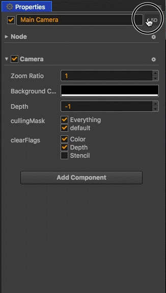
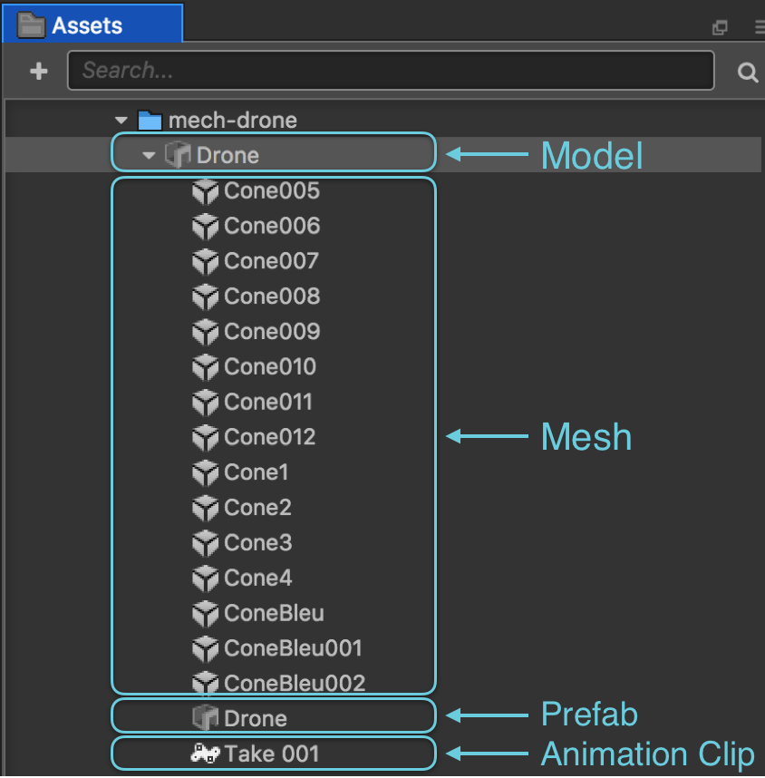
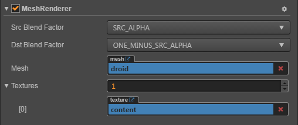

# Cocos Creator v2.1.0 Release Notes

__Cocos Creator__ __v2.1__, adds support for 3D features such as: **3D model rendering**, **3D Camera**, **3D skeletal animation**, and **3D point selection**. The __Cocos Creator__ editor now natively supports parsing 3D model files of type **FBX format**. It's that simple, no additional import workflow is required!

In the previous __v2.0__, __Cocos Creator__ had used a __Cocos3D__ based 3D renderer. With this foundation, 3D support could officially be introduced. The addition of 3D features can greatly enrich the expressiveness of 2D games, reduce the resource overhead of 2D games, and bring more imagination and ideas to expand games.

However, it should be emphasized that the target users of __Cocos Creator__ is still the 2D game development team, and the **2D game is still the core service goal of Cocos Creator 2.x releases**. We will continue to optimize the development experience and basic performance of 2D games, and gradually increase the 3D functions suitable for integration into 2D games. Therefore, __Cocos Creator__ will not become a pure 3D engine, which is the goal of __Cocos3D__. __Cocos Creator's__ roadmap is closer to 2.5D.

This is not the first time __Cocos__ has upgraded the engine from 2D to 3D. A few years ago, __Cocos2d-x__ expanded to the 3D space and accumulated a lot of experience. It also produced a very good game called *Art of Conquest*. However, at that time, 3D functions were piled up on a very heavy 2D renderer. There was also no editor support. It was not widely recognized by the market. This time, __Cocos Creator__ is based on __Cocos3D's__ 3D renderer, which has a lot of 3D stability and guarantees a seamless editor experience.

## Follow-up Version Notice

**v2.0 will continue to be maintained, native platform performance will be optimized as soon as possible**

__v2.0__ and __v2.1__ will grow together over a period of time.__v2.0__ will continue to be maintained, adding more performance optimizations and bug fixes. We will soon be beta testing v2.0.7. In v2.0.7 the rendering performance of the engine has been optimized, especially **Spine** and **DragonBones**. Also, the performance has been greatly improved.

**v2.1 iterations will be more aggressive**

Compared with __v2.0__, the upgrade cycle of __v2.1__ will mainly focus on 3D features. We recommend upgrading new projects with 3D requirements to this version, and establishing contact with us on our forums. This allows us and our 3D partners to provide support. Since v2.1 is a very new version, we will speed up the iteration and try to meet the needs of developers. In particular, **currently v2.1.0 version still does not support 3D scene editing, only the 3D parameters can be set in Properties**. We will be releasing **v2.1.1** in the near future which will support *3D scene editing*, *material systems* and *optimizing the 3D development process*.

## Complete list of changes (compared to v2.0.5)

### What's New

#### 3D Node

In __v2.1__, newly created **Nodes** are still 2D by default. When needed, you only need to click the 2.5D button at the top right of the **Node** to switch to **3D mode**. After switching, you can edit the **z axis**. See [3D Node](../3d/3d-node.md).

You can watch converting to **3D Nodes** in action:

.

#### 3D Camera

Like **Node**, **Camera** is also divided into two modes. When you add a **Camera** component to a normal 2D node, it becomes a 2D Camera. When you switch **Node** to **3D mode**, **Camera** will also enter **3D mode**, and then you can edit **Camera's** **FOV** and other parameters in **3D mode**.

You can watch switching to **3D Camera** in action:

.

#### 3D Model Import

Currently, __Cocos Creator__ supports importing the **.fbx** format of 3D models. **.fbx** is the de-facto standard in 3D modeling software. The process of importing is very simple, just drag the **.fbx** model resources into the **Assets** and wait a few moments for the import to complete. After the import is completed, you can see that the imported model is a folder that can be expanded in **Assets**. When importing the model, the editor will automatically parse the content of the model and generates resources such as __Prefab Meshes__ and __Skeletal Animations__ and so on. See [Import Models](../3d/import-model.md)

#### Mesh Renderer Component

Mesh Renderer is used to draw grid resources. See [Mesh Renderer](../3d/mesh-renderer.md).

#### Skeletal Animation Component

The **Skeletal Animation** component inherits from the **Animation** component. Using the **Skeletal Animation** component is not much different from how you would use the **Animation** component. The exception is the **Skeletal Animation** component uses a clip that can only be a **Skeletal Animation** clip. The **Skeletal Animation** component is automatically added to the model's Prefab when it is imported. See [Skeletal Animation Component](../3d/skeleton-animation.md) for details.

For more 3D instructions, please consult the documentation [3D System](../3d/index.md).

#### Optimize Auto Atlas Build Speed

__v2.1__ greatly optimizes the speed of Auto Atlas construction. If the atlas has not changed, the results of the last build are used.

#### Further Improve Rendering Performance

Between __v2.0__ compared to __v1.x__, there are some cases where the engine does not render batches, resulting in an increase in Draw Calls. __v2.1__ re-optimized these conditions. For example: the previous **color** or **opacity** cannot be batch processed, **sliced** and **non-sliced** share the same texture and cannot be batched. The problem that the **opacity** 0 node still occupies the Draw Call is solved.

#### Add Simulator Debugging Function

In the **Settings -> Preview Run** panel, the **Open simulator debugger panel** option and the **Wait for debugger connect** option have been added. The purpose of the **Open simulator debugger panel** option is to automatically open the debug window when the simulator previews the project. The **Wait for debugger connect** option is used to suspend the boot process until the debugger connection is complete for debugging the load process.

#### Texture Auto Compression

The compression required by the texture can be set directly in the editor, and __Cocos Creator__ will automatically compress the texture when the project is published. Exporting multiple image formats simultaneously on the web is supported. The engine will automatically download the appropriate format according to the different browsers. See [Compressed Textures](../asset-workflow/compress-texture.md) for details.

### Enhancements

#### Editor

  - *Dashboard* is closed when the project is opened, and automatically opened when the project is closed.
  - *Dashboard* will automatically record the last created project path.
  - Optimize the preview of the Button under the editor.
  - Optimize the way Button Click Event indexes components, avoiding the loss of indexes after scripts are renamed.
  - QQ light game construction allows direct packaging of zip files for uploading servers.
  - The new plug-in mall automatically prompts the user to install after the plug-in download is completed.
  - When building a WeChat mini-game main context project, the open data context will not be emptied again.
  - Modify the API Level selected by default when building the Android platform to the current highest level (Target API Level).
  - The node path bar in the scene editor is removed, and the node path can be obtained through the node right-click menu of the hierarchy manager.
  - The animation editor defaults to Constant curves for values ​​of type cc.Enum and cc.Integer, without interpolation.
  - Animation editor key frame addition and deletion experience optimization.
  - The optimization engine automatically compiles the experience.
  - Added a series of other experience optimizations.

#### Engine

  - [UI] Added the affectedByScale property to the Layout component. If the developer wants the scaling of the Layout subnode to affect the layout, you can turn it on manually.
  - [UI] supports fnt files in XML format.
  - [UI] The Content Size of the node will be refreshed immediately when the Label node is onEnable.
  - [UI] When the target of Button is not defined, the current node will be used by default.
  - [UI] ToggleContainer adds a checkEvents event property similar to Toggle, which fires only when Toggle's isChecked state becomes true.
  - [Action] Added support for four actions of `cc.Rotate3DTo, cc.rotate3DTo, cc.Rotate3DBy, cc.rotate3DBy`.
  - [Native] Rejoined WebView and VideoPlayer support removed in v2.0.0 on iOS and Android platforms.
  - [Native] The Mac native platform switches to the V8 engine. If you need to use JSC, you need to manually modify the macro. For details, see [#1515](https://github.com/cocos/engine-native/pull/1515).
  - [Native] Add the missing key and length properties of the native platform LocalStorage, see [#1371](https://github.com/cocos/engine-native/pull/1371).
  - [Native] Adopts Pinyin input behavior unified with Android on iOS native platform, does not retain input of unfinished pinyin.
  - [Android] Upgrade Android compilation to NDK r16+ Clang, and compile Android pre-compiled library with Clang.
  - [Android] Upgrade the Android build tool to configure Gradle to 4.4, plugin to 3.1.4. (Gradle 4.6 has a known issue that will cause resource packaging to fail).
  - [Android] Optimize Android input box experience.
  - [Android] Squeeze Android empty package body, the minimum package body is reduced from 7.0MB to 6.3MB.
  - [Web] Increase transparency support for WebView on the web platform.
  - [Web] Optimized display position of WebView components.
  - [Web] Optimizing the performance of VideoPlayer on the X5 browser.
  - [Wechat] Supports getting the res and referrerInfo parameters passed to the platform when responding to the cc.game.EVENT_SHOW event on WeChat Mini Games.
  - [VideoPlayer] Optimized the performance of VideoPlayer full-screen playback.

### Bug Fixes

#### Editor

  - Fix an issue where the animation editor node list may not be updated.
  - Fix the problem of selecting the RichText subnode in the scene editor.
  - Fixed an issue where the error code always returned 0 when building a project using the command line, whether or not an error occurred.
  - Fixing the background of the mesh in the scene editor will penetrate above some translucent images, causing some differences in color and runtime.
  - The editor will report an error when repairing an external drag resource to an invalid location in the resource manager.
  - Fixed remote server ip getting error when publishing Android Instant platform.

#### Engine

  - [Core] Problem with activeInHierarchy being true after fixing node destroy.
  - [Core] Fix filter in RenderTexture, premultiply alpha setting is invalid.
  - [Core] Fixed an issue where the scene introduced by the plugin could not be loaded.
  - [Web] Fixed a problem with white afterimages on Chrome 69, 70. (Since 2.0)[#3357](https://github.com/cocos/cocos-engine/pull/3357).
  - [UI] Fix Button may have some state invalidation when multiple states are superimposed on each other.
  - [UI] Fix LabelOutline setting invalid color problem.
  - [UI] Fixed an issue where setting Toggle.isChecked to be invalid in the start method.
  - [UI] Fix the problem that the LabelOutline component is not synchronized when the state is modified.
  - [Animation] Fixed an issue where the parameters of AnimationState might be parsed as a string type.
  - [QQPlay] Fix the problem that QQ light game does not respond to the background background switching event.
  - [QQPlay] Fix the problem that the font will become very small if you use italics on QQ light games.
  - [QQPlay] Fix the problem that the QQ light game can't replay when the lock screen re-enters or the front and back switches.
  - [QQPlay] Fixes the problem of the ended event after the audio setCurrentTime is fixed [#3373](https://github.com/cocos/cocos-engine/pull/3373).
  - [Native] Fix native platform connection socket.io server may report Bad Request error.
  - [Native] Fix iOS and Android can't detect gravity sensor.
  - [Native] Fix iOS call cc.game.restart Restart the game and then enter text will crash.
  - [Native] Fixing the problem that the opacity attribute of Label on Windows native platform does not work.
  - [Native] Fixed an issue where Android could not listen to onKeyUp.
  - [Native] Fix the problem that the Android phone will fail to load if the built-in SSL certificate expires.
  - [Native] Fixed an issue where server redirection was not supported when downloading images from Android native platform [#PR](https://github.com/cocos/engine-native/pull/1584).
  - [Physics] Fixed an issue where `MouseJoint` failed to respond to touch cancel.
  - [Spine] Fixes the problem that textures may be lost when Spine is reloaded under Mask.

### MIGRATION GUIDE

#### v2.1 Upgrade Considerations

  - Node's `rotation` related API has been marked as deprecated, and the runtime will prompt to upgrade to `angle`. See [3D Node - Node API Upgrade](../3d/3d-node.md).
  - The NDK version of Android needs to be upgraded to `r16` or the compilation will fail.

#### WeChat Open Data Context

Starting with __v2.0.1__, __Cocos Creator__ upgraded the open data context solution, see [Wechat Open Data Context](../publish/publish-Wechatgame-sub-domain.md).

#### v2.0 Upgrade Guide

See the [v2.0 Upgrade Guide](../release-notes/upgrade-guide-v2.0.md).

#### Resource Upgrade

Since __v1.10__, __Cocos Creator__ has refactored the underlying resource types. Most projects are not affected, but some projects may receive some warnings. For details, please refer to [v1.10 Resource Upgrade Guide](../release-notes/raw-asset-migration.md).

----------
The above is the update description for __v2.1.0__. After downloading, create a new example project and open the case under `assets/cases/3d` to experience it.
