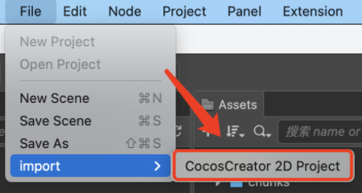
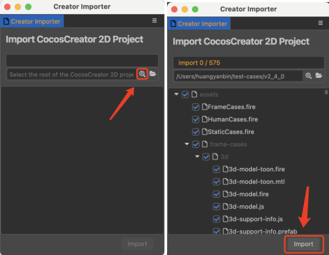
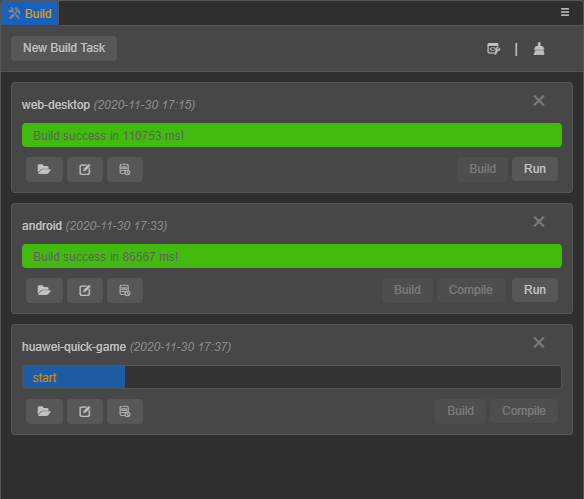
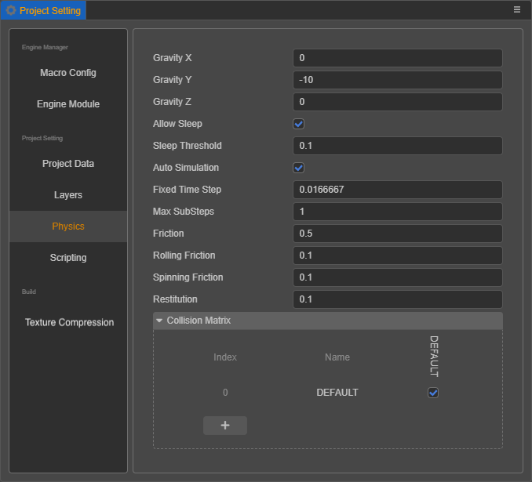
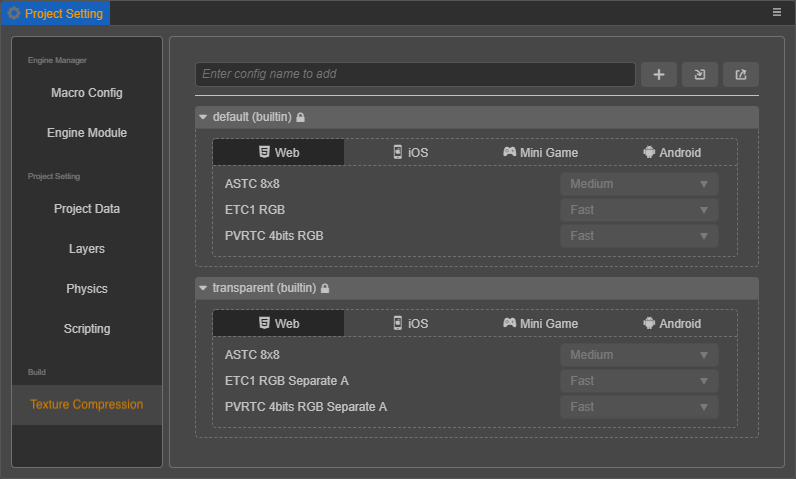
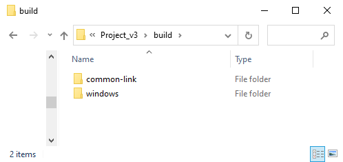
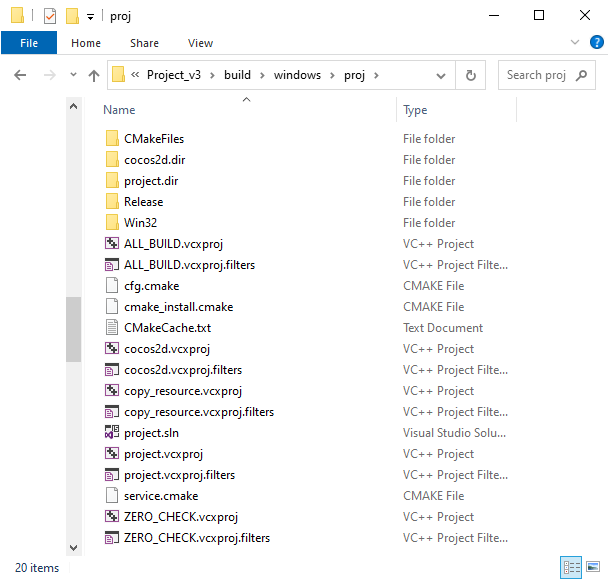

# Cocos Creator 3.0 Upgrade Guide

## Version introduction

__Cocos Creator 3.0__ integrates all the functions of the original __2D__ and __3D__ products, brings many major updates, and will become the main version of __Cocos Creator__. At the same time, 3.0 also continues __Cocos's__ advantages of light weight and high efficiency in 2D categories, and provides an efficient development experience for 3D heavy games.

In order to ensure the smooth transition of an existing __Cocos Creator 2.4__ project, we will use 2.4 as the LTS (long-term support) version and provide continuous updates for the next **two years**! In **2021**, 2.4 will continue to be updated to provide bug fixes and new mini-game platform support to ensure the successful launch of your project; in **2022**, we will continue to provide developers with the key to 2.4 bug fixes to ensure the smooth operation of online games! Therefore,

 - **Existing 2.x projects can continue to develop without compulsory upgrade to 3.0**.
 - **For new projects, it is recommended to use version 3.0 for development**. We will continue to optimize the development experience and operating efficiency of 3.0 to support the smooth launch of heavy games of different categories such as 2D and 3D.

__Cocos Creator 3.0__ uses a new future-oriented engine architecture, which will bring high-performance, data-oriented and load-balanced renderers to the engine, and seamlessly support Vulkan & Metal multi-backend rendering. In the future, it will also support mobile VR/AR and some Host platform. For a detailed introduction to the __Cocos Creator 3.0__, please go to [Official Website Update Instructions](https://cocos.com/creator).

## How to migrate

Although **we do not recommend projects under development, especially projects that are about to go live, to upgrade to v3.0**, there will be a v2.x resource import tool in __Cocos Creator 3.0__. This tool supports importing old projects, project resources, and project code very well. Code-assisted import will convert **JavaScript** into **TypeScript**, and automatically add component type declarations, attribute declarations and function declarations. The references of components in the scene will be preserved, and the code inside the function will be imported in the form of comments, which can reduce the difficulty of upgrading.

Developers only need to click **File -> Import -> Cocos Creator 2D Project** in the main menu, and a window for importing the plug-in will appear.



Next, click the button in the left picture below and select the root directory of the __Cocos Creator 2D__ project. The plug-in will automatically traverse all the resources in the project and present it to the developer. Developers can check the resources to be imported by themselves, and click the __Import__ button in the right picture below after selection. The import is complete.



If an existing project needs to be upgraded under special circumstances, and technical or workload difficulties are encountered, please contact [slackmoehrle@cocos.com](mailto:slackmoehrle@cocos.com) for assistance!

## Old version developers quickly get started

### Engine API upgrade

#### Asset loading

The API for __Cocos Creator 3.0__ asset loading is consistent with v2.4, please refer to the [Asset Manager Overview](../asset/asset-manager.md).

#### UI related interfaces on the obsolete node

The deprecated interfaces are as follows:

- Attributes: `width`, `height`, `anchorX`, `anchorY`.
- Methods: `getAnchorPoint`, `setAnchorPoint`, `getContentSize`, `setContentSize`.

Please get the `UITransform` component on the node first, and then use the corresponding interface, for example:

```typescript
node.getComponent(UITransform).setContentSize(size);
```

### Editor upgrade

#### Build Panel

The builds of all platforms in __Cocos Creator 3.0__ are built-in plug-ins, so the __Build__ panel is also different from __v2.4__. The unique build options of each platform will be placed in a foldable section control separately.


After clicking the build button, it will jump to the __Build Tasks__ panel, where all built platforms will be displayed. You can modify the build options of the built project in this panel and then rebuild, view the build log, open the project directory, etc. If you need to compile for other platforms, click the __New Build Task__ button at the top left of the panel.



In addition, it supports the construction of multi-module results with file separation during construction, which facilitates concurrent loading of multiple modules and dynamic loading of modules, and the WeChat engine plug-in supports the selection of different physical engine backends. The `settings.js` generated after the build is also changed to `settings.json` and placed under `src` directory, allowing it to be used as a resource upload server.

#### Asset Preview Panel

Select the resource in the __Asset__ panel to display resource thumbnails in the __Asset Preview__ panel. If the folder where the resource is located is selected, the thumbnails of all resources under the folder can be displayed for easy viewing.


#### Animation Panel Upgrade

- Support the search and display filtering of nodes in the node tree panel.
- Support using the system clipboard to copy and paste all animation data (nodes, tracks, and key frames) on nodes.
- Support multi-select nodes to add attribute tracks in batches.
- Optimize the experience of selecting and deselecting key frames (__Ctrl + mouse click__ to select key frames to deselect them).
- Support continuing to edit node attributes in the animation editing state, including particle and model material attributes, etc.


#### Project Setting Panel Update

It is divided into three parts: __Engine Manager__, __Project Setting__, and __Build__.

The Physics Collision Group uses the `PhysicsSystem.PhysicsGroup` type independently, and no longer shares the group configuration with `Node.Layers`:



__Texture Compression__ is modified to configure the preset in the __Project Setting__ panel, then select the image resource in the __Asset__ panel, and then select the preset method.<br>
After the old project is upgraded, the editor will automatically scan all the compressed texture configurations in the project and sort out several presets. Since it is automatically scanned, the generated name may not be what you want, you can modify it here.



### Build Directory Differences

__Cocos Creator 2.x__ and __Cocos Creator 3.0__ differ to a certain extent in the directories generated after building on different platforms. Let's take __v2.4.3__ as an example and compare it with __v3.0__ on Web, Native and WeChat Mini Game platforms respectively.

#### Web

The directory generated by Cocos Creator 2.4.3 after building the __Web Desktop__ is as follows:


The directory generated by Cocos Creator 3.0 after building the __Web Desktop__ is as follows:


From the above two figures, notice the directory generated after building the Web Desktop, v2.4.3 and v3.0 are mostly the same, except with the following differences:

1. Cocos Creator 3.0 puts all engine related code, such as core modules, physics modules, plugin scripts, etc., into the `web-desktop/cocos-js` directory, which looks clearer than v2.4.3, which was decentralized in the `web-desktop` directory.

    

2. Cocos Creator 2.4.3 has only one startup script `main.js`, while v3.0 has the following two startup scripts:

    - `index.js` -- Used to do some pre-processing work.
    - `application.js` -- Used to start the game.

3. The `src/settings.js` used to manage configuration in v2.4.3 is changed to `src/settings.json` in v3.0.

4. The splash screen `splash.png` in v2.4.3 is stored in `settings.json` by default in v3.0.

5. The `style-desktop.css` and `style-mobile.css` in v2.4.3 are combined into a single `style.css` in v3.0.

#### WeChat Mini Game

The directory generated by Cocos Creator 2.4.3 after building the __WeChat Mini Game__ is as follows:


The directory generated by Cocos Creator 3.0 after building the __WeChat Mini Game__ is as follows:


From the above two figures, notice the directory generated after building the __WeChat Mini Game__, v2.4.3 and v3.0 are mostly the same, except with the following differences:

1. Cocos Creator 3.0 puts all engine related code, such as core modules, physics modules, plugin scripts, etc., into the `wechatgame/cocos-js` directory. While v2.4.3 scattered part of it in the `wechatgame` directory and part of it in the `wechatgame/cocos` directory.

    

2. Cocos Creator 2.4.3 compiles all the adaptation layer code of mini games into `adapter-min.js`, while v3.0 stores all the adaptation layer code as loose files in the `libs` directory, without compilation.

3. The startup script for v2.4.3 is `main.js`, and for v3.0 it is `application.js`.

4. Cocos Creator 2.4.3 records all references of dynamic code in `ccRequire.js`. While v3.0 currently does not have this feature.

5. The `src/settings.js` used to manage configuration in v2.4.3 is changed to `src/settings.json` in v3.0.

#### Native

The directory generated by Cocos Creator 2.4.3 after building the __Windows__ platform is as follows:


The directory generated by Cocos Creator 3.0 after building the __Windows__ platform is as follows:



As you can see from the above two figures, there is a big difference between v2.4.3 and v3.0 in the directory generated after building the __Windows__ platform.

Since the underlying C++ code generated after building on each native platform (e.g. Android, Windows) is completely consistent. Cocos Creator 3.0 extracts the underlying C++ code that was stored in the `jsb-link/frameworks/runtime-src/Classes` directory in v2.4.3 and placed it in a shared `common-link` folder (or `common-default` folder, depending on the build template). This way, when building the native platform, if the `common-link` folder is detected to already exist, this part will no longer be processed, to speed up the build.

The `Windows` folder is used by v3.0 to store the native-related content for the current built (or the `android` folder if the build is for Android).


Let's take a look at the `jsb-link` directory generated after the build in v2.4.3.


The main differences between them include the following:

1. The files belonging to the application layer in the v2.4.3 build directory have been merged into the `assets` directory in v3.0. The application layer files include the following:

    - **assets** -- Resource directory.
    - **jsb-adapter** -- Directory, store the adaptation layer code.
    - **src** -- Directory, store engine related code, plugin scripts,  `settings.js` etc.
    - Related configuration files (`.cocos-project.json`, `cocos-project-template.json`, `project.json`).
    - The startup script (`main.js`).

    The `assets` directory structure of v3.0 is as follows:

    

    Cocos Creator 3.0 has also made adjustments and changes accordingly during the merging process.

    - All the engine related code (such as core modules, physics modules, plugin scripts, etc.) that was originally placed in the `src/cocos2d-jsb.js` file in v2.4.3 is moved to the `assets/src/cocos-js` directory.

      

    - Cocos Creator 2.4.3 has only one startup script `main.js`, while v3.0 adds a new startup script `application.js` in the `src` directory to startup the game in addition to `main.js`.

    - The `src/settings.js` used to manage configuration in v2.4.3 is changed to `src/settings.json` in v3.0.

2. Cocos Creator 2.4.3 generates all the native build projects in the `frameworks/runtime-src` directory.

    

    While v3.0 generates the native build project in the `build` directory and only generates the native build project for the current built. As shown below:

    

3. Some resources needed for compilation, such as application icons, application startup scripts, etc., v2.4.3 are stored in the build project, while v3.0 are stored in the `windows/proj` directory.

## TypeScript Reference Tutorial

- [TypeScript Official Website](https://www.typescriptlang.org/)
- [TypeScript - Classes](https://www.typescriptlang.org/docs/handbook/classes.html)
- [TypeScript - Decorators](https://www.typescriptlang.org/docs/handbook/decorators.html)
- [TypeScript - DefinitelyTyped](http://definitelytyped.org/)
- [Learn TypeScript in Y minutes [cn]](https://learnxinyminutes.com/docs/zh-cn/typescript-cn/)
- [TypeScript GitHub](https://github.com/Microsoft/TypeScript)
- [The Best Resources For Learning TypeScript for Game Development](https://www.cocos.com/en/the-best-resources-for-learning-typescript-for-game-development)
