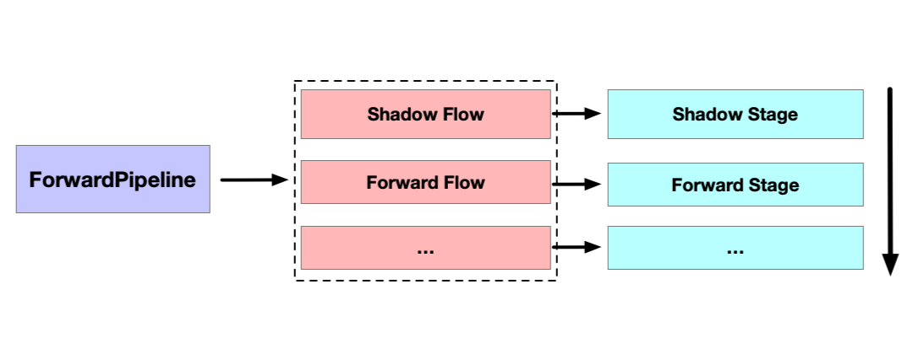

# Builtin Rendering Pipeline

Since this version, the builtin rendering pipeline includes builtin-forward and builtin-deferred. The rendering pipeline can be switched via **Project->Project Settings->Project Data->RenderPipeline**, and restart the editor after the switch to take effect.

</img>

## Forward Rendering Pipeline

The engine uses the forward rendering pipeline by default, and the forward rendering pipeline is executed as shown below.

</img>

ShadowFlow includes a ShadowStage that prepares shadow map for objects in the scene that need to cast shadows, and ForwardFlow includes a ForwardStage that maps all The ForwardFlow contains a ForwardStage that draws all objects in the scene in **Non-Transparent-Lighting-Transparent-UI** order. When calculating light, each object will be calculated with all light to determine if the object is illuminated, and the light illuminated by the object will be drawn and calculated. Currently there will only be one parallel light in effect in the scene, and the maximum number of acceptable lights is 16.

## Deferred Rendering Pipeline

The engine currently provides a trial version of the builtin deferred rendering pipeline, which can be switched for projects with a large number of lights to relieve the pressure on the lighting calculation.

</img>

The builtin deferred pipeline mainly consists of ShadowFlow, GBufferFlow and LightingFlow stages. 
1. ShadowFlow is consistent with forward rendering and preforms shadow mapping.
2. GBufferFlow contains a GBufferStage that draws non-transparent objects in the scene. 
3. LightingFlow contains a LightingStage and a PostProcessStage, where the LightingStage performs screen-space based lighting calculations on the non-transparent objects output to the GBuffer before painting the translucent objects, and then PostProcessStage will draw the full-screen image obtained by LightingStage to the main screen, and then finally draw the UI.

Since the delay pipeline needs to use the GPU's Multiple Render Targets feature to draw the GBuffer, most mobile platforms should support it, but for WebGL1.0 environment, if the platform does not support WEBGL_draw_buffers extension, it will not render properly. For custom Standard materials, you need to refer to the built-in builtin-standard.effect to add the corresponding deferred pass declaration for the deferred pipeline. As follows as shown in the figure.

</img>

If you need to dynamically set the material Uniform to achieve material effect changes, you need to specify the corresponding pass index to update in the deferred pipeline to take effect, instead of updating the pass with index 0 by default, for example, the builtin-standard material has a corresponding passIndex of 1.

The engine's builtin rendering pipeline will continue to be optimized and feature added, such as post-processing stage, HDR, reflection, etc., to provide developers with more diverse and rich rendering features.