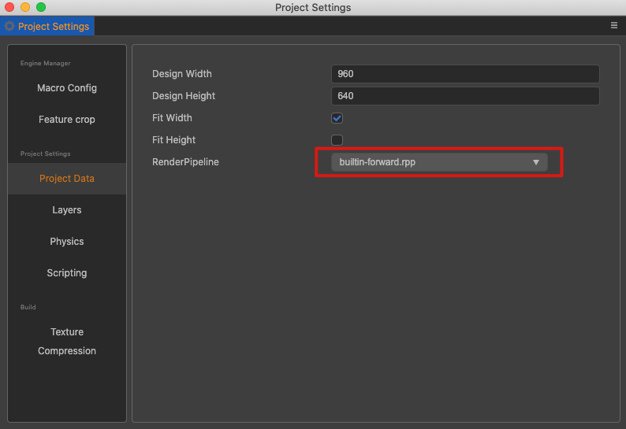

# Built-in Render Pipeline

In Cocos Creator 3.0, the built-in render pipeline includes **builtin-forward** (Forward Render Pipeline). The render pipeline can be set via **Project -> Project Settings -> Project Data -> RenderPipeline** in the editor's main menu, and restart the editor to take effect after the settings are done.

In the built-in render pipeline, there will only be one directional light in effect for a scene. Each object can only receive 2 Spherical lights and 2 spotlights, and if it is out of range, the lights will be sorted by distance and the two closest lights will be taken.

## Forward Render Pipeline

Forward rendering renders each object in the scene in turn, calculating the lighting for each object as it is rendered.

The built-in render pipeline contains a **ForwardFlow**, which contains a **ForwardStage**. Two **RenderQueues** are set in the ForwardStage:

- The first one is used for rendering **opaque** objects, sorted from near to far from the camera.
- The second one is used for rendering **translucent** objects, sorted from far to near from the camera.

The forward render pipeline can be used to control the rendering flow of the scene, for example for lighting management applications, please refer to the [Additive per-pixel lights](../concepts/scene/light/additive-per-pixel-lights.md) documentation.
