# Custom rendering of pipelines (experimental)

A new **Custom Render Pipeline** has been added in Cocos Creator 3.6.

The interface and naming are not yet stable and are not recommended for use in formal projects. Currently, only the web platform is supported.

The interface of the **custom rendering pipeline** is located in `cocos/core/pipeline/custom/pipeline.ts`

## Overview

The **CustomPipeline** allows users to customize the **RenderPass**, set the input/output **RenderView**, and the **RenderContent** to be drawn for each **RenderPass**.

**Render content** can be a **Scene**, a screen **Quad**, or a **Dispatch** of a computational task, depending on the type of **RenderPass**.

The order in which **rendered content** is drawn can be adjusted by a **RenderQueue** (RenderQueue).

The [**RenderPass**, **RenderQueue**, **RenderContent**] of **CustomRenderPipeline** constitute a forest of.

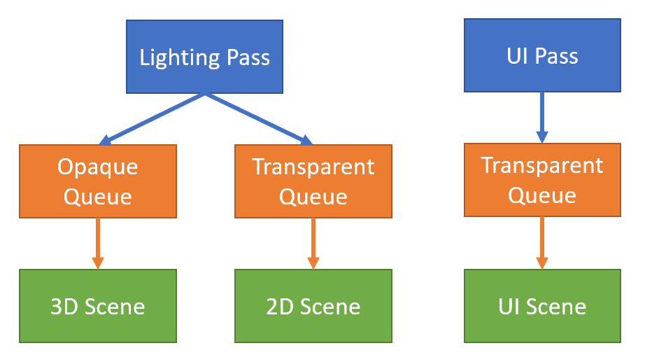</img>

**Custom Rendering Pipeline** of [**Render Pass**, **Render View**] constitutes a directed acyclic graph (DAG).

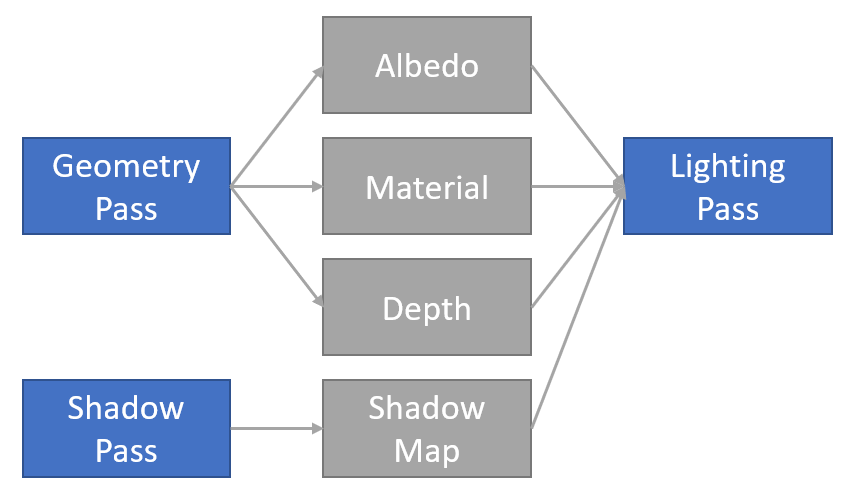</img>

We can stack the above two graphs to get the **RenderGraph**. The **RenderGraph** describes the entire flow of the **Custom Render Pipeline**, and the engine will allocate resources, optimize the flow, and execute the rendering according to the user's customized flow graph.

## RenderPass

**RenderPass** There are three types: Raster, Compute, and Resource.

Each type will have its own different **RenderPass**.

### Raster

The raster type uses the rasterization capabilities of the GPU (executed in GraphicsEngine).

#### 1. RasterPass

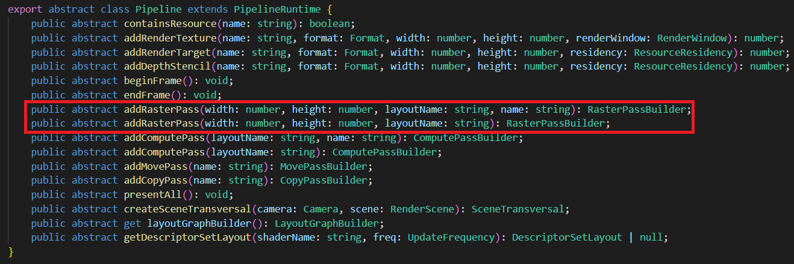</img>

- width, height is the resolution of the output rendering target.

- layoutName is the name of the Effect's Stage.

- name is the name displayed during debugging. If it is empty, the system will give the default name.

#### 2. RasterSubpass

Feature not yet open. Requires GPU Tile-based rendering capability.

#### 3. PresentPass

Present the content to the screen.

### Compute

The compute type uses the general-purpose computing power of the GPU, as well as ray-tracing capabilities (executable in GraphicsEngine, ComputeEngine).

#### 1. ComputePass

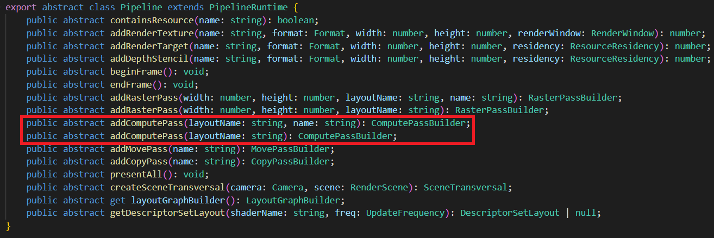</img>

- layoutName is the name of the Effect's Stage.

- name is the name displayed during debugging. If it is empty, the system will give the default name.

#### 2. RaytracePass

Feature not yet open. Requires GPU ray tracing capability.

### Resource

The resource type uses the resource processing power of the GPU (executable in GraphicsEngine, ComputeEngine, CopyEngine).

#### 1. CopyPass

Responsible for copying the resource source to the target, which requires the resource format to be compatible.

</img>

- name is the name displayed during debugging. If it is empty, the system will give the default name.

#### 2. MovePass

Responsible for moving the resource source to the target, requiring the resource to be in the same format.

Move here is a semantic concept (move semantics): move the source variable to the target variable, expiring the source variable. If the resource cannot be moved for some reason (e.g. the resource source is being read), this is done as a copy.

Move semantics are used for pipeline optimization for the purpose of bandwidth reduction. If you are not sure how to use **Move Pass** properly, you can use **Copy Pass** instead, which will not affect the rendering result and is easier to debug.

## RenderView

There are two types of RenderView: **RasterView**, **ComputeView**.

### RasterView

**Rasterized view** will be rasterized. There are two subtypes: RenderTarget, DepthStencil.

</img>

- slotName is the name of the shader pixel component. (e.g. color, normal, etc.)

- accessType is the binding type, which can be Read, ReadWrite, Write, Read as input, Write as output, ReadWrite as both input and output, [Note] DepthStencil When doing DepthTest, although the result is not written to the view, but as output, the binding type is still Write. some platforms open ARM_shader_framebuffer_fetch_depth_stencil extension, DepthStencil binding type is ReadWrite.-> When ARM_shader_framebuffer_fetch_depth_stencil extension is enabled in a shader, the corresponding DepthStencil binding type should be set to ReadWrite

- attachmentType is the type, can be RenderTarget or DepthStencil.

- loadOp is the rasterized read option, which can be Read, Clear, or Discard.

- storeOp is the rasterized store option, can be Write (Store), Discard (Discard).

- clearFlags is the clear flag bit, if the type is RenderTarget, the flag bit must be Color. if the type is DepthStencil, it is one of Depth, Stencil, Depth | Stencil.

- clearColor is the clear color, if the type is RenderTarget, it is RGBA (Float4). If the type is DepthStencil, it is RG, where R stores Depth (Float) and G stores Stencil (Uint8).

### ComputeView

**Computed view** will not be rasterized. Commonly used for Samples, Unordered Access.

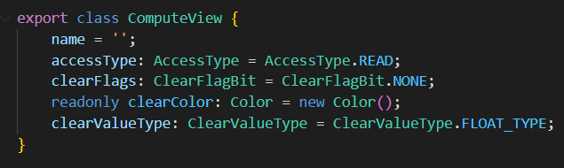</img>

- name is the name of the Shader descriptor (Descriptor).

- accessType is the read/write type. It can be Read, ReadWrite, or Write.

- clearFlags is the clear type of the resource, usually None or Color.

- clearColor is the clear color of the resource, Float4 or Int4. depends on clearValueType.

- clearValueType is the type of the resource's clear color, Float or Int.

If the resource is marked with a clear color, then the resource content is cleared with clearColor before executing **ComputePass**. Raster type passes(Raster) do not clear **ComputeView** content.

## Rendering view settings

**Raster**：

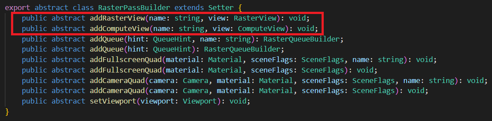</img>

**Compute**：

</img>

## RenderQueue

The **Render Queue** is a child node of the **Render Pass** (Render Pass) and has a strict (rendering) order of precedence. Only after the contents of one **Render Queue** are fully drawn, the contents of the next **Render Queue** will be drawn.

There are two types of **render queues**: **rasterization queue**, **computation queue**. are added in **rasterization pass** and **computation pass**, respectively.

### RasterQueue

**Rasterization queue** performs rasterization tasks, typically drawing **scenes**, drawing full-screen quads, etc. **Rasterization queue** is internally drawn in unspecified order.

</img>

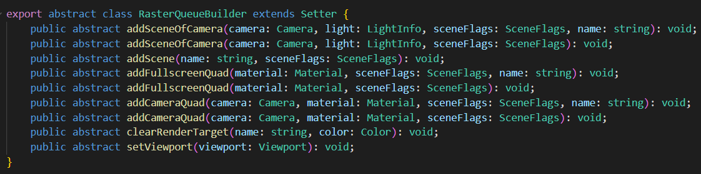</img>

- hint is a queue hint with four options None, Opaque, Cutout, Transparent. hint does not affect execution and is only used for performance testing. For example, on mobile platforms, we often want to draw the Opaque queue first (with AlphaTest off) and then the Cutout queue (with AlphaTest on). If an object with AlphaTest on is accidentally mixed in with the draw content of the Opaque queue, it will degrade the graphics performance. Therefore, we will check if the user's commit meets the expectation through the queue hint.

- name is the name displayed during debugging. If it is empty, the system will give the default name.

### ComputeQueue

**Compute Queue** contains only **Dispatch** , executed sequentially.

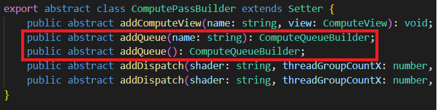</img>

</img>

**Compute Pass** No queue hint.

## RenderContent

**Rendering content** is sorted by **rendering queue** and consists of multiple elements.

### Scene

2D and 3D **scenes** that need to be drawn. Suitable for **RasterQueue**.

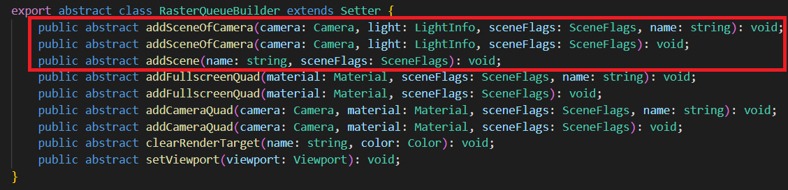</img>

Can be added via camera or directly. Certain lighting information can be attached.

- sceneFlags controls to some extent the rendering of **scene**. For example, which objects are rendered (Opaque, Cutout, Transparent), whether to render only shadow cast objects (ShadowCaster), whether to render only the UI, the lighting method (None, Default, Volumetirc, Clustered, PlanarShadow), whether to render GeometryRenderer, whether to render Profiler, etc.

### Quad

Full screen / partial **Quad**. Commonly used for post-effects rendering. Suitable for **RasterQueue**.

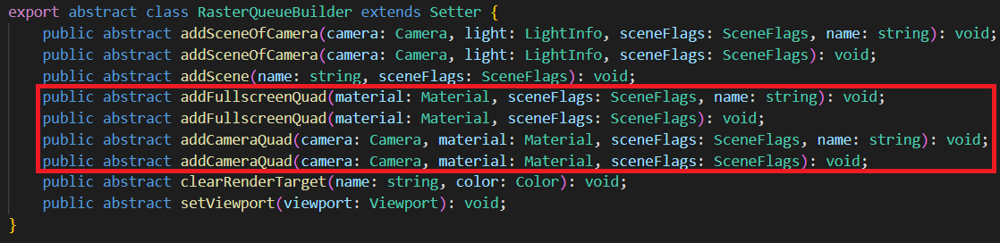</img>

### Dispatch

Used for **ComputeQueue**.

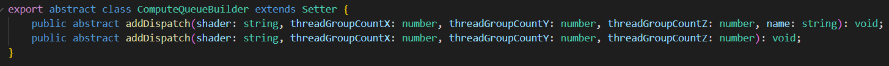</img>

### Dynamic Settings

We can dynamically set some properties of Queue, Pass.

For example, viewport, clearRenderTarget, etc.

## Rendering Data Settings(under development)

When writing rendering algorithms, we often need to set up some data for the Shader to use.

The **RenderGraph** provides interfaces for setting data in **RenderPass**, **RenderQueue**.

</img>

The user can set Constant, Buffer, Texture, and other data.

This data can be read-only or always in read/write state.

For resources with read/write state changes, we recommend tracking with **RenderView**.

Each **RenderPass**, **RenderQueue** has its own separate storage.

Each node has a different data update/upload frequency. The update frequency of user filled constants, Shader Descriptor (Descriptor) needs to match the update frequency of the node.

- **Rendering Pass**: one upload per **rendering pass** (PerPass).

- **Rendering Queue**: one upload per **rendering phase** (PerPhase).

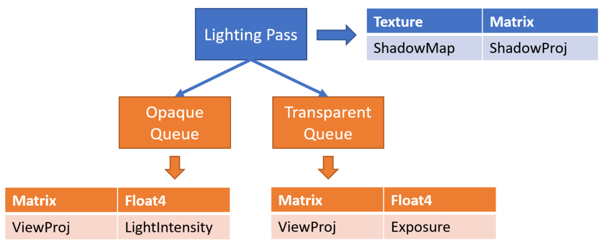</img>

## Feature Enable

Check the **Custom Rendering Pipeline** in **Project Settings** -> **Feature Cropping**:

</img>

Select a registered **custom rendering pipeline** by filling in the name of the **custom pipeline**.

**Forward Render Pipeline** (named Custom or Forward) and **Backward Render Pipeline** (name Deferred) are currently supported.

</img>

## Write a Custom Render Pipeline

Create a new TypeScript file, define a class named TestCustomPipeline, have it implement the `rendering.PipelineBuilder` interface, and register the pipeline to the system via the `rendering.setCustomPipeline` method, as shown in the following code.

```typescript
import { _decorator, rendering, renderer, game, Game } from 'cc';
import { AntiAliasing, buildForwardPass, buildBloomPasses,
    buildFxaaPass, buildPostprocessPass, buildUIPass, isUICamera, decideProfilerCamera } from './PassUtils';

export class TestCustomPipeline implements rendering.PipelineBuilder {
    setup(cameras: renderer.scene.Camera[], pipeline: rendering.Pipeline): void {
        decideProfilerCamera(cameras);
        for (let i = 0; i < cameras.length; i++) {
            const camera = cameras[i];
            if (camera.scene === null) {
                continue;
            }
            const isGameView = camera.cameraUsage === renderer.scene.CameraUsage.GAME
                || camera.cameraUsage === renderer.scene.CameraUsage.GAME_VIEW;
            if (!isGameView) {
                // forward pass
                buildForwardPass(camera, pipeline, isGameView);
                continue;
            }
            // TODO: The actual project is not so simple to determine whether the ui camera, here is just as a demo demonstration.
            if (!isUICamera(camera)) {
                // forward pass
                const forwardInfo = buildForwardPass(camera, pipeline, isGameView);
                // fxaa pass
                const fxaaInfo = buildFxaaPass(camera, pipeline, forwardInfo.rtName);
                // bloom passes
                const bloomInfo = buildBloomPasses(camera, pipeline, fxaaInfo.rtName);
                // Present Pass
                buildPostprocessPass(camera, pipeline, bloomInfo.rtName, AntiAliasing.NONE);
                continue;
            }
            // render ui
            buildUIPass(camera, pipeline);
    }
}
}

game.on(Game.EVENT_RENDERER_INITED, () => {
    rendering.setCustomPipeline('Test', new TestCustomPipeline);
});

```

You can see that the above code references the PassUtils script file, which facilitates direct use by users by simply encapsulating the logic associated with the commonly used `RenderPass` (PassUtils can be found here [download](./code/PassUtils.ts)).

PassUtils has quite a few functions, and we take some of the logic of `buildPostprocessPass` to introduce.

```typescript
function buildPostprocessPass (camera,
    ppl,
    inputTex: string,
    antiAliasing: AntiAliasing = AntiAliasing.NONE) {
    // ...
    const postprocessPassRTName = `postprocessPassRTName${cameraID}`;
    const postprocessPassDS = `postprocessPassDS${cameraID}`;
    if (!ppl.containsResource(postprocessPassRTName)) {        
        // Register a color texture resource, because current pass is to be on-screen, so pass camera.windows as an on-screen information. If is off-screen, you can use 'ppl.addRenderTarget' instead.
        ppl.addRenderTexture(postprocessPassRTName, Format.BGRA8, width, height, camera.window);        
        // Register a depthStencil texture resource
        ppl.addDepthStencil(postprocessPassDS, Format.DEPTH_STENCIL, width, height, ResourceResidency.MANAGED);
    }    
    // The follows codes will update the registered information of the color texture and depth stencil texture (mainly for the size), also if is off-screen, use 'ppl.updateRenderTarget' instead
    ppl.updateRenderWindow(postprocessPassRTName, camera.window);
    ppl.updateDepthStencil(postprocessPassDS, width, height);
    // Register a RasterPass with a layoutName of post-process
    const postprocessPass = ppl.addRasterPass(width, height, 'post-process');
    postprocessPass.name = `CameraPostprocessPass${cameraID}`;    
    // Set the viewport information of current rasterPass
    postprocessPass.setViewport(new Viewport(area.x, area.y, area.width, area.height));
    // Determine if there is information of the same name of the input texture in the system, and inject the input texture into the sampler of outputResultMap
    if (ppl.containsResource(inputTex)) {
        const computeView = new ComputeView();
        computeView.name = 'outputResultMap';
        postprocessPass.addComputeView(inputTex, computeView);
    }    
    // Config the clear color of the postprocessPass的clear
    const postClearColor = new Color(0, 0, 0, camera.clearColor.w);
    if (camera.clearFlag & ClearFlagBit.COLOR) {
        postClearColor.x = camera.clearColor.x;
        postClearColor.y = camera.clearColor.y;
        postClearColor.z = camera.clearColor.z;
    }
    // Register for color texture related passes to view
    const postprocessPassView = new RasterView('_',
        AccessType.WRITE, AttachmentType.RENDER_TARGET,
        getLoadOpOfClearFlag(camera.clearFlag, AttachmentType.RENDER_TARGET),
        StoreOp.STORE,
        camera.clearFlag,
        postClearColor);    
    // Register a PassView for depth stencil texture
    const postprocessPassDSView = new RasterView('_',
        AccessType.WRITE, AttachmentType.DEPTH_STENCIL,
        getLoadOpOfClearFlag(camera.clearFlag, AttachmentType.DEPTH_STENCIL),
        StoreOp.STORE,
        camera.clearFlag,
        new Color(camera.clearDepth, camera.clearStencil, 0, 0));
    // Associate the color texture resource with the associated pass view (i.e. the color texture output of the renderpass)
    postprocessPass.addRasterView(postprocessPassRTName, postprocessPassView);
    // Associate the depth stencil texture resource with the associated pass view
    postprocessPass.addRasterView(postprocessPassDS, postprocessPassDSView);
    // Add a specific render queue and get the postprocess material to draw a quadrilateral of equal size to the screen
    postprocessPass.addQueue(QueueHint.NONE).addFullscreenQuad(
        postInfo.postMaterial, 0, SceneFlags.NONE,
    );
    // ...
    if (profilerCamera === camera) {
        // Enable profiler
        postprocessPass.showStatistics = true;
    }
    // Return the resources of color texture and depth stencil texture, which can be used as data source for other render passes
    return { rtName: postprocessPassRTName, dsName: postprocessPassDS };
}
```

First we need to know how `RasterPass` configures `layoutName` (i.e. the post-process string in the above code). After opening the `post-process.effect` file, we can see that the `pass` name defined internally is `post-process`, so the pass name in the effect file is used as the `layoutName` of RasterPass. If effect does not define pass name, then `layoutName` of `RasterPass` has to be assigned to `default` (forward/gbuffer related RasterPass are configured by default). So to configure your own post-processing scheme, you need to configure the pass name correctly for the effect file you write.

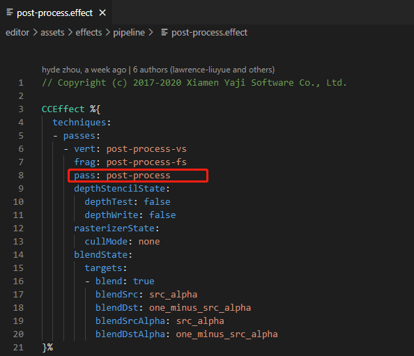</img>

We also need to use the output texture of the previous pass as the input information of the current pass, as mentioned above, we need to achieve this through `ComputeView`, and here the name of `ComputeView` is set to `outputResultMap`, so how to configure this name correctly? Continuing the analysis of the `post-process.effect` file, we can see the following code, the name of `ComputeView` is the same as the texture input name of the slice shader of `post-process-fs`.

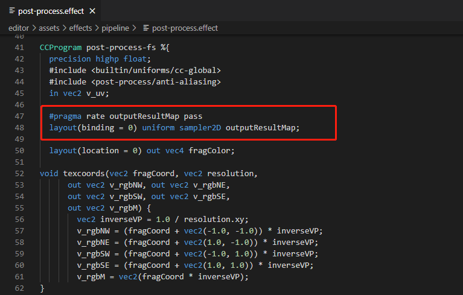</img>

We also need to declare the outputResultMap name with the following line of code, indicating that the input texture is used at Pass level.

```glsl
#pragma rate outputResultMap pass
```

After defining `TestCustomPipeline`, you need to introduce this file through other logical code (e.g. components, etc.) in order to activate the `Game.EVENT_RENDERER_INITED` event listener, and then change **Project Settings** -> **Macro Configurations** -> **CUSTOM_PIPELINE_NAME** to `Test` :

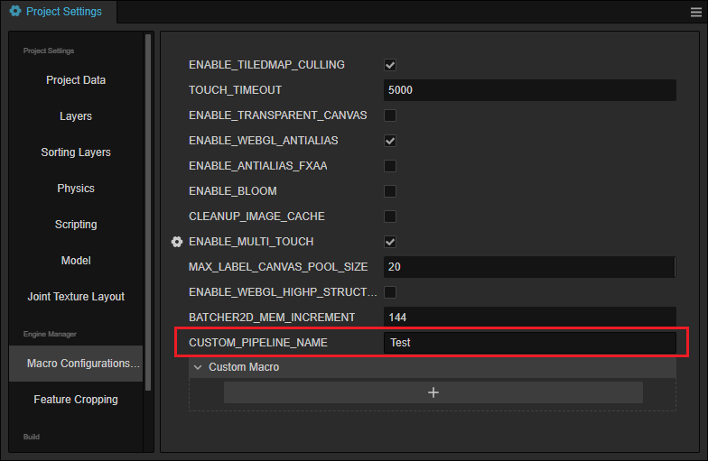</img>

The result after running is shown below, which contains the after-effects of fxaa and bloom.

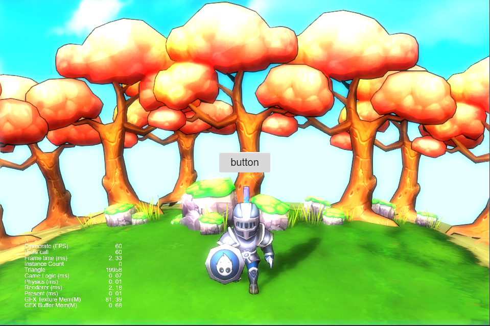</img>

This is the general process of defining a `RenderPass`. PassUtils also defines other Passes that users can refer to, including `BloomPasses`, `FxaaPass` and so on. These `RenderPasses` provide parameters to adjust the output (e.g. Bloom exposure intensity, number of iterations, etc.), so users can try it out for themselves.
