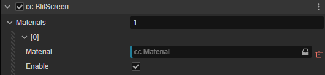

# BlitScreen Component

The BlitScreen component allows users to define various materials to manage [Custom Post Process](./custom.md).

## Properties

| Properties | Description |
| :-- | :-- |
| **Materials** | An array contains post-process materials |

Assign the **Materials** length property to add different post-process materials, which can be seen as follows.

| Properties | Description |
| :-- | :-- |
| **Material** | The material of post effect which is dragged from the **Assets** panel. |
| **Enable** | Enable or disable the material above |

The assigned materials will be executed in the order they are added.
