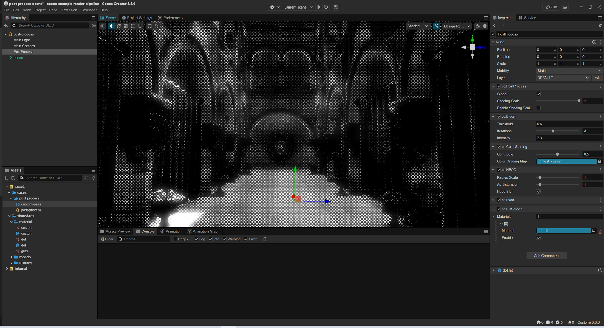
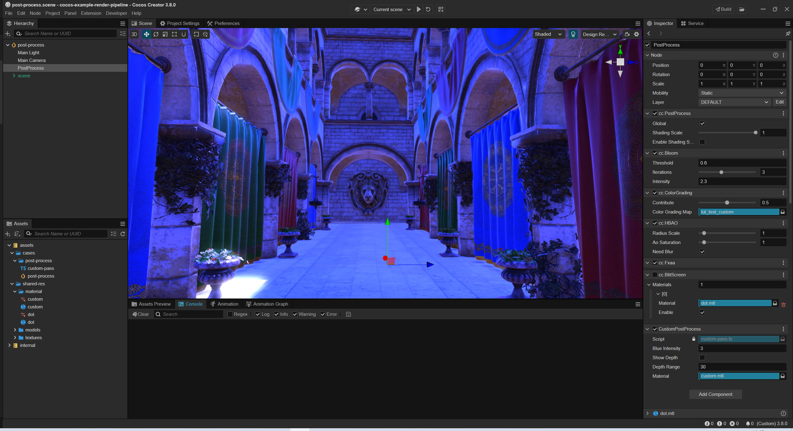
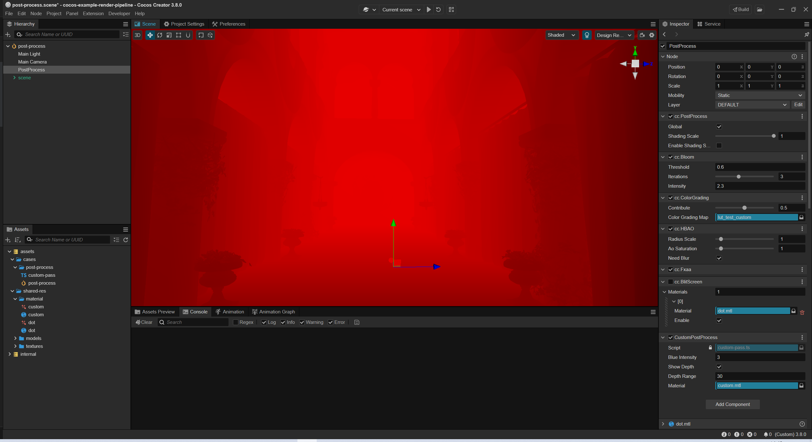

# Customize a Post Process

There are two methods to customize a post-process, add a simple post-process material to the [BlitScreen Component](./blit-screen.md) or define a post pass for a complex post-process.

## Blit-Screen Component

Refer to the [Config Post Process](index.md), add a [BlitScreen Component](./blit-screen.md), and drag the custom post-process material to the **Material** property. The Blit-Screen component will render all the materials in the **Material** property according to the order they are added.

Every material in the **Materials** property contains a single switch to help developers manage them.




For more, please refer to [cocos-example-render-pipeline](https://github.com/cocos/cocos-example-render-pipeline/blob/main/assets/cases/post-process/post-process.scene).

## Customize a Post Process Pass

You can create a custom post-process Pass to accomplish complex post-process effect. 




1. Define a PostProcessSetting component that will be delivered to the CustomPass

    ```js
    import { _decorator, Material, postProcess } from 'cc';
    const { ccclass, property, menu } = _decorator;

    @ccclass('CustomPostProcess')
    @menu('PostProcess/CustomPostProcess')
    export class CustomPostProcess extends postProcess.PostProcessSetting {
        @property
        blueIntensity = 1

        @property
        showDepth = false

        @property
        depthRange = 30

        @property(Material)
        _material: Material | undefined

        @property(Material)
        get material () {
            return this._material;
        }
        set material (v) {
            this._material = v;
        }
    }
    ```

2. Create a CustomPass

    ```js
    import { Vec4, gfx, postProcess, renderer, rendering } from "cc";
    import { CustomPostProcess } from "./CustomPostProcess";

    export class CustomPass extends postProcess.SettingPass {
        // custom pass name
        name = 'CustomPass'

        // out out slot name
        outputNames: string[] = ['CustomPassColor']

        // reference to post process setting
        get setting () { return this.getSetting(CustomPostProcess); }

        // Whether the pass should rendered
        checkEnable(camera: renderer.scene.Camera): boolean {
            let setting = this.setting;
            return setting.material && super.checkEnable(camera);
        }

        params = new Vec4

        render (camera: renderer.scene.Camera, ppl: rendering.Pipeline) {
            const cameraID = this.getCameraUniqueID(camera);

            // clear background to black color 
            let context = this.context;
            context.clearBlack()

            // input name from last pass's output slot 0
            let input0 = this.lastPass.slotName(camera, 0);
            // output slot 0 name 
            let output = this.slotName(camera, 0);

            // get depth slot name
            let depth = context.depthSlotName;

            // also can get depth slot name from forward pass.
            // let forwardPass = builder.getPass(ForwardPass);
            // depth = forwardPass.slotName(camera, 1);

            // set setting value to material
            let setting = this.setting;
            this.params.x = setting.blueIntensity
            this.params.y = setting.showDepth ? 1 : 0;
            this.params.z = setting.depthRange;
            setting.material.setProperty('params', this.params);

            context.material = setting.material;
            context
                // update view port
                .updatePassViewPort()
                // add a render pass
                .addRenderPass('post-process', `${this.name}${cameraID}`)
                // set inputs
                .setPassInput(input0, 'inputTexture')
                .setPassInput(depth, 'depthTexture')
                // set outputs
                .addRasterView(output, gfx.Format.RGBA8)
                // final render
                .blitScreen(0)
                // calculate a version
                .version();
        }
    }   
    ```

3. Register the custom pass

    ```js
    let builder = rendering.getCustomPipeline('Custom') as postProcess.PostProcessBuilder;
    if (builder) {
        // insert CustomPass after a BlitScreenPass
        builder.insertPass(new CustomPass, BlitScreenPass);
    } 
    ```

For more, please refer to [custom-pass](https://github.com/cocos/cocos-example-render-pipeline/blob/main/assets/cases/post-process/custom-pass.ts).
