# Full-Screen Post Process

Post process, short for full-screen post process, means the rendered result image of the camera will be handled once or more by a specific image algorithm to obtain a better effect or special screen effect.

Post process and some common post effects are added to Cocos Creator in v3.8.

## Enable Post Process

1. Enable custom render pipeline.

  Open the **Project Settings** panel by clicking on the **Project** -> **Project Settings**. Navigate to the **Custom Render Pipeline** property on the **Feature Cropping** page.

  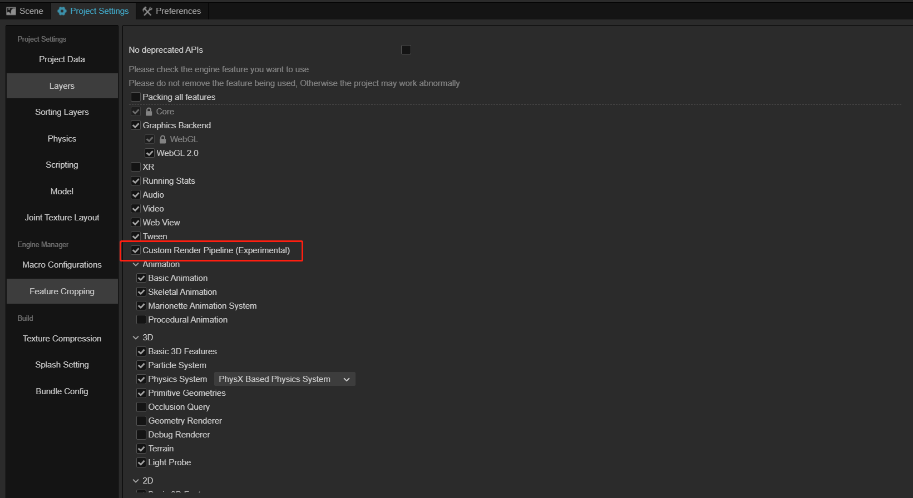

2. Switch the render pipeline to **Custom**.

  Navigate to the **Macro Configurations** page, find the **CUSTOM_PIPELINE_NAME** property, and rename it to `Custom`.

  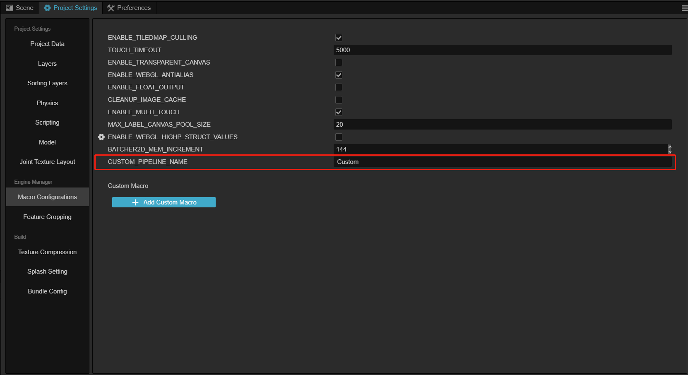

## Config Post Process

1. Add a new empty node to the **Hierarchy** panel, and rename it to `PostProcess` or any name your like.

2. Clicking the **Add Component** button on the **Inspector** panel, and input `PostProcess` in the pop-up label. To add a post-process component, please select one component listed in the drop-down box referred to below.

  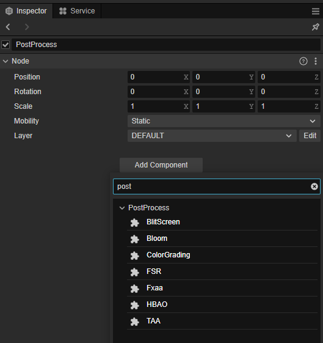

After adding any post-process component, a **PostProcess** component will be automatically added to the node, for more refer to [Post Process](./post-process.md).

## Enable Post Process

The post process can be used for one single camera, or all cameras as a global post process.

Please note that to enable the post process, please check the **Use Post Process** property to make sure the post process is enabled on this camera.

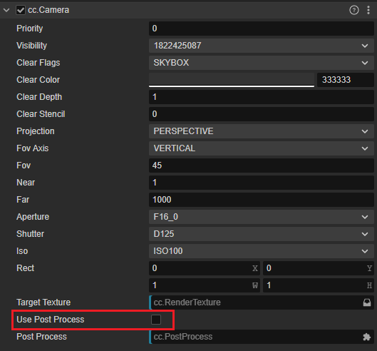

## Global Post Process

To apply all post processes for all cameras with **Use Post Process** on, please check the **Global** property in the **PostProcess** component which is true by default.

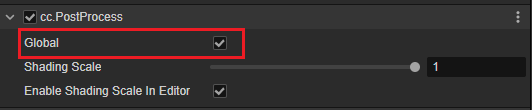

### Post Process for a Single Camera

To enable the post process for a single camera, drag and drop the post process node created above to the **PostProcess** property in the camera component on the **Inspector** panel.

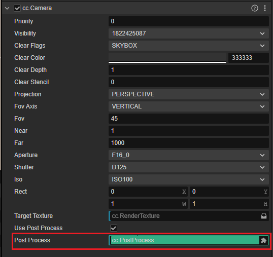

## Builtin Post Effects

### TAA(Temporal Anti-aliasing)

TAA is an advanced anti-aliasing technic that uses historic frames and blends them. Due to the consumption of TAA, it is recommended that the TAA should be enabled only on mid-to-high-end models.

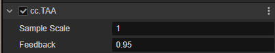

Properties:

1. Sample Scale: For the sample range scale factor, a small floating point value is recommended. A large number may cause the screen to shake.
2. Feedback: value to blend the historic frames. Better anti-aliasing effect with a large value, but the screen may be blurred.

- TAA disabled

  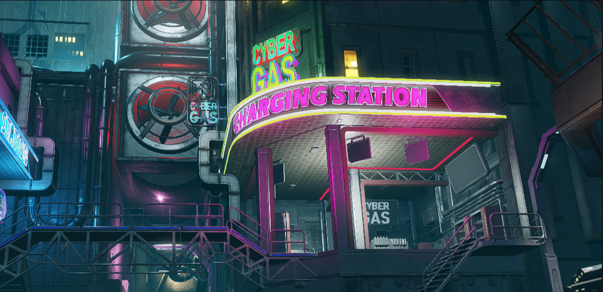

- TAA enabled

  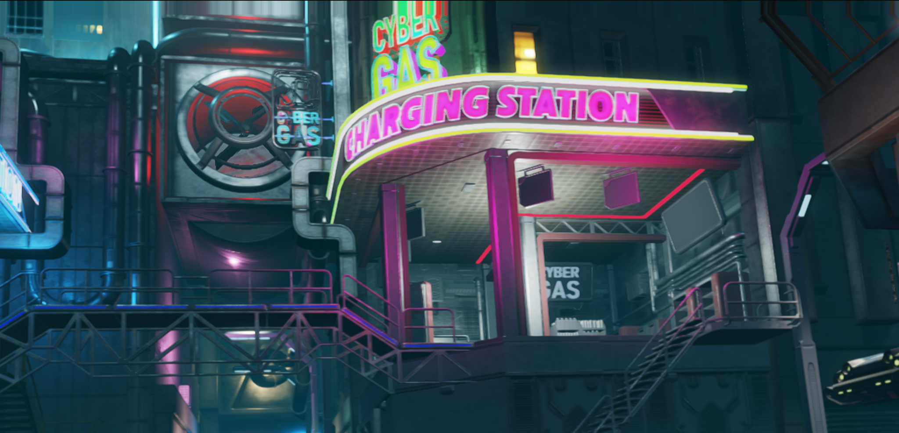

### FSR (AMD FidelityFX Super Resolution)

FSR, a whole new, open-source, and high-quality render solution by AMD, is used to generate a high-resolution render result from a low-resolution input. It uses a series of high-technical algorithms, especially emphasizing creating high-quality edges, improving the performances compared with rendering with the original resolution.

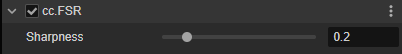

Properties:

1. Sharpness： screen sharpness

- FSR disabled

  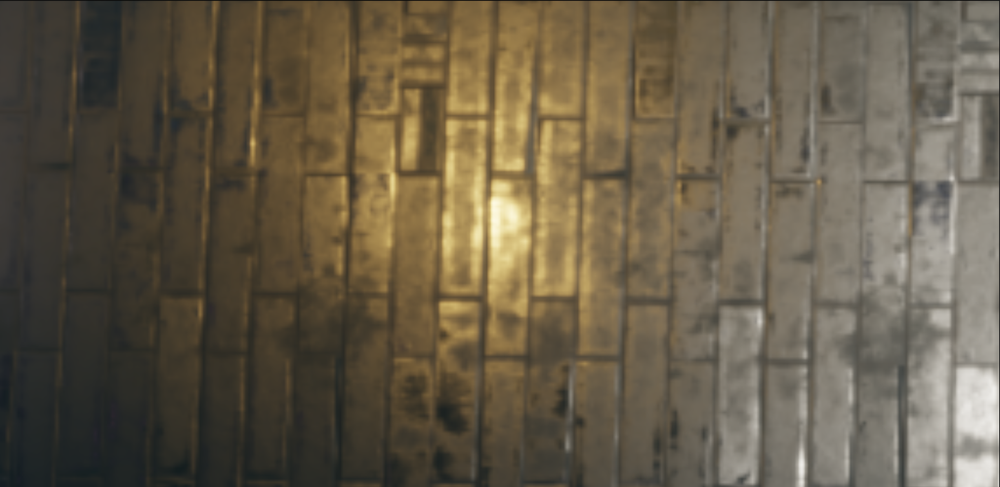

- FSR enabled

  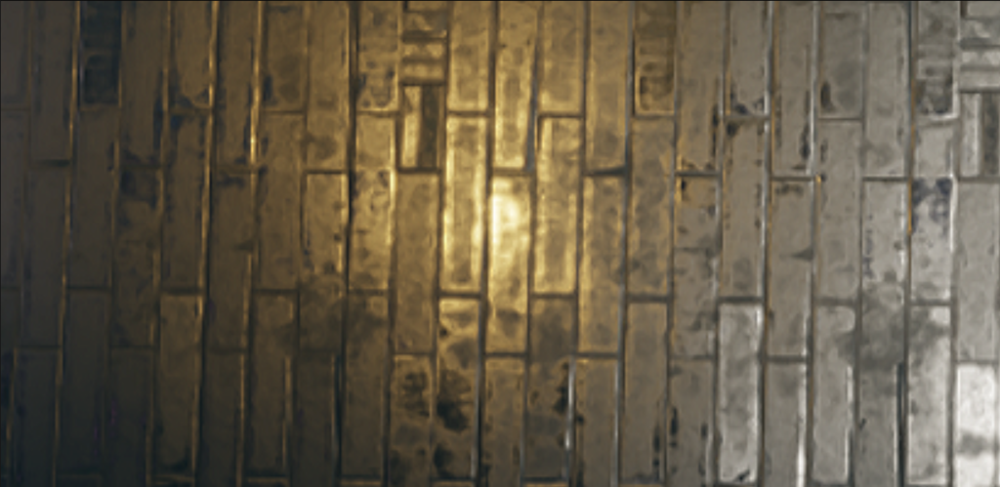

### FXAA(Fast Approximate Anti-Aliasing)

FXAA algorithm uses a low cost to reduce the appearance of jagged or "jaggies** on the rendered image.

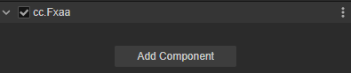

- FXAA disabled

  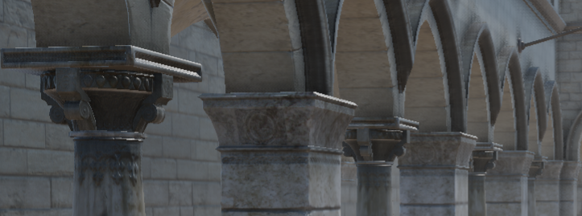

- FXAA enabled

  

### Bloom

The bloom component is used to control the blooming and halo in the highlighted area of the scene, which can make the lighting or strongly reflective materials look more realistic.

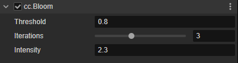

Properties:

1. Threshold: The luminance threshold of the halo, above which the area will be blooming. Note that this value is the LDR brightness unit as seen by the human eye and is not related to exposure
2. Iterations: iteration counts, with a large value, the halo will be larger in range and softer, which will reduce the performance.
3. Intensity: brightness of the blooming, more bright with a larger value. Please modify moderately

- Bloom disabled
  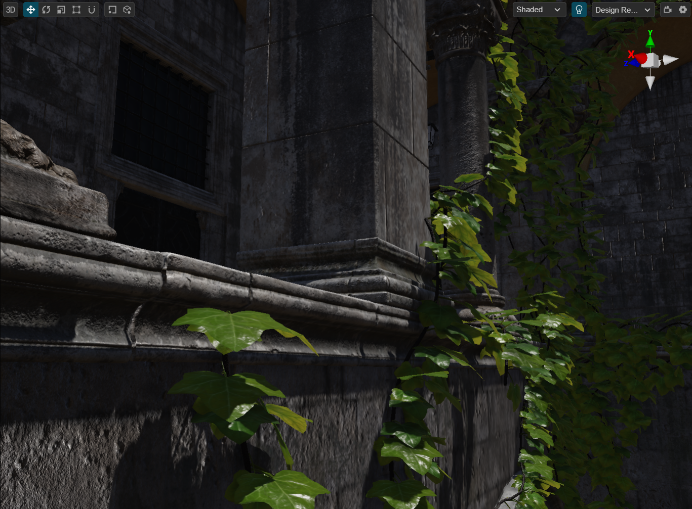
- Bloom enabled
  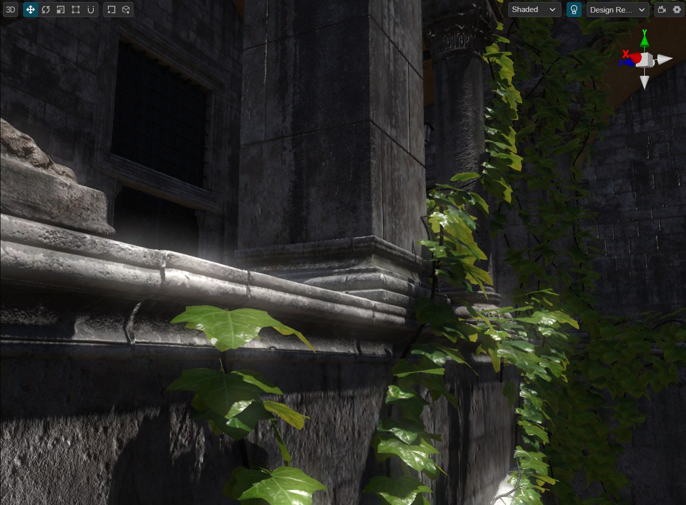

### Color Grading

Color Grading uses a looking-up table(LUT) to correct the scene color from the artist's perspective. LUT mapping can be downloaded from the internet or created by software such as Photoshop.

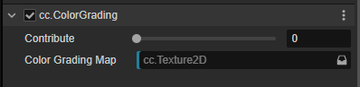

Properties:

1. Contribute the contribution factor which can be adjusted in the range 0-1 for the level of influence on the final color.
2. Color Grading Map: a looking up table map for colors, Nx1 or 8x8 rectangle images are supported automatically by the engine. The location of the built-in LUT map is internal/dependencies/textures/lut/.

- Color Grading disabled
  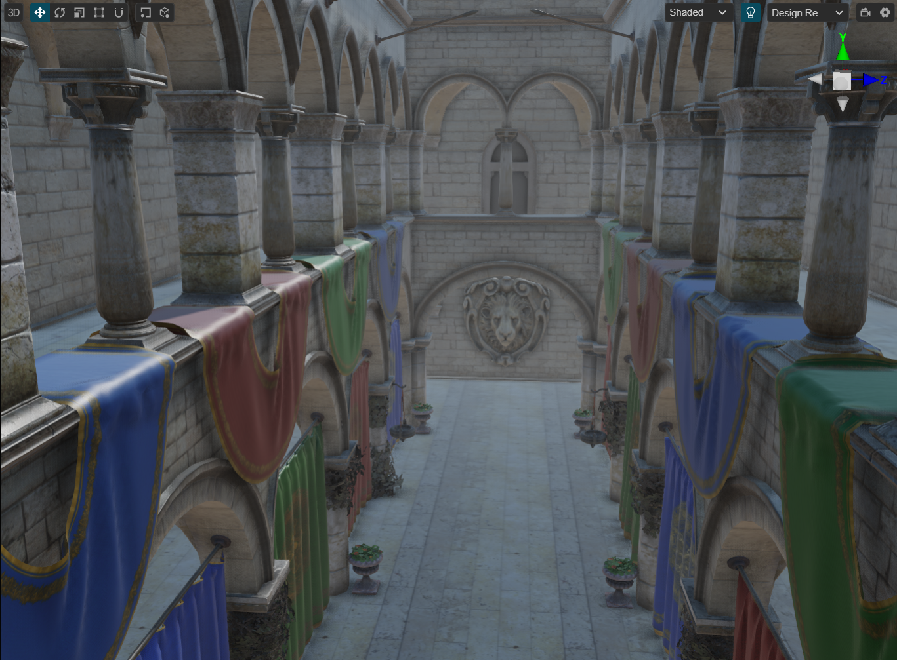
- Color Grading enabled
  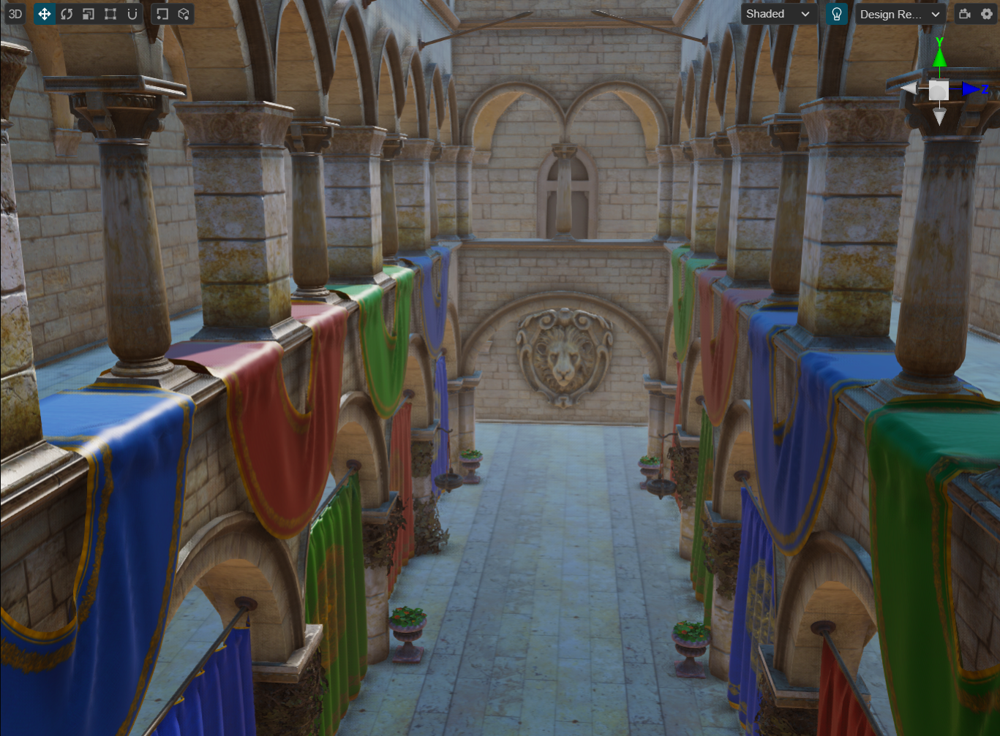

### HBAO(Horizon-Based Ambient Occlusion)

The HBAO algorithm supports a simple, easy way to calculate the ambient occlusion when calculating the global illumination, which will improve the stereo space sensory of the entire scene.

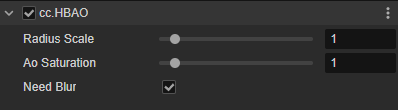

Properties:

1. Radius Scale: the range of the ambient occlusion, the dark area will be better matched to the size of the scene by adjusting this property.
2. AO Saturation: saturation of the ambient occlusion, the larger the value, the darker it is.
3. Need Blur: turn on for softer results and less noise, but it will cost some performance.

- HBAO disabled

  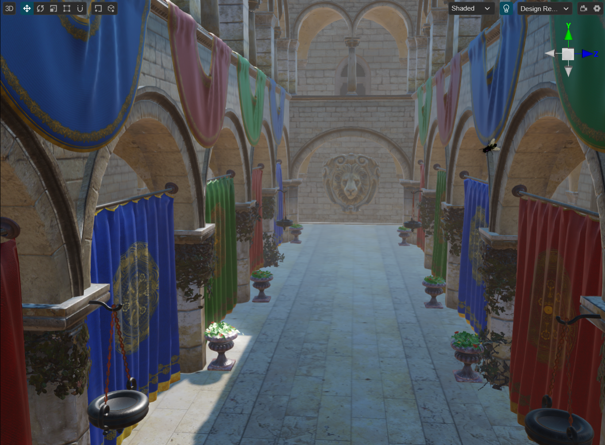

- HBAO enabled

  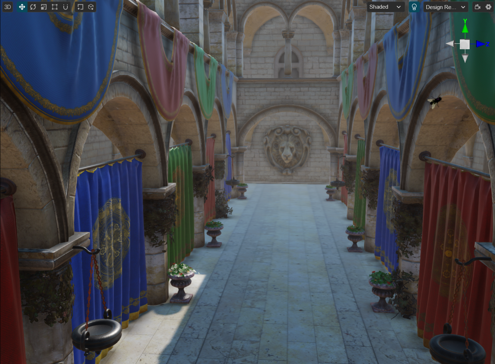
 
- Clicking on the debug menu in the scene, and choose the **Ambient Occlusions** menu to debug the HBAO

  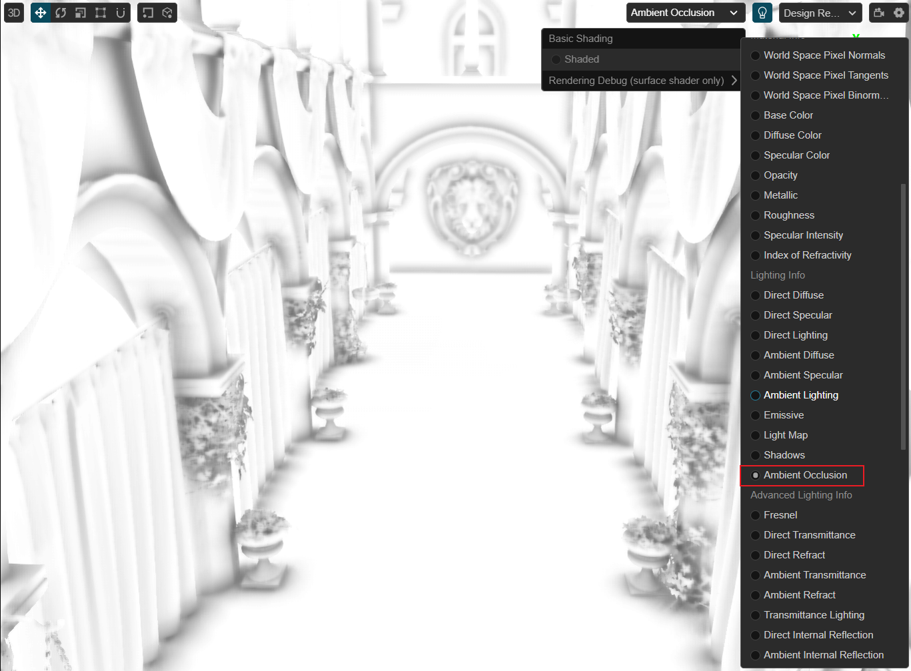

## Custom Post Process

Post process can be customized by referring to [Custom Post Process](./custom.md).

## The Execute Order of Post Process

The execution order of the post-process components attaching to the same node will not be following the order they are added. The post-process components have a strict execute order pre-defined by the engine which can be found in the [post-process-builder.ts](https://github.com/cocos/cocos-engine/blob/v3.8.0/cocos/rendering/post-process/post-process-builder.ts) file.

