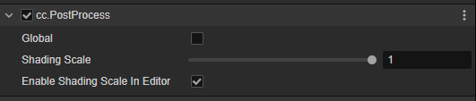

# PostProcess Component

The PostProcess component is an assisted component for [Full Screen Post Process](./index.md), and it will be automatically added to the post-process node after any post-process component is added to config the post-process.

## Properties

| Properties | Description |
| :-- | :-- |
| **Global** | Enable the global post process or not. All cameras with **Use Post Process** on will be affected. |
| **Shading Scale** | The final output image scale factor from 0.01 to 1 based on the screen resolution |
| **Enable Shading Scale In Editor** | Enable or disable the **Shading Scale** in the editor |

### Description

- The **Global** property will be ignored when turning on the **Use Post Process** and assigning a post process to the **Post Process** property of the camera.
- When the **Post Process** property of the camera with **Use Post Process** on is leaving empty, the **Global**  property ought to be enabled to make the post processes take effect.
- If post processes with the same type are added to the scene multiple times, only the first post process mathed will take effect.
