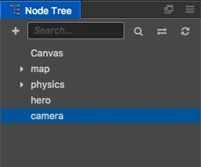
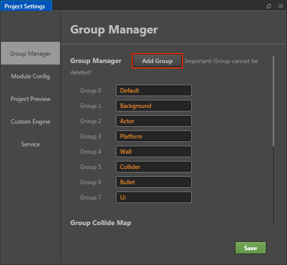
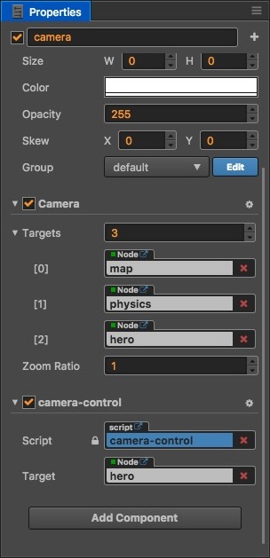
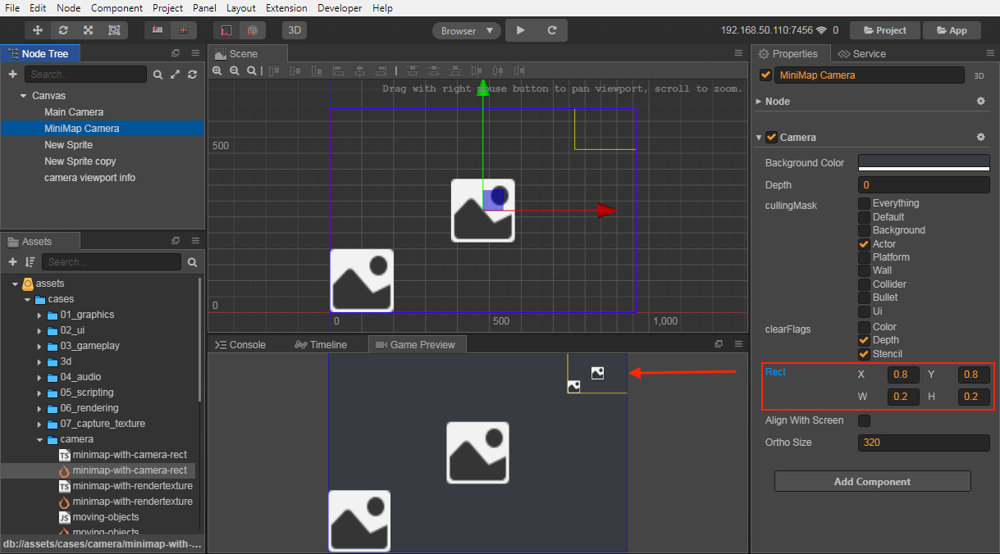

# Camera

The camera is the window that the player observes the game world, the scene must have at least one camera, also can have multiple cameras at the same time. When creating a scene, Creator creates a camera named `Main Camera` by default as the main camera for this scene. Multi-camera support allows you to easily implement advanced customization effects, such as the two-player split screen effect, or the creation of a small scene map.


## Camera Properties

- **backgroundColor**

  The background color used to clear the scene when camera enables color clearFlags.

- **depth**

  Camera depth, used to determine the order in which the camera is rendered. The larger the value, the later the camera is rendered.

- **cullingMask**

  `cullingMask` will determine which parts of the scene the camera is used to render. The `cullingMask` in the camera component in the **Properties** lists the currently available mask options, and you can combine them to generate `cullingMask` by selecting these options.

  For example, the `cullingMask` setting in the following figure indicates that the camera is used only to render the UI part of the game. Generally game UI does not need to be moved, but the player may move out of the screen, then you need another camera to follow the player.

  

  You can add or change groups through **Group Manager** in the **Project -> Project Settings**, which is the corresponding mask.

  

- **clearFlags**

  Specifies the cleanup action that needs to be made when rendering the camera.

  

- **rect**

  Determines where the camera is drawn on the screen, which is convenient for implementing a Viewport such as a mini map. The value is 0 ~ 1.

  

  As shown in the figure above, a camera for displaying a small map is created in the scene. The final display effect can be seen in the upper right corner of the **Game Preview** panel.

- **zoomRatio**

  Specifies the zoom ratio of the camera, and the larger the value, the larger the image displayed.

- **alignWithScreen**

  When alignWithScreen is true, the camera will automatically adjust the window size to the entire screen size. If you want complete freedom to control the camera, you need to set alignWithScreen to false. (New in v2.2.1)

- **orthoSize**

  The viewport size of the Camera when set to orthographic projection. This property takes effect when alignWithScreen is set to **false**.

- **targetTexture**

  If you set the `targetTexture`, the contents of the camera render will not be printed on the screen, but will be rendered to the `targetTexture`.

  If you need to do some of the screen's post-effects, you can first render the screen to `targetTexture`, and then for the `targetTexture` to do the overall processing, finally through a `sprite` to show the `targetTexture`.

### 3D Camera Properties

These properties do not appear in the **Assets** until the camera node is set to a [3D Node](../3d/3d-node.md).

- **nearClip**

  The near clipping plane of the camera.

- **farClip**

  The far clipping plane of the camera.

- **ortho**

  Sets whether the projection mode of the camera is Orthogonal (true) or Perspective (false) mode.

- **fov**

  Determines the width of the camera's view angle. It takes effect when both **alignWithScreen** and **ortho** are set to **false**.

## Camera methods

- **cc.Camera.findCamera**

  `findCamera` gets the first matching camera by finding whether the camera `cullingMask` contains a node's `group`.

  ```javascript
  cc.Camera.findCamera(node);
  ```

- **containsNode**

  Detect whether the node is affected by this camera

- **render**

  If you need to render the camera immediately, you can call this method to manually render the camera, such as when capturing a screenshot.

  ```javascript
  camera.render();
  ```

### Coordinate translation

A common problem is that when the camera is moved, rotated, or scaled, the coordinates acquired by the click event are used to test the coordinates of the node, which often results in incorrect results.

Because the click coordinates obtained at this time are the coordinates in the screen coordinate system, we need to transform this coordinate into the world coordinate system to continue the operation with the node's world coordinates.

Here are some functions of camera coordinate transformation:

```javascript
// Transform a point from screen coordinates to world coordinates
camera.getScreenToWorldPoint(point, out);
// Transform a point from world coordinates to screen coordinates
camera.getWorldToScreenPoint(point, out);

// Gets the matrix from the screen coordinate system to the world coordinate system. Applies only to 2D cameras and alignWithScreen is true.
camera.getScreenToWorldMatrix2D(out);
// Gets the matrix from world coordinate system to the screen coordinate system. Applies only to 2D cameras and alignWithScreen is true.
camera.getWorldToScreenMatrix2D(out);
```

## Screenshot

Screenshot is a very common demand in the game, through the camera and rendertexture we can quickly achieve a screenshot function. For the screenshot, there is a complete test example in example-case, the code example please refer to [07_capture_texture](https://github.com/cocos/example-projects/tree/master/assets/cases/07_capture_texture).

```javascript
let node = new cc.Node();
node.parent = cc.director.getScene();
let camera = node.addComponent(cc.Camera);

// Set the CullingMask of the screenshot you want
camera.cullingMask = 0xffffffff;

// Create a new RenderTexture and set this new RenderTexture to the camera's targetTexture so that the camera content will be rendered to this new RenderTexture
let texture = new cc.RenderTexture();
let gl = cc.game._renderContext;
// If the Mask component is not included in the screenshot, you don't need to pass the third parameter.
texture.initWithSize(cc.visibleRect.width, cc.visibleRect.height, gl.STENCIL_INDEX8);
camera.targetTexture = texture;

// Render the camera once, updating the content once into RenderTexture
camera.render();

// This allows the data to be obtained from the rendertexture.
let data = texture.readPixels();

// Then you can manipulate the data.
let canvas = document.createElement('canvas');
let ctx = canvas.getContext('2d');
let width = canvas.width = texture.width;
let height = canvas.height = texture.height;

canvas.width = texture.width;
canvas.height = texture.height;

let rowBytes = width * 4;
for (let row = 0; row < height; row++) {
    let srow = height - 1 - row;
    let imageData = ctx.createImageData(width, 1);
    let start = srow*width*4;
    for (let i = 0; i < rowBytes; i++) {
        imageData.data[i] = data[start+i];
    }

    ctx.putImageData(imageData, 0, row);
}

let dataURL = canvas.toDataURL("image/jpeg");
let img = document.createElement("img");
img.src = dataURL;
```

### Capture part of the area

When the camera is set to RenderTexture and **alignWithScreen** is
**true**, the camera window size will be adjusted to the size of **design resolution**. If you only need to capture a certain area of the screen, set **alignWithScreen** to **false** and adjust **orthoSize** or **fov** according to the projection mode of the camera. (New in v2.2.1)

```js
camera.alignWithScreen = false;
camera.orthoSize = 100;
camera.position = cc.v2(100, 100);
```

Please refer to [minimap-with-camera-rect](https://github.com/cocos/example-projects/blob/master/assets/cases/camera/minimap-with-camera-rect.ts) and [minimap-with-rendertexture](https://github.com/cocos/example-projects/blob/master/assets/cases/camera/minimap-with-rendertexture.ts) in example-cases for details.

### Save screenshot file on native platform

First take a screenshot, and then use the following method after `readPixels`:

```js
var data = renderTexture.readPixels();
var filePath = jsb.fileUtils.getWritablePath() + 'Image.png';
jsb.saveImageData(data, imgWidth, imgHeight, filePath)
```

Please refer to [capture_to_native](https://github.com/cocos/example-projects/blob/master/assets/cases/07_capture_texture/capture_to_native.js) for details.

## The screenshot in WeChat

Because of WeChat Mini Games does not support createImageData, nor does it support creating image with data url, so the above method needs some flexibility. After using Camera to render the desired results, use WeChat's screenshot API: [canvas.toTempFilePath](https://developers.weixin.qq.com/minigame/en/dev/api/render/canvas/Canvas.toTempFilePath.html) to save and use the screenshot.

## Case

Please refer to [example-case](https://github.com/cocos/example-projects/tree/master/assets/cases/07_capture_texture) for details, create a Example Collection project from the editor to see the actual running effect.
