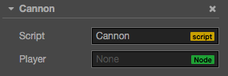

# Access node and other component

You can edit node and component in the **Properties** panel, or dynamically modify in script as well. The advantage of dynamic modification is let you modify or transit property continuously for a period of time, to achieve some easing effects. Script can also be used to respond player inputs, or modify-create-or-destroy node and component, so as to implement various game logics. To achieve these, you should acquire the node or component which you want to modify.

In this tutorial, we will introduce how to

- get the node which a component belongs to
- get other component
- setup node and component in **Properties** panel
- find child node
- find node in global
- access exists variable

## Get the node which the component belong

Getting the node which the component belong is easy, just use `this.node` variable in component:

```js
    start: function () {
        var node = this.node;
        node.x = 100;
    }
```

## Get other component

You will get other component in the same node frequently, that is where `getComponent` comes in, it help you to find the component you need.

```js
    start: function () {
        var label = this.getComponent(cc.Label);
        var text = this.name + ' started';

        // Change the text in Label Component
        label.string = text;
    }
```

You can also pass in a class name for the `getComponent`. 

```js
    var label = this.getComponent("cc.Label");
```

For user defined components, the class name is simply the filename of the script, and **case sensitive**. For example, if a component declared in "SinRotate.js", its class name will be "SinRotate".

```js
    var rotate = this.getComponent("SinRotate");
```

There is also a `getComponent` method on node, they are the same thing.

```js
    start: function () {
        cc.log( this.node.getComponent(cc.Label) === this.getComponent(cc.Label) );  // true
    }
```

If the component is not exists in the node, `getComponent` will return null. If you are trying to access a null value at runtime, the "TypeError" exception will be thrown. So always remember to check if you are not sure of it.

```js
    start: function () {
        var label = this.getComponent(cc.Label);
        if (label) {
            label.string = "Hello";
        }
        else {
            cc.error("Something wrong?");
        }
    }
```

## Get other node and their component

It is not enough to access to components in the same node, scripts often need to interact between nodes. For example, a cannon which takes aim at player by itself, need to constantly get player's position. Cocos Creator provider some different ways to retrieve other node and their component.

### Use Properties panel to link node

The most obvious and straightforward is to set object in **Properties** panel. Take node as an example, it just need to declare a property which type is `cc.Node`:

```js
// Cannon.js

cc.Class({
    extends: cc.Component,
    properties: {
        // declare player property
        player: {
            default: null,
            type: cc.Node
        }
    }
});
```

Above code declared a property named `player` in `properties`, its default value is null, its object type is `cc.Node`. It is the equivalent of the `public cc.Node player = null;` statement in other programe language. In **Properties** panel, the component will looks like this after the script compiled:



Then you can drag and drop any node from **Node Tree** panel to the Player control:


This way, the player property will be set successfully, you can access it in your script directly:

```js
// Cannon.js

var Player = require("Player");

cc.Class({
    extends: cc.Component,
    properties: {
        // declare player property
        player: {
            default: null,
            type: cc.Node
        }
    },

    start: function () {
        var playerComp = this.player.getComponent(Player);
        this.checkPlayer(playerComp);
    },

    // ...
});
```

### Use Properties panel to link component

In the example above, if you set the property's type to Player component, when you drag the "Player Node" to **Properties** panel, player property will be set to the Player component in the node. Then you don't need to call `getComponent` for yourself.

```js
// Cannon.js

var Player = require("Player");

cc.Class({
    extends: cc.Component,
    properties: {
        // declare player property, but directly use component type this time
        player: {
            default: null,
            type: Player
        }
    },

    start: function () {
        var playerComp = this.player;
        this.checkPlayer(playerComp);
    },

    // ...
});
```

You can also set the property's default value from `null` to an array `[]`, then you can set multiple objects in **Properties** panel.<br>
But if you need to dynamically get other objects in runtime, you need to search them by using methods shown below.

### Find child node

Sometimes there will be many objects with the same type in game scene, such as turret, enemy and effects, they can be uniformly managed by a global script. If we use **Properties** panel to associate them with the script one by one, that will be a heavy workload. It is often better to manage these objects by making them all children of one parent node, then retreive all children via the parent node:

```js
// CannonManager.js

cc.Class({
    extends: cc.Component,

    start: function () {
        var cannons = this.node.children;
        // ...
    }
});
```

You can also use `getChildByName`:

```js
this.node.getChildByName("Cannon 01");
```

If the child's hierarchy is too deep, you can use `cc.find`, `cc.find` will find step by step based on the path passed into it:

```js
cc.find("Cannon 01/Barrel/SFX", this.node);
```

### Find by name globally

When omit the second parameter of `cc.find`, it will find starts from the scene root:

```js
this.backNode = cc.find("Canvas/Menu/Back");
```

## Access value from exists variable

If you already have the reference of a node or component in somewhere, you can also access them directly, there are two ways:

### <a name="global_variable"></a>Access by using global variable

> You should use global variable with care and understanding, we do not recommend using it, you had better keep them readonly if really need to do that.

Let's define a global object `window.Global`, it will cantain two properties, `backNode` and `backLabel`.

```js
// Globals.js, this file can have any name

window.Global = {
    backNode: null,
    backLabel: null,
};
```

Because all scripts are declared as "use strict" by default, so you should not omit the `window.` when declaring global variable.<br>
Then you can directly initialize the `Global` where appropriate:

```js
// Back.js

cc.Class({
    extends: cc.Component,

    onLoad: function () {
        Global.backNode = this.node;
        Global.backLabel = this.getComponent(cc.Label);
    }
});
```

After initialization, you can read the value from `Global` in everywhere:

```js
// AnyScript.js

cc.Class({
    extends: cc.Component,

    // start will be executed after onLoad, so the Global will be initialized
    start: function () {
        var text = 'Back';
        Global.backLabel.string = text;
    }
});
```

> An exception will be thrown if the global variable is not yet declared when you access to it.<br>
> Please avoid name duplication with exists global variables in the system.<br>
> You must make ensure all global variable are initialized before using.

### Access by using module

If you don't want to use global variable, you can use `require` to perform operation cross-scirpts, let's look at an example:

```js
// Global.js, now the filename matters

module.exports = {
    backNode: null,
    backLabel: null,
};
```

You can use `require` + filename(without paths) everywhere to retreive the object exported by "exports" from other scripts.

```js
// Back.js

// this feels more safe since you know where the object comes from
var Global = require("Global");

cc.Class({
    extends: cc.Component,

    onLoad: function () {
        Global.backNode = this.node;
        Global.backLabel = this.getComponent(cc.Label);
    }
});
```

```js
// AnyScript.js

// this feels more safe since you know where the object comes from
var Global = require("Global");

cc.Class({
    extends: cc.Component,

    // start will be executed after onLoad, so the Global will be initialized
    start: function () {
        var text = "Back";
        Global.backLabel.string = text;
    }
});
```

For details, please refer to [Modular script](modular-script.md).


---

Continue on to read about [Basic node and component API](basic-node-api.md).
