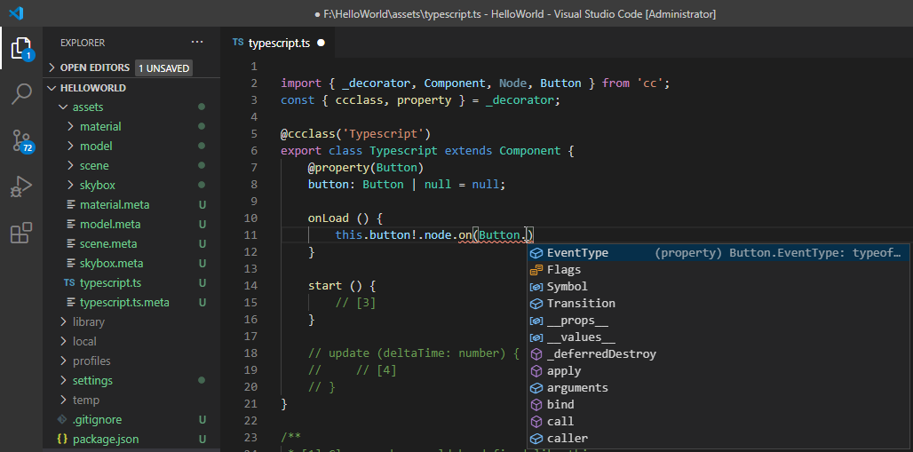
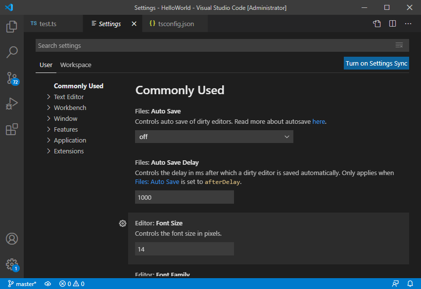
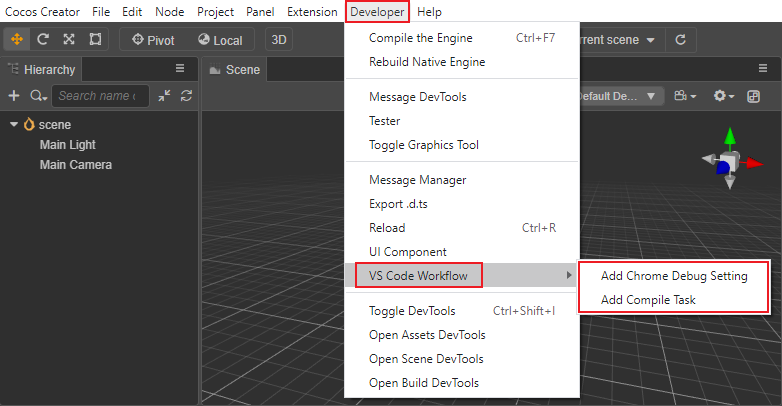
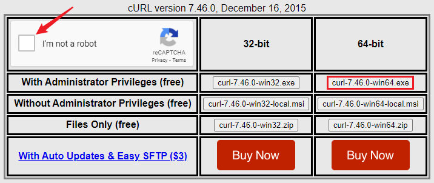
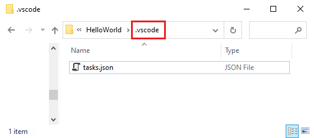
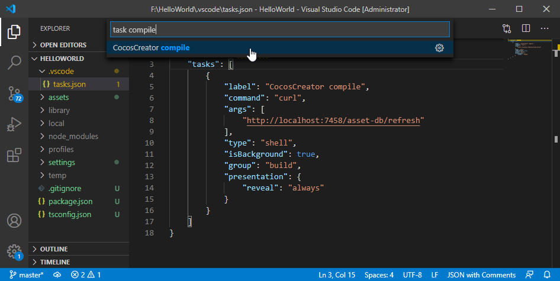
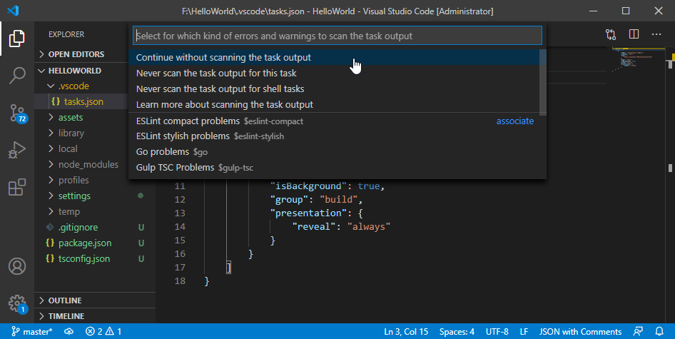
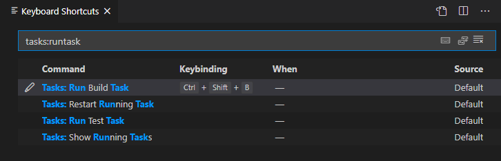
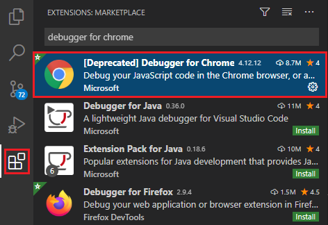
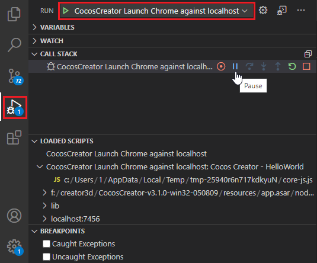

# Configuring The Code Editing Environment

The[Default Script Editor](../editor/preferences/index.md#%E5%A4%96%E9%83%A8%E7%A8%8B%E5%BA%8F) can be specified in the **Preferences** panel. Double-click the script file in **Assets** panel to open the code editor to quickly edit the code. Visual Studio Code is used as an example to introduce how to configure the development environment. [Visual Studio Code](https://code.visualstudio.com/) (hereinafter referred to as VS Code) is a lightweight cross-platform IDE created by Microsoft. It supports Windows, Mac, and Linux platforms. Installation and configuration are very simple. Using VS Code to manage and edit project script codes can easily realize functions such as syntax highlighting, smart code prompts, and web page debugging.

## Installing VS Code

Go to the [VS Code Official Website](https://code.visualstudio.com/) and click the download link on the homepage to download it.

MacOS users should decompress the downloaded package and double-click **Visual Studio Code** to run it.

Windows users should run **VSCodeUserSetup.exe** after downloading it and follow the prompts to complete the installation.

## IntelliSence Data

When creating a project in Cocos Creator 3.x, a [tsconfig.json](tsconfig.md) file will be automatically generated in the project directory, which is configured with a directory file path for code hinting. When opening the project with VS Code and writing code, it will automatically pop up the Cocos Creator engine API suggestions. If the project is upgraded, the engine API will also be updated automatically.

After starting VS Code, select **File -> Open Folder...** in the main menu, and select the project root directory in the pop-up dialog box, which is the path where `assets` and `project.json` are located. Then when creating a new script, or opening the original script for editing, there will be a syntax prompt.



> **Note**: when using a custom engine, or switching to use the built-in engine/custom engine, if the API code hinting are not updated, please follow the steps below to get the latest code hinting:
>
> 1. Delete the `cache` folder under the `bin` directory in the custom engine (the built-in engine is the `resources\resources\3d\engine\bin` directory)
> 2. Execute `npm run build-declaration` in the engine directory

## Setting file display and search filter

In the main menu of VS Code, select **File (Windows)/Code (Mac) -> Preferences -> Settings**, or select in the lower left corner! [gear.png](coding-setup/gear.png) **Setting** option, this operation will open the user configuration file **USER SETTINGS**:



Now, enter **exclude** search in the search box above and find **Files: Exclude** and **Search: Exclude** modules:


Next, click **Add Mode** to add the missing parts in the following content:

```json
{
    "files.exclude": {
        "**/.git": true,
        "**/.DS_Store": true,
        "**/*.meta": true,
        "library/": true,
        "local/": true,
        "temp/": true
    },

    "search.exclude": {
        "**/node_modules": true,
        "**/bower_components": true,
        "build/": true,
        "temp/": true,
        "library/": true,
        "**/*.anim": true
    }
}
```

The fields above will set the directories to exclude from the search for VS Code, as well as the types of files to hide in the file list. Since `build`, `temp`, and `library` are all paths automatically generated when the editor is running, and will contain the content of the script we wrote, they should be excluded from the search. And each file in the `assets` directory will generate a `.meta` file. Generally speaking, there is no need to care about its content, just let the editor help manage these files.

## VS Code extension use

Cocos Creator integrates the **Add Compilation Task** and **Add Chrome Debug Configuration** functions in **Developer -> VS Code Workflow** in the top menu bar to better assist development:



- **Add compilation task**: used to trigger the script compilation of Creator in VS Code. For details, please refer to the content in the **Use VS Code to activate script compilation** section.

- **Add Chrome Debug configuration**: It is used to debug the web version of the game. For details, please refer to the following **Use VS Code to debug the web version of the game** section.

### Using VS Code to activate script compilation

After using the external script editor to modify the project script, return to Cocos Creator to trigger script compilation. The **add compilation task** function is provided in Creator, which activates the compilation of Creator by sending a request to a specific address through the API of a preview server. After the external script editor modifies the project script, the **compilation task** is executed and can trigger script compilation without returning to Cocos Creator.

#### Installing cURL

First, make sure that the [cURL command](https://curl.haxx.se/) can be run in the operating system. If when running the `curl` command on the command line of the Windows operating system and the command cannot be found, install cURL to operating system:

- Visit this webpage for [help](http://www.confusedbycode.com/curl/)

- Click the control shown by the arrow in the figure below to complete the human-machine identity verification.

    

- Click `curl-7.46.0-win64.exe` to start downloading and installing

#### Adding VS Code compilation task

To activate script compilation in VS Code, perform the following steps:

1. Click **Developer -> VS Code Workflow -> Add Compilation Task** on the top menu bar of Creator. This operation will add the task configuration file ,`tasks.json`, under the `.vscode` folder of the project directory.

    

2. Press the shortcut key <kbd>Cmd/Ctrl + P</kbd> in VS Code to activate the **Quick Open** input box, then enter `task CocosCreator compile`, select `CocosCreator compile`.

    

    Next, select the output type:

    

3. After the task is completed, the results will be displayed in the output panel at the bottom of the VS Code window (the output results will vary depending on the VS Code version and configuration).

In this way, after using VS Code to edit the script, execute the second step to trigger the script compilation of Creator without returning to Creator.

VS Code can also configure shortcut keys for compilation tasks, select **File (Windows)/Code (Mac) -> Preferences -> Keyboard Shortcuts** in the main menu, or select the lower left corner, this operation will open the shortcut configuration file. Then modify the shortcut keys of the compilation task as needed. For example, set it to <kbd>Cmd/Ctrl + Shift + B</kbd> in the following figure:



Next, press the shortcut key <kbd>Cmd/Ctrl + Shift + B</kbd> in VS Code and it will automatically display `CocosCreator compile`, no need to search manually.

For more information about configuring and executing tasks in VS Code, please refer to the [Integrate with External Tools via Tasks](https://code.visualstudio.com/docs/editor/tasks) documentation.

### Using VS Code to debug web games

VS Code has excellent debugging capabilities. It is possible to directly debug the web version of the game program in the source code project.

First, install:

- [Google Chrome](https://www.google.com/chrome/)

- VS Code plug-in: Debugger for Chrome

    Click the **Extensions** button in the left navigation bar of VS Code to open the extension panel, enter **Debugger for Chrome** in the search box and click Install. After installation, you may need to restart VS Code to take effect.

    

Next, click **Developer -> VS Code Workflow -> Add Chrome Debug Configuration** in the top menu bar of Cocos Creator, this menu command will add a `.vscode/launch.json` file under the project folder as the configuration of the debugger:

  

Third, click the **Debug** button in the left column in VS Code to open the debugging panel, and select `Cocos Creator Launch Chrome against localhost` in the debugging configuration at the top, and then click the green start button on the left to debug.

  

Debugging relies on the built-in Web server of the Cocos Creator editor, therefore debugging can only be carried out when the editor is started. If the port used by the editor to preview the game is not the default port, manually modify the `url` field in `launch.json` to add the correct port.

During the debugging process, it is possible to directly set breakpoints on the source file for monitoring, which is a more convenient and friendly workflow than using Chrome's built-in DevTools to debug.

## Learning how to use VS Code

Visit the [VS Code official website documentation](https://code.visualstudio.com/Docs) to learn how to use it from editing function operations, personalization, syntax highlighting settings to plug-in extensions.
