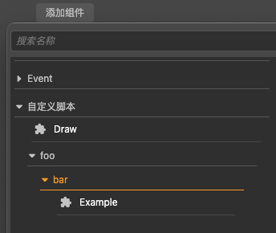
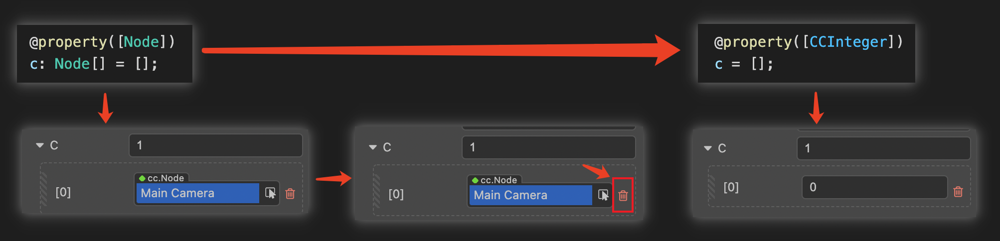

# Decorator

## `cc` class

When applying a decorator `ccclass` to a class, such class is called a `cc` class. A `cc` class injects additional information to control Cocos Creator 3.0's serialization of the class object, the editor's presentation of the class object, etc. Therefore, component classes that do not have `ccclass` declared, cannot be added to nodes as components either.

The various characteristics of the `cc` class are specified by the `ccclass(name)` argument.

The parameter `name` specifies the name of the `cc` class, which is **unique**. When the corresponding `cc` class needs to be retrieved, it can be found by its `cc` class name, e.g.:

- Serialization. If the object is a `cc` class object, the `cc` class name of the object will be recorded during serialization, and the corresponding `cc` class will be found for serialization based on this name during deserialization.

- When the `cc` class is a component class, `Node` can look up the component by the `cc` class name of the component class.

```ts
@ccclass('Example')
export class Example extends Component {
}
```

## Editor Parameters

Such parameters are subclasses that can only be defined in cc.

### `executeInEditMode`

By default, all components are executed only at runtime, meaning that their lifecycle callbacks are not triggered in editor mode. `executeInEditMode` allows the current component to run in editor mode, with an initial value of `false`.

```ts
const { ccclass, executeInEditMode } = _decorator;

@cclass('Example')
@executeInEditMode(true)
export class Example extends Component {
}
```

### `requireComponent`

The `requireComponent` parameter is used to specify a dependent component for the current component, the default value is `null`. When a component is added to a node, the engine will automatically add the dependent component to the same node if the dependent component does not exist, preventing script errors. This option is also valid at runtime.

```ts
const { ccclass, requireComponent } = _decorator;

@cclass('Example')
@requireComponent(Sprite)
export class Example extends Component {
}
```

### `executionOrder`

`executionOrder` is used to specify the execution priority of script lifecycle callbacks. Scripts less than 0 will be executed first and scripts greater than 0 will be executed last. The ordering is as follows.
- For different components on the same node, those with smaller values are executed first, and those with the same values are executed in the order in which they are added.
- For the same component on different nodes, the order of execution is determined by the node tree.
- For all nodes in the node tree, if both nodes and components are active, the smaller the value, the first to be executed.

This priority setting is only valid for `onLoad`, `onEnable`, `start`, `update` and `lateUpdate`, but not for `onDisable` and `onDestroy`.

```ts
const { ccclass, executionOrder } = _decorator;

@cclass('Example')
@executionOrder(3)
export class Example extends Component {
}
```

### `disallowMultiple`

Only allow one component of the same type (with subclasses) to be added to the same node to prevent logic conflicts, the default value is false.

```ts
const { ccclass, disallowMultiple } = _decorator;

@cclass('Example')
@disallowMultiple(true)
export class Example extends Component {
}
```

### `menu`

`menu(path)` is used to add the current component to the component menu to make it easier for the user to find it.

```ts
const { ccclass, menu } = _decorator;

@cclass('Example')
@menu('foo/bar')
export class Example extends Component {
}
```



### `help`

Specify the `url` of the current component's help file. Once set, a help icon will appear in the **Inspector** panel and can be clicked to open the specified page.

```ts
const { ccclass, help } = _decorator;

@cclass('Example')
@help('https://docs.cocos.com/creator/3.0/manual/en/scripting/decorator.html')
export class Example extends Component {
}
```

## `cc` Property

When the decorator [property](#property) is applied to a property or accessor of a `cc` class, this property is called a `cc` property.

Similar to the `cc` class, the `cc` property injects additional information to control Cocos Creator 3.0's serialization of the property, the editor's presentation of the property, and so on.

### `property`

The various properties of the `cc` property are specified via the `property()` parameter. Optional parameters can be found in: [Property Attributes](./reference/attributes.md).

`property()` is written with the following reference:

```ts
@property({
    type: Node,
    visible: true,
})
targetNode: Node | null = null; // Equivalent to targetNode: Node = null!;
```

Next, some of the common ways to write property parameters are listed below.

### `type`

The `type` option specifies the cc type of the attribute. The type can be specified with several forms of arguments.

- Cocos Creator 3.0 built-in property type identifier:

  `CCInteger`, `CCFloat`, `CCBoolean`, and `CCString` are built-in property type identifiers that generally work on array properties. Non-array types usually do not need to declare a type.

    - `CCInteger` declares the type as **integer**.
    - `CCFloat` declares the type as **floating point**.
    - `CCString` declares the type as **String**.
    - `CCBoolean` declares the type as **Boolean**.

- `cc` class properties not identified by built-in property types.

  All `cc` class properties **need to specify a type**, otherwise the editor will not recognize the type and serialization will not write the correct type.

- Arrays

  When the built-in property type identifier or the `cc` class is used as an array element, the property is specified as a **Cocos Creator 3.0 array**. For example, `[CCInteger]`, `[Node]` will present the property as an array of integers and an array of nodes, respectively.

If the property does not specify a `cc` type, Cocos Creator 3.0 will derive its `cc` type from the property's default value or the result of an initialization formula:

- If the type of the value is the JavaScript primitive types `number`, `string`, and `boolean`, then the `cc` type is the Creator's floating-point number, string, and boolean, respectively.
- Others indicate that the property's type is **undefined**, and the editor will prompt for the `Type(Unknown)` character.

> **Note**: when using the JavaScript built-in constructors `Number`, `String`, `Boolean` as `cc` types, there will be a warning and they will be treated as `CCFloat`, `CCString`, `CCBoolean` of the `cc` types respectively. After the initialized array property is modified, clear the original array data and reassign it manually, otherwise the data type will be inconsistent and lead to data mismatch.
>
> 

<!-- See [property-type](#%E5%B1%9E%E6%80%A7%E5%8F%82%E6%95%B0) and [serializable-parameters](#serializable-parameters) below for an introduction to how cc types affect cc properties and the handling of properties with undefined cc types. -->

> **Note**: serializable properties that need to be used by the editor should not have `_` at the beginning of the property name, otherwise they will be recognized as private properties, and private properties will not be displayed in the editor component properties panel.

The following code demonstrates the declaration of `cc` properties for different `cc` types.

```ts
import { _decorator, CCInteger, Node, Enum } from 'cc';
const { ccclass, property, integer, float, type } = _decorator;

enum A {
    c,
    d
}
Enum(A);

@ccclass
class MyClass {
    @property // JavaScript primitive type, automatically recognized as Creator's floating-point type by default.
    index = 0;

    @property(Node) // Declare property cc to be of type Node, which is equivalent to @property({type: Node}) when the property parameter is only type.
    targetNode: Node | null = null; // Equivalent to targetNode: Node = null!

    // Declare the cc type of the property children to be a Node array
    @property({
        type: [Node]
    })
    children: Node[] = [];

    @property({
        type: String,
    }) // Warning: the constructor String should not be used. equivalent to CCString. or you can choose not to declare the type
    text = '';

    @property
    children2 = []; // Undeclared cc type, inferring from initialization result that the elements are undefined arrays

    @property
    _valueB = 'abc'; // Properties starting with '_' here are only serialized and will not be displayed in the editor properties panel

    @property({ type: A })
    accx : A = A.c;
}
```

For convenience, several additional decorators are provided to quickly declare `cc` types. For properties where only the type is defined use:

| Decorators | Corresponding property writes |
| :-------- | :---------------- |
| @type(t) | @property(t) |
| @integer | @property(CCInteger) |
| @float | @property(CCFloat) |

```ts
import { _decorator, CCInteger, Node } from 'cc';
const { ccclass, property, integer, float, type } = _decorator;
@ccclass
class MyClass {
    @integer // declare the cc type of the property as an integer
    index = 0;

    @type([Node]) // Declare the cc type of the property children to be a Node number
        children: Node[] = [];

    @type(String) // Warning: should not use constructor String. equivalent to CCString. can also choose not to declare type
    text = '';
    // JavaScript primitive types `number`, `string`, `boolean` can usually be undeclared
    // You can just write
    @property
    text = '';
}
```

<!-- ### Default value

The `default` option specifies the default value of the cc attribute. See the [default parameter](#default%E5%8F%82%E6%95%B0) description below for details. -->

<!-- ### Constructors

#### defined by constructor

Constructors for CCClass are defined using `constructor`. To ensure that deserialization always works correctly, `constructor` **is not allowed** to define **constructor parameters**.

> Developers who do need to use constructor arguments can get them via `arguments`, but remember that if the class will be serialized, they must ensure that the object can still be created if all the constructor arguments are missing. -->

<!-- ### default

`default` is used to declare the default value of an attribute, which is implemented as a member variable by CCClass. The default value is only used when the **first** time an object is created, meaning that modifying the default value of an attribute does not change the current value of a component attribute that has been added to the scene.

> When a developer adds a component to the **Inspector** panel and then goes back to the script to modify the property defaults, the property values of the component in the **Inspector** panel will not change because the current values of the properties in the component have been serialized into the scene and are no longer the defaults used when they were first created. To force all properties of a component to be set back to their default values, select **Reset** from the Settings button at the top right of the component in the **Property Inspector**.

`default` is allowed to be set to the following value types.

1. a value of any `number`, `string` or `boolean` type
2. `null` or `undefined`
3. an object instantiated from a subclass of `ValueType`, such as `Vec3`, `Color` or `Rect`.

    ```typescript
    @property({ type: Vec3 })
    pos = null;
    ```

4. an empty array `[]` or an empty object `{}` -->

### `visible` Parameter

In general, whether an attribute is displayed in the **Inspector** panel depends on whether the attribute name starts with `_`. **If it starts with `_`, it is not displayed**.

To force display in the **Inspector** panel, set the `visible` parameter to `true`:

```typescript
@property({ visible: true })
private _num = 0;
```

To force hiding, set the `visible` parameter to `false`:

```typescript
@property({ visible: false })
num = 0;
```

### `serializable` Parameter

Properties are serialized by default. Once serialized, the property values set in the editor will be saved to the scene and other resource files, and will be automatically restored to the set property values when the scene is loaded. To not serialize, set `serializable: false`.

```typescript
@property({ serializable: false })
num = 0;
```

### `override` Parameters

All properties are inherited by subclasses. If a subclass wants to override a property of the same name of the parent class, the override parameter needs to be set explicitly, otherwise, there will be a renaming warning:

```typescript
@property({ tooltip: "my id", override: true })
id = "";
```

## Reference Link

- [Property Attributes](./reference/attributes.md)
- [Advanced Scripting](./reference-class.md)
