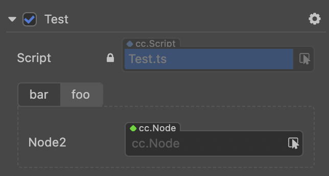
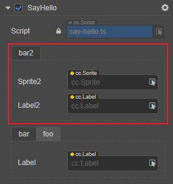
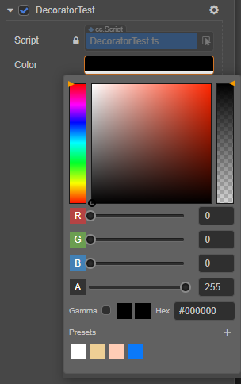
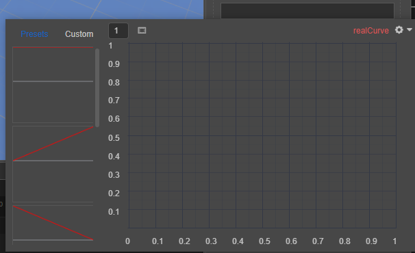
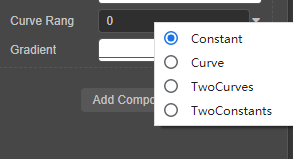
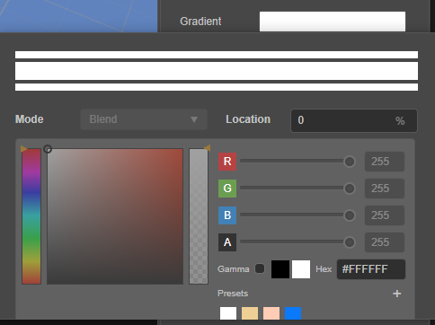
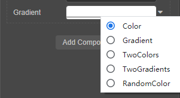

# Decorator

## `cc class`

When applying a decorator `ccclass` to a class, such class is called a `cc class`. A `cc class` injects additional information to control Cocos Creator's serialization of the class object, the editor's presentation of the class object, etc. Therefore, component classes that do not have `ccclass` declared are incomplete, they cannot be added to nodes as components either.

The parameter `name` of the decorator `ccclass` specifies the name of the `cc class`, which is **unique**, even same `ccclass` name in scripts in different sub folder is forbidden and considered as conflicts. When the corresponding `cc class` needs to be retrieved, it can be found by its `cc class` name, e.g.:

- Serialization. If the object is a `cc class` object, the `cc class` name of the object will be recorded during serialization, and the corresponding `cc class` will be found for serialization based on this name during deserialization.

- When the `cc class` is a component class, `Node` can look up the component by the `cc class` name of the component class.

```ts
@ccclass('Example')
export class Example extends Component {
}
```

## Component class decorators

These decorators are used to decorate sub classes of `Component`.

### `executeInEditMode`

By default, all components are executed only at runtime, meaning that their lifecycle callbacks are never triggered in editor mode. `executeInEditMode` allows the current component to be executed in editor mode, the default value of this decorator is `false`.

```ts
const { ccclass, executeInEditMode } = _decorator;

@ccclass('Example')
@executeInEditMode(true)
export class Example extends Component {
    update (dt: number) {
        // Will be executed in editor environment
    }
}
```

### `requireComponent`

The `requireComponent` decorator is used to specify a dependent component for the current component, the default value is `null`. When a component is added to a node, the engine will automatically add the dependent component to the same node if the dependent component does not exist yet, preventing script errors. This behavior is also valid at runtime.

```ts
const { ccclass, requireComponent } = _decorator;

@ccclass('Example')
@requireComponent(Sprite)
export class Example extends Component {
}
```

### `executionOrder`

`executionOrder` is used to specify the execution priority of component lifecycle callbacks. The execution ordering is described as follows.

- For different components on the same node, those with smaller `executionOrder` are executed first, and those with the same `executionOrder` are executed in the order in which they are added.
- For the same component on different nodes, the order of execution is determined by the node tree.

This ordering setting is only valid for `onLoad`, `onEnable`, `start`, `update` and `lateUpdate`, but not for `onDisable` and `onDestroy`.

```ts
const { ccclass, executionOrder } = _decorator;

@ccclass('Example')
@executionOrder(3)
export class Example extends Component {
}
```

### `disallowMultiple`

Only allow one component of the same type (with subclasses) to be added to the same node to prevent logic conflicts, the default value is false.

```ts
const { ccclass, disallowMultiple } = _decorator;

@ccclass('Example')
@disallowMultiple(true)
export class Example extends Component {
}
```

### `menu`

`@menu(path)` is used to add the current component to the component menu to make it easier for the user to find it.

Please note that this decorator generates a new menu in the drop-down box when the users click the **Add Component** button on the **Inspector** panel.

```ts
const { ccclass, menu } = _decorator;

@ccclass('Example')
@menu('foo/bar')
export class Example extends Component {
}
```


### `help`

Specify the URL of the current component's help page. Once set, a help icon will appear in the **Inspector** panel and can be clicked to open the specified page.

```ts
const { ccclass, help } = _decorator;

@ccclass('Example')
@help('https://docs.cocos.com/creator/3.5/manual/en/scripting/decorator.html')
export class Example extends Component {
}
```

## Property decorator

The decorator `property` is applied to a property or accessor of a `cc class`. Similar to the `ccclass` decorator, the `property` decorator injects additional information to control Cocos Creator's serialization of the property, the presentation of the property in the **Inspector** panel, and so on.

The various features of the `property` decorator are specified via its attributes in `@property({})`. Usage of all attributes can be found in: [Property Attributes](./reference/attributes.md).

The following code is an example of the usage of the `property` decorator:

```ts
@property({
    type: Node,
    visible: true,
})
targetNode: Node | null = null;
```

Next, some of the important `property` attributes are listed below.

### `type` attribute

The `type` attribute specifies a type recognizable by the editor. The type can be specified with several forms of arguments.

- Built-in primitive type:

  `CCInteger`, `CCFloat`, `CCBoolean`, and `CCString` are built-in property type identifiers that generally work on array properties. Non-array types usually do not need to explicitly declare a type.

    - `CCInteger` declares the type as **integer**.
    - `CCFloat` declares the type as **floating point**.
    - `CCString` declares the type as **String**.
    - `CCBoolean` declares the type as **Boolean**.

- Other `cc class` type

  All properties with `cc class` type **need to explicitly specify its type**, otherwise the editor will not be able to recognize the type and how to serialization the property.

- Array type

  When use the built-in primitive type or the `cc class` type as array element type for an array property, the property can be declared using the array type. For example, `[CCInteger]`, `[Node]` will let the **Inspector** panel present the property as an array of integers and an array of nodes, respectively.

If the property does not specify a type, Cocos Creator will derive its `cc` type from the property's default value or the result of an initialization formula:

- If the type of the property is the JavaScript primitive types `number`, `string`, and `boolean`, then the property `type` is `CCFloat`, `CCString`, and `CCBoolean`, respectively.
- Under other circumstances, the property's type will be **undefined**, and the editor will prompt a `Type(Unknown)` notice in the **Inspector** panel.

> **Note**: when using the JavaScript built-in constructors `Number`, `String`, `Boolean` as `type`, there will be a warning and they will be treated as `CCFloat`, `CCString`, `CCBoolean` respectively. Modifying the type of an initialized array property, a manual clear of the original array data is necessary, otherwise the data type will be inconsistent and lead to data mismatch.
>
> 

<!-- See [property-type](#%E5%B1%9E%E6%80%A7%E5%8F%82%E6%95%B0) and [serializable-parameters](#serializable-parameters) below for an introduction to how cc types affect cc properties and the handling of properties with undefined cc types. -->

> **Note**: editable properties that need to be presented in the **Inspector** panel should not have `_` at the beginning of the property name, otherwise they will be recognized as private properties, and private properties will not be displayed in the component **Inspector** panel.

The following code demonstrates the declaration of properties for different `cc` types.

```ts
import { _decorator, CCInteger, Node, Enum } from 'cc';
const { ccclass, property, integer, float, type } = _decorator;

enum A {
    c,
    d
}
Enum(A);

@ccclass
class MyClass {
    @property // JavaScript primitive type, automatically recognized as Creator's floating-point type by default.
    index = 0;

    @property(Node) // Declare property cc to be of type Node, which is equivalent to @property({type: Node}) when the property parameter is only type.
    targetNode: Node | null = null; // Equivalent to targetNode: Node = null!

    // Declare the cc type of the property children to be a Node array
    @property({
        type: [Node]
    })
    children: Node[] = [];

    @property({
        type: String,
    }) // Warning: the constructor String should not be used. equivalent to CCString. or you can choose not to declare the type
    text = '';

    @property
    children2 = []; // Undeclared cc type, inferring from initialization result that the elements are undefined arrays

    @property
    _valueB = 'abc'; // Properties starting with '_' here are only serialized and will not be displayed in the editor properties panel

    @property({ type: A })
    accx : A = A.c;
}
```

For convenience, several additional decorators are provided to quickly declare `cc` types. If you only need to declare `type` attribute of the property, you can use the following decorators instead of `@property`:

| Decorators | Corresponding property writes |
| :-------- | :---------------- |
| @type(t) | @property(t) |
| @integer | @property(CCInteger) |
| @float | @property(CCFloat) |

```ts
import { _decorator, CCInteger, Node } from 'cc';
const { ccclass, property, integer, float, type } = _decorator;
@ccclass
class MyClass {
    @integer // declare the cc type of the property as an integer
    index = 0;

    @type([Node]) // Declare the cc type of the property children to be a Node number
        children: Node[] = [];

    @type(String) // Warning: should not use constructor String. equivalent to CCString. can also choose not to declare type
    text = '';
    // JavaScript primitive types `number`, `string`, `boolean` can usually be undeclared
    // You can just write
    @property
    text = '';
}
```

<!-- ### Default value

The `default` option specifies the default value of the cc attribute. See the [default parameter](#default%E5%8F%82%E6%95%B0) description below for details. -->

<!-- ### Constructors

#### defined by constructor

Constructors for CCClass are defined using `constructor`. To ensure that deserialization always works correctly, `constructor` **is not allowed** to define **constructor parameters**.

> Developers who do need to use constructor arguments can get them via `arguments`, but remember that if the class will be serialized, they must ensure that the object can still be created if all the constructor arguments are missing. -->

<!-- ### default

`default` is used to declare the default value of an attribute, which is implemented as a member variable by CCClass. The default value is only used when the **first** time an object is created, meaning that modifying the default value of an attribute does not change the current value of a component attribute that has been added to the scene.

> When a developer adds a component to the **Inspector** panel and then goes back to the script to modify the property defaults, the property values of the component in the **Inspector** panel will not change because the current values of the properties in the component have been serialized into the scene and are no longer the defaults used when they were first created. To force all properties of a component to be set back to their default values, select **Reset** from the Settings button at the top right of the component in the **Property Inspector**.

`default` is allowed to be set to the following value types.

1. a value of any `number`, `string` or `boolean` type
2. `null` or `undefined`
3. an object instantiated from a subclass of `ValueType`, such as `Vec3`, `Color` or `Rect`.

    ```typescript
    @property({ type: Vec3 })
    pos = null;
    ```

4. an empty array `[]` or an empty object `{}` -->

### `visible` attribute

In general, whether an property is displayed in the **Inspector** panel depends on whether the property name starts with `_`. **If it starts with `_`, it is not displayed**.

To force display in the **Inspector** panel, set the `visible` attribute to `true`:

```typescript
@property({ visible: true })
private _num = 0;
```

To force hiding, set the `visible` attribute to `false`:

```typescript
@property({ visible: false })
num = 0;
```

### `serializable` attribute

Properties are serialized by default. Once serialized, the property values set in the editor will be saved to the scene and other resource files, and will be automatically restored to the set property values when the scene is loaded. To not serialize, set `serializable` as false.

```typescript
@property({ serializable: false })
num = 0;
```

### `override` attribute

All properties are inherited by subclasses. If a subclass wants to override a property of the same name of the parent class, the override attribute needs to be set explicitly, otherwise, there will be a renaming warning:

```typescript
@property({ tooltip: "my id", override: true })
id = "";
```

### `group` attribute

If there are many properties or mixed properties defined in the script, the properties can be grouped and sorted by `group` for easy management. It also supports sorting properties within a group.

- `@property({ group: { name } })`

- `@property({ group: { id, name, displayOrder, style } })`

| Property | Description |
| :--- | :--- |
| `id`           | Group ID, `string` type, is a unique identifier for the property group, and defaults to `default`. |
| `name`         | The name to classify the properties in the group, `string` type. |
| `displayOrder` | Sort the groups, `number` type. The smaller the number, the higher the sorting. The default is `Infinity`, which means the group is sorted last.<br>If there are multiple groups without `displayOrder` set, they will be sorted in the order declared in the script. |
| `style`        | Grouping styles, currently **tab** and **section** styles are supported. |

Example script is as follows:

```ts
import { _decorator, Component, Label, Sprite } from 'cc';
const { ccclass, property } = _decorator;

@ccclass('SayHello')
export class SayHello extends Component {

    // Group 1
    // The property category named "bar" within the group, which contains a Label property named "label".
    @property({ group: { name: 'bar' }, type: Label }) 
    label: Label = null!; 
    // The property category named "foo" within the group, which contains a Sprite property named "sprite".
    @property({ group: { name: 'foo' }, type: Sprite }) 
    sprite: Sprite = null!;

    // Group 2
    // The property category named "bar2" within the group, which contains a Label property named "label2" and a Sprite property named "sprite2".
    @property({ group: { name: 'bar2', id: '2', displayOrder: 1 }, type: Label }) 
    label2: Label = null!; 
    @property({ group: { name: 'bar2', id: '2' }, type: Sprite }) 
    sprite2: Sprite = null!;

}
```

Mounting the script to the node displays the following image in the **Inspector** panel:



Because group 1 does not specify `displayOrder` and group 2 specifies `displayOrder` as `1`, group 2 will be ranked ahead of group 1.

Sorting the properties within a group can also be done via `displayOrder`. Taking group 2 as an example, it is currently sorted in the order defined in the script, with label2 in front of sprite2. Let's adjust it to:

```ts
// Group 2
@property({ group: { name: 'bar2', id: '2', displayOrder: 1 }, displayOrder: 2, type: Label }) 
label2: Label = null!; 
@property({ group: { name: 'bar2', id: '2' }, displayOrder: 1, type: Sprite }) 
sprite2: Sprite = null!;
```

Back to the editor, the sprite2 is now in front of label2 in the **Inspector** panel:



For additional information about the properties, please refer to the [Properties](./reference/attributes.md) documentation.

## Built-in Type User Interface

For some common types, the engine supports a default user interface that can be use via the developers' needs.

- Color

    

    The code example is as follows:

    ```ts
    @property(Color)
    color:Color
    ```

- Curve: Used to save the type of curve, sample, and sample data, and the result can be evaluated.

    

    The code example is as follows:

    ```ts
    @property(RealCurve)
    realCurve:RealCurve = new RealCurve();
    ```

- CurveRange: Use constants, curves, two-curves, or two-constants to control the curve-range

    

    The code example is as follows:

    ```ts
    @property(CurveRange)
    curveRang : CurveRange = new CurveRange();    
    ```

- Gradient: You can record the key values of the gradient and evaluate the gradient result

    

    The code example is as follows:

    ```ts
    @property(Gradient)
    gradient = new Gradient();
    ```

- GradientRange: use color, gradient, two gradients, two colors or random color to evaluate the final color

   

   The code example is as follows:

    ```ts
    @property(GradientRange)
    gradientRange:GradientRange = new GradientRange();      
    ```


## Reference Link

- [Property Attributes](./reference/attributes.md)
- [Advanced Scripting](./reference-class.md)
