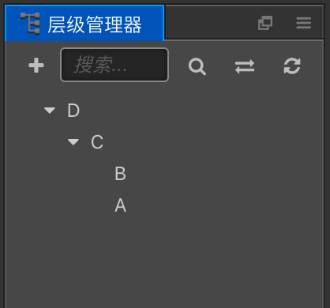

# Node System Events

As stated in the last file, `cc.Node` has a whole set of [event listener and dispatch mechanisms](./events.md). Based on this mechanism, we provide some basic system events. This file will introduce the system events related to Node hierarchy.

Cocos Creator supports four types of system events: mouse, touch, keyboard, device motion. This document will mainly discuss the usage of touch and mouse events which is dispatched by related `cc.Node`. For keyboard and device motion events, they are dispatched as [Global System Events](./player-controls.md) by `cc.systemEvent`.

System events follow the general register method, developers can register event listener not only by using the enumeration type but also by using the event name directly, the definition for the event name follows DOM event standards.

```javascript
// Use enumeration type to register
node.on(cc.Node.EventType.MOUSE_DOWN, function (event) {
  console.log('Mouse down');
}, this);

// Use event name to register
node.on('mousedown', function (event) {
  console.log('Mouse down');
}, this);
```

## Mouse event type and event object

The Mouse event will only be triggered on desktop platforms, the event types the system provides are as follows:

| Enumeration object definition   | Corresponding event name | Event trigger timing |
| :------------------------------ | :----------------------- | :------------------- |
| `cc.Node.EventType.MOUSE_DOWN`  | `mousedown`  | trigger once when mouse down in the target node region                   |
| `cc.Node.EventType.MOUSE_ENTER` | `mouseenter` | when the mouse enters the target node region, regardless if it is down   |
| `cc.Node.EventType.MOUSE_MOVE`  | `mousemove`  | when the mouse moves in the target node region, regardless if it is down |
| `cc.Node.EventType.MOUSE_LEAVE` | `mouseleave` | when the mouse leaves the target node region, regardless if it is down   |
| `cc.Node.EventType.MOUSE_UP`    | `mouseup`    | trigger once when the mouse is released from the down state              |
| `cc.Node.EventType.MOUSE_WHEEL` | `mousewheel` | when the mouse wheel rolls                                               |

The important APIs of mouse events (`cc.Event.EventMouse`) are as follows (`cc.Event` standard events API excluded):

| Function name  | Returns value type | Meaning |
| :------------- | :----------------: | :------ |
| `getScrollY`   | `Number` | get the y axis distance wheel scrolled, effective only when scrolling                        |
| `getLocation`  | `Object` | get mouse location object which includes x and y properties                                  |
| `getLocationX` | `Number` | get X axis location of the mouse                                                             |
| `getLocationY` | `Number` | get Y axis location of the mouse                                                             |
| `getDelta`     | `Object` | get the distance object the mouse moves since last event, which includes x and y properties  |
| `getButton`    | `Number` | `cc.Event.EventMouse.BUTTON_LEFT` or `cc.Event.EventMouse.BUTTON_RIGHT` or `cc.Event.EventMouse.BUTTON_MIDDLE` |

## Touch event types and event objects

Touch event can be triggered in both mobile platforms and desktop platforms. This is designed to serve developers to debug on desktop platforms better, all you need to do is listen to touch events, touch events from mobile platforms and mouse events from desktop can be responded to at the same time. Touch event types that the system provides are as follows:

| Enumeration object definition    | Corresponding event name | Event trigger timing |
| :------------------------------- | :----------------------- | :------------------- |
| `cc.Node.EventType.TOUCH_START`  | `touchstart`             | when the finger touches the screen in the target node region                        |
| `cc.Node.EventType.TOUCH_MOVE`   | `touchmove`              | when the finger moves on screen                              |
| `cc.Node.EventType.TOUCH_END`    | `touchend`               | when the finger leaves screen in the target node region      |
| `cc.Node.EventType.TOUCH_CANCEL` | `touchcancel`            | when the finger leaves screen outside the target node region |

The important APIs of touch event (`cc.Event.EventTouch`) are as follows (`cc.Event` standard event API excluded):

| API name              | Type       | Meaning |
| :-------------------- | :--------- | :------ |
| `touch`               | `cc.Touch` | contact object related to the current event |
| `getID`               | `Number`   | identification ID of the touch spot, can be used in multi-touch to track the touch spot              |
| `getLocation`         | `Object`   | get location object of the touch spot which includes x and y properties                             |
| `getLocationX`        | `Number`   | get X axis location of the touch spot       |
| `getLocationY`        | `Number`   | get Y axis location of the touch spot       |
| `getPreviousLocation` | `Object`   | get the location object of the touch spot at the last event which includes x and y properties        |
| `getStartLocation`    | `Object`   | get the location object the where touch spot gets down which includes x and y properties             |
| `getDelta`            | `Object`   | get the distance object the touch spot moves since the last event, which includes x and y properties |

> **Note**: touch events support multi-touch, each touch spot will send one event to the event listener.

## Touch event propagation

### Touch event bubbles

Touch events support the event bubbles on the node tree, take the pictures below as an example:


In the scene shown in the picture, suppose node A has a child node B which has a child node C. The developer set the touch event listeners for all these three nodes (each node has a touch event listener in examples below by default).  

When the mouse or finger was applied in the node C region, the event will be triggered at node C first and the node C listener will receive the event. Then the node C will pass this event to its parent node, so the node B listener will receive this event. Similarly the node B will also pass the event to its parent node A. This is a basic event bubbling phase. It needs to be emphasized that there is no hit test in parent nodes in the bubbling phase, which means that the node A and B can receive touch events even though the touch location is out of their node region.

The bubbling phase of touch events is no different than the general events. So, calling `event.stopPropagation()` can force to stop the bubbling phase.

### Ownership of touch points among brother nodes

Suppose the node B and C in the picture above are brother nodes, while C partly covers over B. Now if C receives a touch event, it is announced that the touch point belongs to C, which means that the brother node B won't receive the touch event any more, even though the touch location is also inside its node region. The touch point belongs to the top one among brother nodes.

At the same time, if C has a parent node, it will also pass the touch event to its parent node through the event bubble mechanism.

### Register touch or mouse events in the capturing phase

Sometimes we need to dispatch the touch or mouse events to parent node event listeners before dispatching to any child nodes beneath it in hierarchy, like the design of CCScrollView component.  
Now the event bubbling can't meet our demand, so that we need to register the parent node event listeners in the capturing phase.  
To achieve this goal, we can pass the fourth parameter `true` when registering touch or mouse event on node, which means `useCapture`. For example:

```js
this.node.on(cc.Node.EventType.TOUCH_START, this.onTouchStartCallback, this, true);
```

When node fires `touchstart` event, the `touchstart` event will be firstly dispatched to all the parent node event listeners registered in the capturing phase, then dispatched to the node itself, and finally comes the event bubbling phase.

Only touch or mouse events can be registered in the capturing phase, while the other events can't be.

### Example for touch events

Let's make a summary of touch event propagation with the example below:


There are four nodes A, B, C and D in the picture above, where A and B are brother nodes.  
The specific hierarchical relationship should be like this:



1. If one touch is applied in the overlapping area between A and B, now B won't receive the touch event, so that propagating order of the touch event should be **A -> C -> D**
2. If the touch location is in node B ( the visible blue area ), the order should be **B -> C -> D**
3. If the touch location is in node C, the order should be **C -> D**
4. As a precondition to the second case, we register touch events on C D node in the capturing phase, then the order should be **D -> C -> B**

## Other events of `cc.Node`

| Enumeration object definition | Corresponding event name | Event trigger timing |
| :---------- | :---------- | :---------- |
| null | `position-changed` | when the location property is changed |
| null | `rotation-changed` | when the rotation property is changed |
| null | `scale-changed`    | when the scale property is changed    |
| null | `size-changed`     | when the size property is changed     |
| null | `anchor-changed`   | when the anchor property is changed   |

## Multi-touch Event

The engine has added a muting switch for multi-touch events in v2.3. Multi-touch events are enabled by default. For some types of games, in order to prevent multi-touch accidents, multi-touch events need to be shielded, which can be closed by the following code:

```javascript
cc.macro.ENABLE_MULTI_TOUCH = false;
```

## Pause or resume node system events

Pause node system events

```js
// Pause all node system events registered on the current node. Node system events include Touch and Mouse Events.
// If a parameter true is passed, the API will pause node system events on this node and all its children.
// Example
this.node.pauseSystemEvents();
```

Resume node system events

```js
// Resume all node system events registered on the current node. Node system events include Touch and Mouse Events.
// If a parameter true is passed, the API will resume node system events on this node and all its children.
// Example
this.node.resumeSystemEvents();
```
