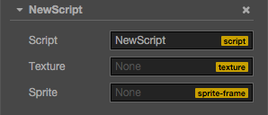
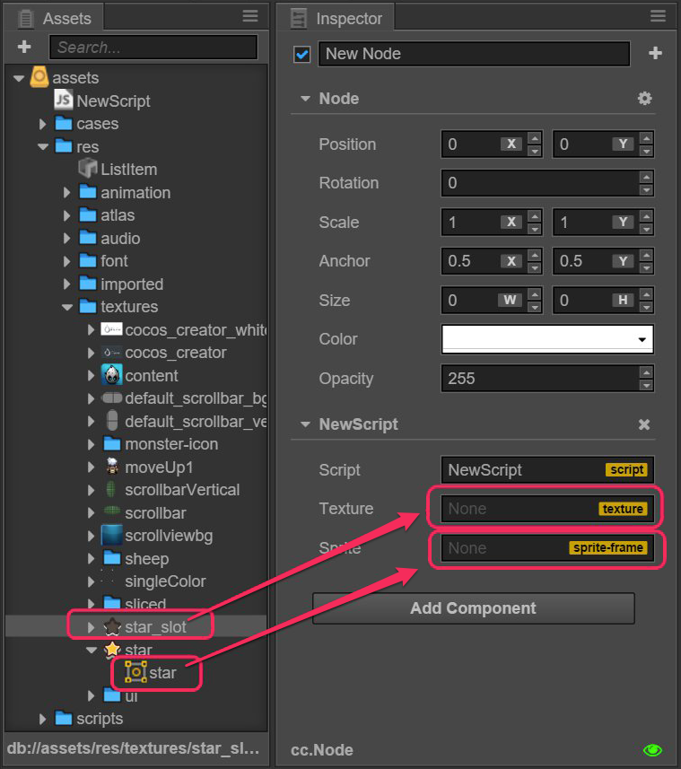
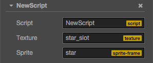

# Acquire and set asset

## Declaration of asset properties

In Creator, all types inherited from `cc.Asset` are collectively called assets, such as `cc.Texture2D`, `cc.SpriteFrame`, `cc.AnimationClip`, `cc.Prefab` and so on. Their loading is uniform and automatic. Assets that rely on each other can be preloaded automatically.

> For example, when the engine is loading the scene, it will first automatically load the assets linked to the scene and if these assets are linked to other assets, then these other assets will also be loaded first. Only when the loading is complete will the loading of the scene be finished.

The script can define an Asset properties:

```javascript
// NewScript.js

cc.Class({
    extends: cc.Component,

    properties: {
        spriteFrame: {
            default: null,
            type: cc.SpriteFrame
        },
    }
});
```

## How to set assets in the Properties panel

As long as you define the type in the script, you can set assets easily in the **Properties** panel. Suppose we create a script like this:

```js
// NewScript.js

cc.Class({
    extends: cc.Component,
    properties: {

        texture: {
            default: "",
            type: cc.Texture2D,
        },
        spriteFrame: {
            default: null,
            type: cc.SpriteFrame,
        },

    }
});
```

Here is how it looks like in the **Properties** panel after adding it into the node:



Then we drag a Texture and a SpriteFrame separately from **Assets** to the corresponding attribute in the **Properties** panel:



The result is as follows:



In this way you can get the set asset directly from the script:

```js
onLoad: function () {
    var spriteFrame = this.spriteFrame;
    var texture = this.texture;

    spriteFrame.setTexture(texture);
}
```

Although it is very straight forward to set assets in the **Properties** panel, assets can only be pre-set in the editor without dynamic switching. If you need dynamic switching, please refer to the document [Dynamic loading of resources](./dynamic-load-resources.md).
