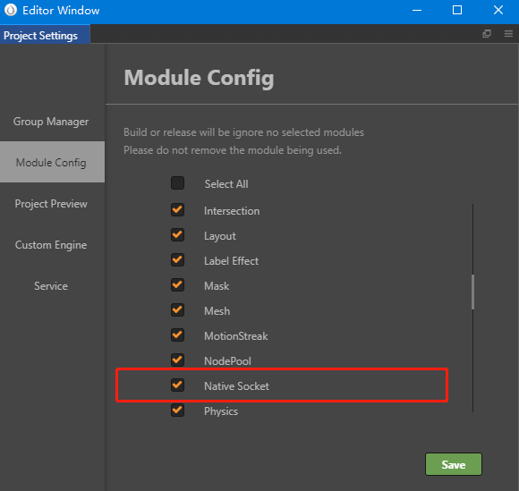

# Standard network interface

In Cocos Creator, we support the most widely used standard network interface on the Web platform:

- **XMLHttpRequest**: for short connection
- **WebSocket**: for long connection

Of course, browsers on the Web platform support these two interfaces originally. The reason why we say Cocos Creator supports it is because when we release the native version, the user can operate it using these two network interface codes which follows the principle of "one set of code for multiple platforms operation" which Cocos honors.

> **Note**: if you need to use `WebSocket` on the native platform, make sure that the **Native Socket** module is checked in the **Project -> Project Settings -> Module Config**.

## How to use

1. XMLHttpRequest

    Simple example:

    ```js
    let xhr = new XMLHttpRequest();
    xhr.onreadystatechange = function () {
        if (xhr.readyState == 4 && (xhr.status >= 200 && xhr.status < 400)) {
            var response = xhr.responseText;
            console.log(response);
        }
    };
    xhr.open("GET", url, true);
    xhr.send();
    ```

    Developers can use `new XMLHttpRequest()` directly.

    For the standard file of `XMLHttpRequest`, please refer to [MDN file](https://developer.mozilla.org/en-US/docs/Web/API/XMLHttpRequest).

2. WebSocket

    Simple example:

    ```js
    let ws = new WebSocket("ws://echo.websocket.org");
    ws.onopen = function (event) {
        console.log("Send Text WS was opened.");
    };
    ws.onmessage = function (event) {
        console.log("response text msg: " + event.data);
    };
    ws.onerror = function (event) {
        console.log("Send Text fired an error");
    };
    ws.onclose = function (event) {
        console.log("WebSocket instance closed.");
    };

    setTimeout(function () {
        if (ws.readyState === WebSocket.OPEN) {
            ws.send("Hello WebSocket, I'm a text message.");
        }
        else {
            console.log("WebSocket instance wasn't ready...");
        }
    }, 3);
    ```

    For the standard file of `WebSocket`, please refer to [MDN file](https://developer.mozilla.org/en-US/docs/Web/API/WebSocket).

## SocketIO

> Unfortunately, Creator does not provide Socket.io official support on the Web platform, requires users to add them themselves to the project. And the Socket.io of the native platform is discarded. Previously the socket.io for the native platform was implemented by a third-party developer and has not been maintained for a long time. So it is not recommended to use.

Beyond these, SocketIO provides packaging based on the WebSocket API which can be used on the Node.js server. If this library is needed, developers can reference SocketIO on their own.

Reference SocketIO in script:

1. Download SocketIO: [https://socket.io](https://socket.io).

2. Drag the downloaded file into the route you would like to save in Explorer/Finder.

3. Modify SocketIO script to avoid the execution on native environment.

    As web SocketIO can not parsed correctly in JSB, the Cocos provides native SocketIO on native environment. So we should hack to make the web SocketIO script not work on native environment, the way to achieve this is to modify the SocketIO script:

    ```js
    if (!cc.sys.isNative) {

        // SocketIO original code

    }
    ```

4. Make the SocketIO script [Import As Plugin](./plugin-scripts.html), so we can access the SocketIO in the component by using `window.io` directly.

5. To use SocketIO in the component you can go to [SocketIO official website](http://socket.io/) for API and files.

> **Note**: if you need to use `WebSocket` or `SocketIO` on native platform, make sure you check the `Native Socket` module.
>
> 
