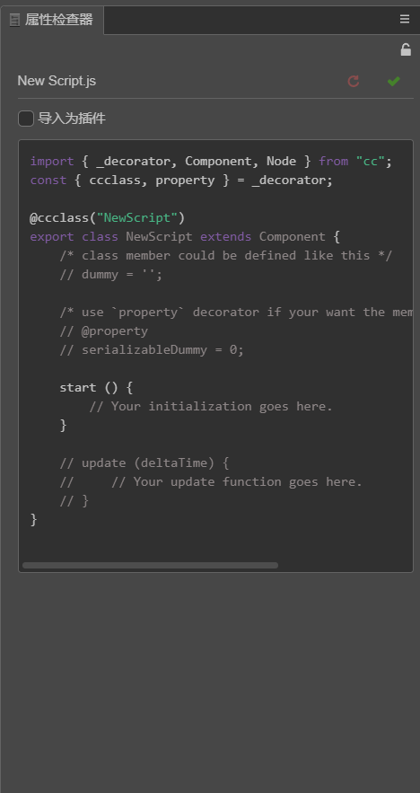

# Plugin Script



In the **Assets**, select any of the script, you can see such a settings interface in the **Properties**, we can set whether the script is "Import As Plugin" here.

 - For Component script, data logic, the default is to cancel this option, such a script is referred to as **Normal Script**.
 - For third-party script, or the underlying plugin, it may be necessary to select the option, such a script is referred to as **Plugin Script**.

This option is only related to the script, specific aspects of the impact, beginners only need a simple understanding

Type: | Normal Script | Plugin Script
---------- | ----------- | -----------
Declare components | Support | Not Support
[Modular](../scripting/modular-script.md) | Support, you can refer to other Normal Script by [require](../scripting/modular-script.md#require), can not require Plugin Script | Not Support, also can not require Normal Script
Variable scope | The local variables defined within each script are not exposed to global | At runtime, local variables within the script that are not in any function are exposed as global variables
use strict | Forced, undefined variables can not be assigned | Need to manually declare, otherwise once the undefined variable is assigned it will become a global variable
When the script is imported into the editor | The ES2015 feature in the script is [compiled](../scripting/reference/javascript-support.md) first, and then into a unified modular analysis process | Do not do anything
During the project building phase | All Normal Scripts will be packaged into a **single** script file, and in the release mode will be further compressed | Not packaged, and in the release mode will be compressed
SourceMap | Support | Not Support

## Script loading order

The script loading order is as follows:

 1. Cocos2d engine
 1. Plugin Script (If there are multiple, they are loaded in alphabetical order according to the path in the project)
 1. Normal Script (Only one file after packing, the internal scripts will be initialized in the order of require dependencies)

## Target platform compatibility

After the project is published, the plugin will be loaded directly by the target platform, so please check the plugin compatibility with the target platform, or the plugin may not run.

 - **The target platform does not provide native Node.js support**<br>
 For example, many [npm](https://www.npmjs.com/) modules depend directly or indirectly on Node.js, which can not be used when they are published to a native or web.
 - **Plugins that rely on the DOM API will not be able to publish to native platforms**<br>
 Web pages can use a lot of front-end plugins, such as jQuery, but they may depend on the browser's DOM API. Plugins that rely on these APIs can not be used in native platforms.

## Precautions

 - **If the plugin contains multiple scripts, you need to merge all the scripts used by the plugin into a single js file**<br>
 Take Async([https://github.com/caolan/async](https://github.com/caolan/async)) as an example, this library contains a lot of fragmented source files, if you put all the source files into the project, each source file must be set "Import As Plugin" once, and Creator can not guarantee the load order between these source files, it is easy to report errors. So we have to find the pre-compiled single script provided by plugin author, such as `async.js` or `async.min.js`. Such a file can be loaded directly by the browser, do not need to do additional compilation operations, generally can be put directly into Creator. If the plugin author does not provide a packaged version, usually also shows how to compile the browser executable script in the document, according to the operation just fine.

 - **If the plugin also depends on other plugins, you also need to merge multiple plugins into a single js file**<br>
 In the example of [protobuf.js](https://github.com/dcodeIO/ProtoBuf.js), this library also depends on [bytebuffer.js](https://github.com/dcodeIO/bytebuffer.js), but the plugin author does not provide an integrated standalone version. We can first download the two files [protobuf.js](https://github.com/dcodeIO/protobuf.js/tree/master/dist/) and [bytebuffer.js](https://github.com/dcodeIO/bytebuffer.js/tree/master/dist) which compiled from the two libraries, and then use the text editor or a command-line tool like `cat` to concat these two scripts into a new script `protobuf_all.js`. Then you can use this `protobuf_all.js` directly in Creator.

- **Does not support plugins to actively load other scripts**<br>
To [lzma plugin](https://github.com/nmrugg/LZMA-JS), for example, the default `lzma.js` script provided by this plugin will load another worker script through the browser's Worker, which is not currently supported by Creator. The solution is to [use `lzma_worker.js` alone](https://github.com/nmrugg/LZMA-JS#but-i-dont-want-to-use-web-workers). Others like the use of `document.createElement("script")` self-loading dependencies plugins, also need to do a similar process to import into Creator.

## Global variable

Since all Plugin Scripts are guaranteed to be loaded before Normal Scripts, you can use this feature to declare some special global variables in addition to being used to load the plugin.

You can add such a script in the project, and set the "Import As Plugin":

```javascript
/* globals.js */

// Defines the default value for new components
window.DEFAULT_IP = "192.168.1.1";

// Define the component switch
window.ENABLE_NET_DEBUGGER = true;

// Define engine API abbreviations (only for constructors)
window.V2 = cc.Vec2;
```

Then you can access them directly in any **Normal** Script:

```javascript
/* network.js */

cc.Class({
    extends: cc.Component,
    properties: {
        ip: {
            default: DEFAULT_IP
        }
    }
});
```

```javascript
/* network_debugger.js */

if (ENABLE_NET_DEBUGGER) {
    // This component takes effect when ENABLE_NET_DEBUGGER
    cc.Class({
        extends: cc.Component,
        properties: {
            location: {
                default: new V2(100, 200)
            }
        },
        update: function () {
            ...
        },
    });
}
else {
    // Otherwise this component does nothing
    cc.Class({
        extends: cc.Component,
        start: function () {
            // Remove the component after it starts
            this.destroy();
        }
    });
}
```

In this case, the variables in `globals.js` has been used since scripts such as `network.js` and `network_debugger.js` are loaded. So if the `globals.js` is not a plugin script, each script that might use those global variables should declare `require("globals");` at the top, to ensure that `globals.js` is loaded first.

But if a global variable itself is to be initialize in the component's onLoad, it is recommended to use `window.foo = bar` to declare the global variables directly in the onLoad of a Normal Scirpt, do not need to use the Plugin Scirpt, see [Access by using global variable](../scripting/access-node-component.md#global_variable).

Please note that when the game is running away from the editor, the plugin script will run directly on the global scope. Local variables within the script that are not in any function will be exposed as global variables. Be careful to cause global variables to pollute.

> You should use global variable with care and understanding, we do not recommend using it, you had better keep them readonly if really need to do that.<br>
> Please avoid name duplication with exists global variables in the system.<br>
> You can freely encapsulate or extend the Cocos2d engine in Plugin Scripts, but this will increase team communication costs, making scripts difficult to reuse.


---

Continue on to read about [JavaScript Primer](javascript-primer.md) or back to [Scripting](index.md).
