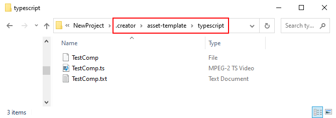
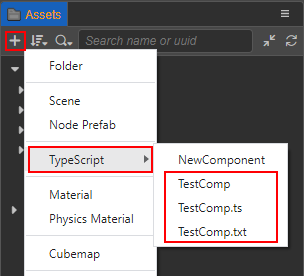
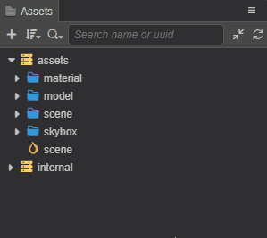

# Creating Scripts

## Creating Component Scripts

In Cocos Creator, scripts are part of assets. A script created in the **Assets** panel is a NewComponent by default, which is called a component script. It can be created in two ways:

- Select the folder in the **Assets** panel where the component script is to be placed, then right-click and select **TypeScript**.
- Click the **+** button in the upper left corner of the **Assets** panel directly, and then select **TypeScript**.


When creating a script, the script name cannot be empty and defaults to `NewComponent`. If the created component script is named as `say-hello`, and then a script file named `say-hello` is generated in the **Assets** panel:


A simple component script may look like this example:

```ts
import { _decorator, Component, Node } from 'cc';
const { ccclass, property } = _decorator;

/**
 * Predefined variables given by default, for some project management needs.
 * 
 * Name = SayHello
 * DateTime = Thu Jul 29 2021 15:19:02 GMT+0800 (China Standard Time)
 * Author = <%Author%>  // If not logged in, the entry is empty.
 * FileBasename = say-hello.ts
 * FileBasenameNoExtension = say-hello
 * URL = db://assets/say-hello.ts
 * ManualUrl = https://docs.cocos.com/creator/3.3/manual/en/
 *
 */
 
@ccclass('SayHello')
export class SayHello extends Component {
    // [1]
    // dummy = '';

    // [2]
    // @property
    // serializableDummy = 0;

    start () {
        // [3]
    }

    // update (deltaTime: number) {
    //     // [4]
    // }
}

/**
 * [1] Class member could be defined like this.
 * [2] Use `property` decorator if your want the member to be serializable.
 * [3] Your initialization goes here.
 * [4] Your update function goes here.
 *
 * Learn more about scripting: https://docs.cocos.com/creator/3.3/manual/en/scripting/
 * Learn more about CCClass: https://docs.cocos.com/creator/3.3/manual/en/scripting/ccclass.html
 * Learn more about life-cycle callbacks: https://docs.cocos.com/creator/3.3/manual/en/scripting/life-cycle-callbacks.html
 */
```

When a script is created, its original filename is handled as its `className`, which is not allowed to be repeated in the project. Note that renaming a created script file does not automatically update the `className`, see the **Script Renaming** section below for details.

> **Note**: it is recommended that users use **TypeScript** to write scripts. If you wish to use **JavaScript** to write scripts, they can be created directly in the operating system file manager, or created in a code editor.

## Editing Scripts

Choose a favorite text-editing tool (such as: **Vim**, **Sublime Text**, **Web Storm**, **VSCode**...) for script editing, please setup in the **Preferences -> External Program -> Default Script Editor** option of the editor menu bar.

By double-clicking the script asset, the script editor directly opens to allow for editing. When the script is edited and saved, then returned to the editor, Cocos Creator will automatically detect the changes to the script and compile it quickly.

Before writing code, please read the following documentations to learn more about scripts:

- [Coding Environment Setup](coding-setup.md)
- [Operating Environment](basic.md)

## Add a Script to a Scene Node

Adding a script to a scene node is actually adding a script component to that node. Select the scene node to which you wish to add a script in the **Hierarchy** panel, at which point the properties of that node will be displayed in the **Inspector** panel. Adding a script component includes the following two ways:

1. Drag and drop the script from **Assets** panel directly into the **Inspector** panel.

    

2. Click the **Add Component** button at the bottom of the **Inspector** panel and select **Custom script -> SayHello** to add the script component just created. It is also possible to add it by searching for **SayHello** in the **Add Component** search box.

    

## Script Renaming

Note that the component name of a script component is the class name defined in the script, not the script file name. When a script is created, the script file generates the class name according to the following rules:

- Use Upper Camel Case.
- There are no numbers on the head.
- Without special characters.
- Use the symbols and spaces in the script file name as intervals, and capitalize the first letter after each interval. For example, the script file name is `say-hello`, and the class name is `SayHello`.

If there are secondary changes to the script file name/script class name afterwards, the two are not automatically synchronized, and can be synchronized manually if needed.

Using `say-hello.ts` above as an example, if it is renamed to `hello` in the **Assets** panel, notice that the script component name in the **Inspector** panel is still the original name, **SayHello**, only the script name has changed to `hello`:


Double click to open `say-hello.ts`, and change the class name to **Hello**:

```TypeScript
import { _decorator, Component, Node } from 'cc';
const { ccclass, property } = _decorator;

@ccclass('Hello')
export class Hello extends Component {}
```

After saving the script and returning to the editor, notice that the script component name in the **Inspector** panel has changed to **Hello**, but the script file name is still the original name, `say-hello`:


## Custom script template

Cocos Creator supports custom script templates in the project. The operation steps are as follows:

1. Create a new `.creator/asset-template/typescript` directory in the project directory and add a text file containing the content of the custom script template in the `typescript` directory, which can be in any format or without format.

    

    The content of the custom script template can refer to the `resources\3d\engine\editor\assets\default_file_content\ts` file in the engine directory, which contains several predefined variables given by default for some of the project management needs.

    ```ts
    /**
    * Predefined variables
    * Name = <%Name%>
    * DateTime = <%DateTime%>
    * Author = <%Author%>
    * FileBasename = <%FileBasename%>
    * FileBasenameNoExtension = <%FileBasenameNoExtension%>
    * URL = <%URL%>
    * ManualUrl = <%ManualUrl%>
    *
    */
    ```

2. Then, returning to the editor, notice that a secondary menu appears under **TypeScript** in the menu for creating assets in the **Assets** panel, containing the component script template (`NewComponent`) that comes with the editor, as well as the three custom script templates added in the previous step.

    

    When creating a custom script, the editor will read the text content in the custom script template and process it as an TypeScript script.

    
